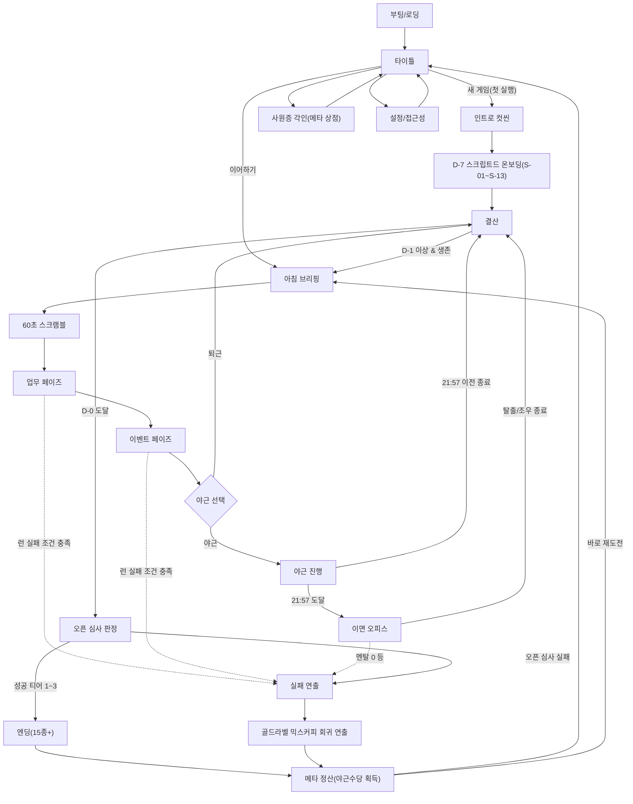

# 《60초 오피스: D-7》 게임 기획서 (GDD)

> **"정식 오픈까지 7일. 퇴근까지 60초. 그리고 밤 9시 57분, 사무실은 더 이상 사무실이 아니다."**

| 항목 | 내용 |
|------|------|
| 제목(가칭) | 60초 오피스: D-7 (60 Seconds Office: D-7) |
| 장르 | 서바이벌 어드벤처 + 로그라이크 (택틱컬 스케빈지 & 초이스 드리븐) |
| 원안 | 「60 Seconds!」의 코어 구조(스캐빈지 → 일차별 생존)를 한국 1년차 스타트업 사무실로 재해석 |
| 플랫폼 | 웹(HTML5) 프로토타입 → PC(Steam) / 모바일 |
| 타겟 | 직장인 유머·괴담 콘텐츠 소비층 20~30대, 로그라이크 라이트 유저 |
| 플레이 타임 | 1런 20~30분, 멀티 엔딩·메타 진행으로 반복 플레이 |
| 핵심 재미 | ① 60초 스크램블의 손맛 ② "오늘 야근할 것인가"의 리스크 관리 ③ K-직장 블랙코미디 × 오컬트 호러의 낙차 |

## 1. 컨셉 개요

### 1.1 하이 컨셉

핵전쟁 벙커 대신 **런웨이 3개월짜리 1년차 스타트업 사무실**, 낙진 대신 **데드라인**, 바퀴벌레 대신 **복사기 요괴**. 「60 Seconds!」가 "60초 안에 챙긴 것으로 벙커에서 버티는 게임"이라면, 《60초 오피스: D-7》는 **"아침 60초 안에 챙긴 것으로 하루를 버티고, 7일 안에 플랫폼을 정식 오픈하는 게임"**이다.

### 1.2 셀링 포인트

1. **매일 아침이 스캐빈지** — 원작의 60초 스캐빈지를 1회성 오프닝이 아니라 **매일 반복되는 코어 메커닉**으로 승격. 어제의 결과가 오늘 아침 사무실 맵 상태(어질러짐, 잠긴 문, 새로 생긴 아이템)를 바꾼다.
2. **야근의 공포를 문자 그대로** — 진척도가 부족하면 야근해야 하고, 야근하면 밤 9시 57분 '이면 오피스'의 괴이와 마주친다. 하이리스크 하이리턴의 핵심 딜레마.
3. **모두가 아는 인물들** — 아이디어가 폭주하는 대표, 협찬과 MOU를 물어와 회사를 연명시키는 영업 실장, KPI 대시보드를 야근으로 지키는 데이터 팀장, 혼자 플랫폼 절반을 짠 번아웃 직전의 CTO. 스타트업의 원형적 인물 4인은 스탯 덩어리가 아니라 7일짜리 개인 서사를 가진 생존 파트너다.
4. **타임루프 로그라이크** — 실패해도 '골드라벨 믹스커피'로 D-7 아침으로 회귀. 죽음(퇴사)조차 콘텐츠가 되는 메타 진행.

### 1.3 톤 앤 매너

- **낮**: K-직장 블랙코미디, 스타트업 버전. 과장된 리얼리즘 (전체회신 사고, "간단한 수정", 오픈 전날의 신기능 아이디어).
- **밤**: 정통 오컬트 호러. 웃기던 게임이 밤 9시 57분에 진짜로 무서워지는 낙차가 이 게임의 시그니처.

## 2. 세계관 & 시놉시스

> **허구 고지** — 본 기획의 등장인물은 ㈜엑스컴 실제 구성원을 모델로 한 코믹 과장 캐릭터이며, 성격·비밀·사건은 전부 허구다.

### 2.1 배경

주식회사 엑스컴. 2025년 10월 설립, 1년차 플랫폼 스타트업. 멤버 6인+신입, 런웨이 3개월. 인천 부평의 오래된 테크노밸리 건물 — 엘리베이터보다 계단이 빠르다는 소문이 도는, 준공 연도를 아무도 정확히 모르는 그 건물의 한 층에 세들어 있다. 대형 문화재단 **제왕문화재단**과의 협약으로 신진 예술인 포트폴리오 플랫폼 **「아트풀(Artful)」**의 정식 오픈이라는 마지막 기회를 잡았다. 정식 오픈까지 남은 시간 7일. 실패하면 협약 목표 미달, 투자 무산, 회사 존폐 위기다.

### 2.2 주인공

엑스컴에 갓 합류한 입사 3개월차 신입사원 **김신입**(기본명, 변경 가능). 입사 첫날 근로계약서 더미에 섞여 있던 정체불명의 낡은 서류 — 이 건물에 대대로 내려온다는 **'갑·을·병·정 계약서'** — 의 마지막 빈칸 '정(丁)'에 무심코 서명해버린 탓에, 밤 9시 57분 이후의 사무실 — **이면(裏面) 오피스** — 가 보인다. 귀신이 보이는 건 회사에서 신입뿐이다. 아무도 믿어주지 않는다.

### 2.3 이면 오피스 — 건물의 전설

매일 밤 9시 57분(정시 퇴근의 미련이 완전히 죽는 시각), 사무실의 이면이 열린다. 형광등은 주파수가 바뀌고, 복사기는 스스로 출력을 시작하며, 존재하지 않는 4층으로 가는 엘리베이터가 도착음을 울린다. 이면 오피스는 엑스컴의 과거가 아니다 — 2025년에 태어난 회사에게 과거란 없다. 그것은 **건물의 기억**이다. 이 터를 거쳐간 모든 입주사, 모든 야근, 모든 퇴사의 잔류물이 고인 곳 — 그 가장 깊은 곳, 지하 전산실에는 1997년 이 건물에서 밤샘 중 사라졌다는 전설의 개발자 **'정전무'**가 아직도 무언가를 컴파일하고 있다. 관리실 구석에 남은 옛 입주사의 유품 — 빛바랜 단체사진과 사원명부 — 이 그 전설의 유일한 물증이다.

### 2.4 타임루프

정식 오픈에 실패한 날 밤, 탕비실의 낡은 자판기가 아무도 누르지 않은 버튼으로 **'골드라벨 믹스커피'**를 뱉어낸다. 그것을 마시면 D-7 아침, 출근 지하철 안에서 눈을 뜬다. 루프를 기억하는 것은 김신입뿐이다 — '정(丁)'에 서명한 사람만이 건물의 시간에 묶이기 때문인지도 모른다. 이 루프의 정체 역시 게임의 최심부 떡밥이다.

---

> **문서 안내** — 본 문서는 장(章) 단위로 구성된다. 각 장 내부의 번호(예: 4.2, 3.4)는 장 독립 번호이며, 타 장 참조는 "장 이름 + 내부 번호"(예: '시스템 장의 3.4')로 읽는다. 수치가 충돌할 경우 시스템 장(제4장)이 정본이다.

## 목차

| 장 | 제목 | 내용 |
|----|------|------|
| 1 | 컨셉 개요 | 하이 컨셉, 셀링 포인트, 톤 앤 매너 |
| 2 | 세계관 & 시놉시스 | ㈜엑스컴, 이면 오피스(건물의 전설), 타임루프 |
| 3 | 등장인물 | 5인 프로필·스탯·시너지·7일 개인 서사·전용 대사 + 서포트 NPC 2인 |
| 4 | 코어 루프 & 시스템 (정본) | 자원·스크램블·업무 페이즈·상태이상 12종·D-0 오픈 심사 판정·난이도 |
| 5 | 현실 사무실 이벤트 | 낮 이벤트 25종 (OF-01~25) + 체인 상세 |
| 6 | 이면 오피스 이벤트 | 야근 괴이 25종 (GH-01~25), 공포 게이지, 진엔딩 체인 |
| 7 | 로그라이크 메타 진행 | 야근수당, 사원증 각인 20종, 전공 클래스 4종, 유물 20종 |
| 8 | 엔딩 분기 | 엔딩 17종 조건표, 진엔딩 '1997의 성불' 상세, 우선순위 규칙 |
| 9 | 밸런스 & 이코노미 시뮬레이션 | 7일 플레이라인 3종 검산, 튜닝 권고, 난이도별 목표 승률 |
| 10 | FTUE·튜토리얼 & UX 플로우 | 온보딩 스텝 스크립트, 와이어프레임 6종, 입력 매핑, 접근성 |
| 11 | 화면 목록 총람 & UX 원칙 | 전체 화면 8종 요약, UX 3원칙 |
| 12 | 내러티브 스타일 & 샘플 스크립트 | 문체 규칙, 풀 대사 4씬, 이벤트 작법 템플릿 |
| 13 | 아트 & 사운드 디렉션 | 스타일 가이드, 에셋 물량 전수 산정, SFX 큐 시트, 연출 명세 |
| 14 | 데이터 스키마 & 기술 기획 | JSON 스키마, 조건 DSL, 세이브·시드 설계, 이벤트 엔진 |
| 15 | 출시 전략·수익화·KPI·QA | 경쟁작 분석, 가격, 심의, 텔레메트리 20종, QA 계획 |
| 16 | 개발 로드맵 & 리스크 | MVP 6주 계획, 정식판 확장, 리스크 대응 |

---

## 3. 등장인물

본 섹션은 플레이어블 캐릭터 1인과 핵심 NPC 4인의 프로필, 게임플레이 수치, 관계 시스템, 개인 서사, 그리고 배치 불가 서포트 NPC 2인(이영림·조세희)을 정의한다. 핵심 인물들은 ㈜엑스컴의 실제 구성원을 모델로 한 **코믹 과장 캐릭터**다. 모든 핵심 NPC는 **개인 유대도(0~100, 초기값 20)** 를 가지며, 이벤트 선택지로 증감한다(팀 공유 자원인 '대표 신뢰도'·'클라이언트 신뢰도'와는 별개의 인물별 수치다). 유대도 30/60/90 도달 시 개인 이벤트 체인이 1단계씩 해금된다. 멘탈 0·체력 0의 붕괴 처리는 시스템 섹션의 **'멘탈 0 / 체력 0 붕괴 처리 표'** 를 단일 정본으로 따른다 — 단 김신입(플레이어)의 체력 0은 병가가 아니라 즉시 ED-09 배드엔딩이다.

#### 4.1 프로필 카드

| 인물 | 직급/담당 | 한 줄 소개 | 성격 | 두려워하는 것 | 숨겨진 비밀 (공개 시점) |
|---|---|---|---|---|---|
| **김신입** (플레이어) | 사원 (입사 3개월) | 갑·을·병·정 계약서에 서명한 죄로 밤의 사무실을 보게 된 막내 | 눈치 빠르고 성실하나 거절을 못 함. 위기 속에서 의외의 배짱 | 아무도 자기 말을 믿어주지 않는 것. 그리고 수습 종료 평가 | 계약서의 갑·을·병 서명자는 1997년의 그 회사, 이후의 입주사, 그리고 허파랑. 김신입은 비어 있던 마지막 '정(丁)'을 채운 네 번째 서명자다 (D-1) |
| **허파랑** 대표 | 대표 / 총괄기획 | 설립 1년에 피봇 세 번, 그러나 「아트풀」만은 진심인 아이디어 폭주 기획자 | 카리스마와 영감의 시계추. 정에 약하고 피봇에 강함 | 런웨이 시계. 아이디어보다 통장이 먼저 마르는 것 | 입주 계약 날, 건물의 낡은 부속서류 — 갑·을·병·정 계약서 — 에 '병(丙)'으로 서명했다. 그리고 그 사실을 까맣게 잊고 있었다 (D-3) |
| **이혜미** 실장 | 실장 / 영업·B2B 매칭 | 협찬·지원사업·MOU를 물어와 런웨이 3개월을 연명시켜온 발로 뛰는 살림꾼 | 미팅 앞에선 낙관주의자, 정산 앞에선 냉철한 계산기. 클로징 전엔 내색하지 않음 | 텅 빈 미팅 캘린더. 더 이상 물어올 제휴가 없는 달 | 제왕문화재단으로부터 "아트풀을 재단 산하 서비스로 흡수 — 단, 플랫폼 간판은 내리는 조건" 제안을 받고 홀로 저울질 중이다 (D-2 회신 기한) |
| **박주호** 팀장 | 팀장 / 데이터·운영·KPI | 대시보드의 마지막 그래프가 꺼져야 퇴근하는 야근의 화신 | 책임감이 인격을 초과함. 부하에겐 무르고 자신에겐 잔인. 모든 말이 지표로 시작한다 | 우하향 곡선. 자기가 잠든 사이 꺾이는 그래프 | 본가가 지방이라 3개월째 사실상 회사 소파 생활 중. 가족에게는 "좋은 숙소 구했다"고 말해뒀다 (D-5) |
| **김강영** CTO | CTO / 기술 총괄 | 플랫폼 절반을 혼자 짠, 번아웃 직전의 개발 에이스 | 유능하고 시니컬. 다정함을 들키면 화를 냄 | 자기 코드가 영원히 자기만 아는 코드로 남는 것 — 그리고 10년째 소파에서 야근하는 미래의 자신 | 대기업 스카우트 제의를 받고 흔들리는 중 — 첫 출근 요구일이 하필 「아트풀」 정식 오픈 다음 날이다 (D-2) |

#### 4.2 게임플레이 스탯

| 인물 | 업무력 | 멘탈 최대 | 체력 최대 | 고유 특성 (패시브) | 고유 스킬 (액티브) |
|---|---|---|---|---|---|
| 김신입 | 5 | 80 | 90 | **이면시야** — 야근 페이즈 이면 조우 시 도주 성공률 +25%, 조우 후 멘탈 피해 -5 | **커피 셔틀**: 커피 2 소모, 지정 1인 멘탈 +10·체력 +5. 쿨다운 1일 |
| 허파랑 | 4 | 100 | 70 | **오너 리스크** — 같은 슬롯 동료 산출 +10%, 단 매일 20% 확률로 '변덕 이벤트' 발생(밤새 떠오른 신기능 아이디어로 슬롯 재배치 강제) | **투자자 라운딩**: 허파랑 당일 배치 불가, 예산 +80만 원. 쿨다운 2일 |
| 이혜미 | 7 | 90 | 80 | **발로 뛰는 살림** — 협찬·제휴 네트워크로 매일 결산 시 예산 소모 총액 -10% | **미팅 원큐 클로징**: 본인 멘탈 -15, 당일 문서 슬롯 산출 2배. 쿨다운 2일 |
| 박주호 | 8 | 60 | 60 | **야근의 화신** — 야근 페이즈 진척도 +50%, 대신 다음 날 체력 추가 -10 | **몸빵 리더십**: 본인 체력 -20, 당일 같은 슬롯 동료의 멘탈 감소 전부 무효. 쿨다운 1일 |
| 김강영 | 10 | 50 | 70 | **에이스의 대가** — 개발 슬롯 산출 +30%, 단 매일 자동 멘탈 -5 | **한 번만 갈아넣기**: 본인 멘탈 -25, 진척도 즉시 +8%. 쿨다운 3일 |

> 설계 의도: 업무력 총합은 낮게(34 — 시스템 섹션 3.1 기초 스탯 표와 동일 수치) 잡아 "누구를 갈아 넣을 것인가"의 죄책감 루프를 만든다. 김강영은 최고 화력·최저 멘탈, 박주호는 야근 특화·최저 내구로, 강한 카드일수록 빨리 부서지도록 설계한다. 6인 스타트업답게 대체 인력은 없다 — 한 명이 무너지면 그 슬롯은 그냥 빈다.
>
> 멘탈·체력은 2층 구조다: 본 4.2 표의 '멘탈 최대·체력 최대'가 **인물별 최대치의 정본**이며, **런 시작 초기값**은 시스템 섹션 1 자원표가 정본이다. 두 표는 상호 참조 관계로, 초기값은 언제나 최대치 이하에서 시작한다.

#### 4.3 시너지·불화 매트릭스 (동일 슬롯 배치 시)

> 각 조합의 적용 수치는 **시스템 섹션 3.4 페어 시너지 표가 유일 정본**이다. 본 매트릭스는 조합의 성격과 서사적 사유만 정의하며, 수치를 별도로 기재하지 않는다.

| 조합 | 관계 유형 | 서사적 이유 |
|---|---|---|
| 김신입 × 허파랑 | 혼합 — 대표의 총애와 막내의 소모 | 대표는 막내를 예뻐한다. 막내는 30분짜리 신기능 피칭 폭주를 견딘다 |
| 김신입 × 이혜미 | 시너지 — 스파르타 성장형 | 미팅 현장 동행 스파르타 멘토링. 혹독하지만 명함 돌리는 법부터 클로징까지 배운다 |
| 김신입 × 박주호 | 혼합 — 치유형이나 손은 느려진다 | 지표 읽는 법을 가르치느라 손은 느려지지만, 누군가를 키우는 일이 그를 버티게 한다 |
| 김신입 × 김강영 | 시너지 — 안정형(멘탈 보호) | 막내 앞에서만 김강영은 "코딩이 원래 재밌었다"는 걸 기억한다 |
| 허파랑 × 이혜미 | 조건부 시너지 — 응대 특화, 실무에선 역효과 | 대표의 비전 피칭과 실장의 클로징, 환상의 미팅 콤비. 단 실무 슬롯에선 다음 미팅 얘기만 한다 |
| 허파랑 × 박주호 | 역시너지 — 멘탈 소모형 | "이 지표는 일단 감으로 가자!" 데이터로 사는 사람 앞에서의 직감 경영이 그를 부순다 |
| 허파랑 × 김강영 | 역시너지 — 퇴사 리스크형 | "간단한 기능이잖아, 하루면 되지?" 한 마디가 받은편지함의 연봉 제안서를 다시 연다 |
| 이혜미 × 박주호 | 시너지 — 문서·QA 특화 | 제휴 문서와 지표 리포트가 말없이 오간다. 회사에서 유일하게 서로를 갈아 넣지 않는 두 사람 |
| 이혜미 × 김강영 | 혼합 — 감시 가속형 | 이혜미는 스카우트 낌새를 눈치챘다. 감시의 눈빛 아래 손은 빨라지고 속은 탄다 |
| 박주호 × 김강영 | 시너지 — 최고 효율·상호 소모 | 데이터와 코드, 회사 최강의 페어이자 서로의 미래·과거를 보는 거울. 최고 효율, 최악의 침묵 |

#### 4.4 인물별 7일 스토리 아크

| D-day | 김신입 | 허파랑 | 이혜미 | 박주호 | 김강영 |
|---|---|---|---|---|---|
| D-7 | 서류 더미 속 계약서를 처음 자각한다(튜토리얼) | "무조건 된다"며 전 멤버 앞 오픈 호언장담 | 예산 통제 선언, 법인카드 한도 축소 — "이번 주는 협찬으로 삽니다" | 누가 시키지도 않은 야근을 자원한다 | 화장실에서 몰래 헤드헌터와 통화 |
| D-6 | 밤 9시 57분, 이면 오피스와 첫 조우 | 데모데이 초청장에 들떠 투자자 미팅을 강행, 접대 예산 유출 | 제왕문화재단에서 온 정체불명의 전화를 받는다 | 본가 가족의 영상통화를 세 번 거절한다 | 대기업의 정식 스카우트 제안 — 연봉 제안서를 받는다 |
| D-5 | 복사기 요괴에게서 '97년 사원명부'를 입수 | 기대하던 브릿지 투자가 미뤄진다는 통보 | 밀봉된 흡수 제안서를 몰래 검토한다 | 회사 소파에서 이불을 덮고 자는 모습이 목격된다 | 빈 회의실에서 연봉 제안서를 다시 꺼내 읽는다 |
| D-4 | 명부의 회사명이 계약서 '갑' 서명과 같은 필체임을 발견 | 밤, 입주 계약 서류철에서 낡은 부속서류 한 장을 꺼내 들고 갸웃한다 | 김강영의 스카우트 준비를 눈치챈다 | 모니터 밑에 붙은 본가 반려견 사진이 발견된다 | 제안서 메일 화면을 김신입에게 들킬 뻔한다 |
| D-3 | 정전무의 귀신과 첫 대화에 성공 | 부속서류의 '병(丙)' 서명이 자기 필체임을 깨닫고 처음으로 손을 떤다 | 김신입에게 시험하듯 아트풀의 미래를 묻는다 | 과로로 쓰러질 뻔한다(체력 25 미만 시 실제 병가) | 마음의 짐을 덜려고 몰래 인수인계 문서를 만든다 |
| D-2 | 계약서 '정' 서명의 의미를 파악한다 | 사재 출연 결단 혹은 투자자 미팅 잠적(유대도 60 분기) | 흡수 제안 회신 마감 — 찢거나, 서명하거나 | 유대도 60 이상이면 입사 후 첫 정시퇴근 | 이혜미 앞에서 스카우트 제안 사실을 털어놓으려 한다 |
| D-1 | 계약을 승계할 것인가, 파기할 것인가 — 최종 선택 | 오픈 심사 프레젠 최전선에 서거나, 자리가 빈다 | 아트풀의 간판을 지켰는지가 에필로그 연출에 반영 | 본가에 전화를 걸거나("사실 그 숙소가…"), 최후의 밤샘 | 잔류/이직 선택 — 유대도 90 시 '오픈만 끝내고 간다' 제3의 길 |

**유대도 해금 개인 이벤트 체인 (30 / 60 / 90)**

| 인물 | 1단계 (유대도 30) | 2단계 (유대도 60) | 3단계 (유대도 90) |
|---|---|---|---|
| 김신입* | 「첫 월급의 무게」 — 계약서 원본 열람 가능 | 「97년 명부」 — 이면 조우 위험도 상시 표시 | 「네 번째 서명자」 — 진 엔딩 루트 개방(진 엔딩 체인은 판타지 섹션 GH-19 C 선택지→GH-24→GH-25 참조) |
| 허파랑 | 「데모데이 피치덱」 — 스킬 쿨다운 -1일 | 「관리실의 단체사진」 — 정전무 단서 획득 | 「세 번째 서명자」 — D-2 사재 출연 확정, 예산 +200만 원 |
| 이혜미 | 「협찬의 여왕」 — 예산 소모 추가 -5% | 「두 개의 제안서」 — 흡수 제안 존재를 플레이어에게 공유 | 「살림꾼의 진심」 — D-2에 제안서를 찢는다 |
| 박주호 | 「식은 편의점 도시락」 — 야근 체력 소모 -5 | 「소파 밑의 이불」 — 소파 생활 고백, 멘탈 최대치 +10 | 「제대로 된 집」 — 이탈 조건이 멘탈 0 → -20으로 완화 |
| 김강영 | 「받은편지함의 제안서」 — 자동 멘탈 감소 -5 → -3 | 「스카우트 통보」 — 제의 사실 고백 | 「마지막 인수인계」 — D-1 잔류 시 최종일 산출 2배 |

*김신입의 체인은 '정전무 귀신과의 유대도'로 진행된다.

#### 4.5 인물별 전용 이벤트 훅 (각 5종)

**김신입**
1. 「복사 좀」 — 4명이 동시에 복사를 시키는데 복사기는 한 대, 시계는 9시 51분.
2. 「막내의 촉」 — 이면시야의 잔상으로 오늘의 랜덤 이벤트 1개를 미리 본다.
3. 「회식 생존기」 — 대표의 기습 회식 소집("오늘 같은 날 안 먹으면 언제 먹어!"). 참석 시 대표 신뢰도 +5, 전원 체력 -15.
4. 「믹스커피 감별사」 — 자판기에서 골드라벨이 아닌 '실버라벨'이 나왔다. 마실 것인가.
5. 「사원증의 무게」 — 사원증 사진이 어제와 미묘하게 다르다. 루프의 흔적을 낮에 처음 마주한다.

**허파랑**
1. 「대표님의 아이디어」 — 밤새 떠오른 신기능 추가 지시("작가 랜덤 매칭 룰렛 어때?"). 수락 시 진척도 -10%, 대표 신뢰도 +10.
2. 「재단 오찬 대작전」 — 제왕문화재단 방 팀장과의 오찬 미팅. 예산 -60만 원, 클라이언트 악재 이벤트 확률 절반.
3. 「아침 스탠드업 폭주」 — 15분짜리 스탠드업이 전격 비전 공유회로 진화, 오늘 업무 슬롯 1개 봉인.
4. 「법인카드의 행방」 — 카드 실종. 60초 스크램블에서 발견 시 예산 +40만 원 회수.
5. 「입주 계약의 밤」 — 야근 중, 입주 계약 날 관리실에서 들었다는 이 건물의 97년 이야기를 풀어놓는다. 끝까지 들으면 정전무 단서 +1, 체력 -10.

**이혜미**
1. 「정산 심판의 날」 — 지원사업 증빙 누락 발각. 3일 내 미해결 시 예산 -30만 원.
2. 「실장님의 미소」 — 이혜미가 미팅도 없는데 웃었다. 이유를 캐묻거나(진실 단서), 모른 척한다(전원 멘탈 -5).
3. 「재단에서 온 봉투」 — 밀봉 제안서 전달 심부름. 열어볼 것인가.
4. 「협찬 비상금」 — 유대도 60 이상 시 이혜미만 아는 비상 예산 +50만 원 해금.
5. 「영업 동선의 마법」 — 오늘 이혜미가 지정한 배치안을 그대로 따르면 전 슬롯 산출 +15%.

**박주호**
1. 「기절 야근」 — 서버실에서 잠든 채 발견. 깨우지 않으면 야근 자동 진행, 이면 조우 확률 2배.
2. 「모니터 밑의 사진」 — 본가 반려견 사진 발견. "얘 이름이 뭐예요?" — 비밀 아크 진입 열쇠.
3. 「대리 출근」 — 몸살인데 출근했다. 돌려보내면 진척도 -5%, 박주호 멘탈 +20.
4. 「라꾸라꾸 침대」 — 스크램블에서 접이식 침대 확보 시 야근 체력 소모 -50%. 그는 유난히 익숙하게 조립한다.
5. 「퇴근하세요, 팀장님」 — 전원 합심 강제 퇴근 작전. 성공 시 다음 날 박주호 업무력 +2.

**김강영**
1. 「미팅 알리바이」 — 수상한 반차 요청. 승인하면 개발 슬롯 공백, 거절하면 김강영 멘탈 -15.
2. 「에이스의 어깨」 — 서버 장애. 김강영 단독 해결(멘탈 -20) vs 전원 투입(진척도 -5%).
3. 「헤드헌터의 전화」 — 자리에 울리는 낯선 번호. 김신입이 대신 받을 것인가.
4. 「키보드 소리」 — 새벽, 아무도 없는 김강영의 자리에서 타건 소리가 들린다(이면 오피스 연계).
5. 「연봉 제안서 PDF」 — 공유 드라이브에 잘못 올라간 'offer_final_진짜최종.pdf'. 본 사람은 아직 김신입뿐.

#### 4.6 인물별 대표 대사

이면 오피스의 존재는 김신입에게만 보인다. 따라서 NPC의 '이면 조우' 대사는 **보지 못하면서 스치는 반쯤 자각의 대사**로 연출해 공포를 배가한다.

| 인물 | 평상시 | 위기 | 이면 오피스 조우 시 |
|---|---|---|---|
| 김신입 | "넵! 넵. …넵?" | "저 3개월차인데요. 이 회사에서만… 일곱 번째 3개월차예요." | "저기요… 목에 거신 그 사원증, 97년도 디자인인데요." |
| 허파랑 | "이거 되면 우리 유니콘이야. 아니, 일단 아트풀 오픈부터." | "피봇은 실패가 아니야. 선택지가 하나 늘어나는 거지. …근데 지금은 선택지가 좀 많네." | (복사기 요괴의 울음을 들으며) "복합기 리스 바꾸라니까. 기계가 곡소리를 내네." |
| 이혜미 | "그 견적, 제가 한 번 더 만나고 오면 반값 됩니다." | "예산은 발로 뛰면 어디선가 나와요. 문제는 시간이 발로 안 뛴다는 거지." | (정전무가 스친 자리에서) "왜 이렇게 춥니. 관리비 아깝게 누가 창문 열었어?" |
| 박주호 | "먼저 들어가요. 난 대시보드만 보고." | "지표는 거짓말을 안 해요. 지금 제일 빨리 꺾이는 게 제 체력 그래프라는 것도요." | (4층 버튼이 생긴 엘리베이터 앞에서) "우리 건물에 4층이… 있었나. 피곤하니까 별게 다 보이네." |
| 김강영 | "그거 제가 할게요. 어차피 제 코드라 제가 봐야 끝나요." | "저 없으면 안 돌아가는 서비스면, 그건 서비스가 아니라 단일 장애점이죠." | (퇴사자의 그림자를 지나치며) "방금 지나간 분… 우리 멤버 아니잖아. 이 건물 상주 인원, 분명 우리뿐인데." |

#### 4.7 서포트 멤버 — 이영림 & 조세희

배치 불가·스탯 없음. 두 사람은 업무 슬롯에 배치되지 않으며, 유대도·멘탈·체력 수치를 갖지 않는다. 오직 **이벤트를 통해 개입**하는 서포트 NPC로, 낮 이벤트·야근 이벤트의 선택지와 연출 속에서 팀을 돕는다(적용 수치는 언제나 해당 이벤트 표가 정본이며, 본 소절은 서사·개입 방식만 정의한다).

| 인물 | 담당 | 한 줄 소개 | 개입 방식 | 숨겨진 비밀 (공개 시점) |
|---|---|---|---|---|
| **이영림** | 마케팅 | 팔로워 50만, 본인이 곧 채널인 인플루언서 마케터 | 바이럴 이벤트로 지원 — 오픈 D-day 카운트다운 콘텐츠, 작가 스토리 릴레이 등 홍보 계열 이벤트의 조력자로 등장 | 본계정보다 잘 나가는 부계정이 사실 '사무실 괴담 계정'. 김신입이 흘린 이면 오피스 목격담을 잘 쓴 창작인 줄 알고 연재 중이다 — 실화라는 것만 모른다 (D-4) |
| **조세희** | 데이터관리 / 온보딩·품질 | 김신입의 사수. 문서화에 진심인 온보딩·QA의 수호자 | 온보딩·QA 이벤트로 지원 — 튜토리얼 안내역이자 품질 계열 이벤트의 조력자로 등장 | 역대 퇴사자·전 입주사의 인수인계 문서를 연도별로 완벽 보관 중. 그 서고가 이 건물 괴담 도감의 열쇠라는 걸 본인만 모른다 (D-3) |

**개입 원칙**

- 두 사람은 아침 60초 스크램블·업무 슬롯·야근 페이즈의 배치 대상이 아니다. 이벤트 발생 시 선택지 또는 연출로만 등장한다.
- 이영림의 개입은 주로 **바깥**을 향한다: 홍보·바이럴·여론. 오픈 심사를 앞둔 아트풀의 '보이는 지표'를 돕는다.
- 조세희의 개입은 주로 **안**을 향한다: 온보딩·QA·문서. 김신입이 낮의 회사에서 무너지지 않게 받쳐주는 사수다. 그리고 그녀의 서고는 — 본인은 단순한 직업윤리라고 믿지만 — 정전무와 이 건물의 역사로 통하는 유일한 문서 아카이브다.

**대사 샘플**

| 인물 | 평상시 | 개입 시 | 비밀에 스칠 때 |
|---|---|---|---|
| 이영림 | "그건 피드에 올리면 죽어요. 스토리 감이에요, 스토리." | "오픈 카운트다운 릴레이 시작할게요. 오늘 밤 우리 계정, 뜨겁습니다." | "신입 님 괴담 진짜 잘 쓰신다… 어제 올린 '9시 57분 복사기' 편, 저장 수 미쳤어요. 다음 화 언제 줘요?" |
| 조세희 | "그거 문서에 있어요. 온보딩 폴더, 3번 문서, 두 번째 표." | "QA 체크리스트 돌릴게요. 심사 전에 구멍부터 메워요." | "이 캐비닛이요? 전에 계시던 분들 인수인계예요. …97년 것도 있긴 한데, 그건 좀 이상하게 끝나요. 마지막 장이 없거든요." |

---
## 4. 코어 루프 & 시스템 (정본)

### 1. 핵심 자원 정의

모든 자원은 결산 페이즈에 정산되며, 표기 수치는 노멀 난이도 기준이다.

| 자원 | 귀속 | 초기값 | 상한 | 주요 획득처 | 주요 소모처 | 0이 되면 |
|---|---|---|---|---|---|---|
| 진척도 | 팀 공유 | 0% | 120% | 개발·문서 슬롯, 야근 보너스, 이벤트 보상 | 이벤트 페널티(서버 폭파, 요구사항 번복), D-1 통합테스트 버그 차감 | D-4 아침 '중간보고'에서 0%면 대표 신뢰도 -30. D-0에 100% 미만이면 오픈 심사 판정의 진척도 게이트에서 즉시 실패 → ED-04 '부도'(5절 참조) |
| 커피 | 팀 공유 | 6잔 | 20잔 | 스크램블 픽업(IT-01~03), 예산 구매(1잔 2,000원) | 야근 시 참여 인원 1인당 1잔, '커피 각성'(3.7절), 일부 이벤트 선택지 | 야근 페이즈 선택 불가, 전원 멘탈 -5 |
| 간식 | 팀 공유 | 4개 | 15개 | 스크램블 픽업(IT-04~06), 예산 구매(1개 3,000원) | 결산 시 배치 인원 1인당 1개 자동 소모, 휴식 슬롯 추가 1개 | '허기 디버프': 전원 체력 -10, 멘탈 -5 |
| 예산 | 팀 공유 | 300만 원 | 1,000만 원 | 대표 신뢰도 60 이상 시 D-4에 한도 +200만 원, 이벤트 보상 | 커피·간식 구매, 회식·외주 등 이벤트 선택지 | 구매 불가 + '법카 정지' 이벤트 발생, 이혜미 멘탈 -10. ※ 예산이 100만 원(시작 예산의 1/3) 미만이면 OF-10 '비용절감 캠페인 공문'이 확정 발동하고, -100만 원 이하로 떨어지면 ED-08 '법인카드 정지' 엔딩 |
| 대표 신뢰도 | 팀 공유 | 50 | 100 | 진척도 보고(D-4 중간보고), 투자자 미팅·데모데이 관련 선택지, 이벤트 보상 | 마감 관련 이벤트 실패, D-4 중간보고 부진, 이벤트 페널티 | 즉시 ED-06 '대표 연락두절' 배드엔딩(엔딩 섹션 참조). 40 미만 구간에서는 경고 이벤트 '김신입 해고 위기'가 발생해 위험을 예고한다 |
| 클라이언트 신뢰도 | 팀 공유 | 50 | 100 | 클라이언트 응대 슬롯 성공 +5, 클라이언트 계열 이벤트(OF-01~05 등) | 응대 실패 -5, 클라이언트 콜 공석 -10, 이벤트 페널티(OF-25 담당자 교체 시 30으로 리셋) | 즉시 엔딩은 없으나 D-0 오픈 심사 판정의 신뢰도 보정이 하한(-25%p)으로 고정된다(5절 참조) |
| 멘탈 | 인물별 | 허파랑 70 / 이혜미 65 / 박주호 40 / 김강영 35 / 김신입 60 | 인물별 최대치(캐릭터 4.2 표 참조) | 휴식 슬롯 +15, 컵라면(IT-05), 이벤트 | 업무 -6~-10, 야근 -10, 이벤트, 상태이상 | 해당 인물 **이탈** — 처리는 1.1 '멘탈 0 / 체력 0 붕괴 처리 표'가 단일 정본 |
| 체력 | 인물별 | 허파랑 60 / 이혜미 70 / 박주호 45 / 김강영 55 / 김신입 65 | 인물별 최대치(캐릭터 4.2 표 참조) | 휴식 슬롯 +12, 에너지바(IT-06), 홍삼(IT-07) | 업무 -3~-8, 야근 -12, 상태이상 | **병가 1일** — 처리는 1.1 붕괴 처리 표가 단일 정본. 단 김신입은 즉시 ED-09 배드엔딩 |

> 멘탈·체력은 2층 구조다: **런 시작 초기값은 본 자원표가 정본**이며, **인물별 최대치는 캐릭터 섹션 4.2 표가 정본**이다. 두 표는 상호 참조 관계로, 초기값은 언제나 최대치 이하에서 시작한다.

#### 1.1 멘탈 0 / 체력 0 붕괴 처리 표 (단일 정본)

캐릭터·엔딩 섹션의 붕괴 관련 기술은 본 표를 참조하며, 본 표와 다른 서술은 본 표가 우선한다.

| 붕괴 | 처리 | 상세 |
|---|---|---|
| 멘탈 0 | **이탈** | 해당 인물은 잔여 런 동안 배치 불가. 팀의 진척도 일일 상한 -20%. 이탈 연출은 인물별로 다르나(김강영=이직 통보, 박주호=무단결근, 허파랑=잠적, 이혜미=출근 거부) 기계적 처리는 전원 동일. 박주호는 유대도 90 특전으로 이탈 조건이 멘탈 0 → -20으로 완화된다(캐릭터 4.4 참조) |
| 체력 0 | **병가 1일** | 다음 날 배치 불가. 병가 종료 시 체력 40으로 복귀 |
| 김신입 체력 0 (예외) | **즉시 ED-09** | 병가가 아니라 즉시 배드엔딩 '구급차는 야근수당이 없다'(엔딩 섹션 참조) |
| 김신입 멘탈 0 (예외) | **이탈 = 루프 강제 리셋** | 플레이어의 '이탈'은 충동적으로 골드라벨 믹스커피를 마시는 것으로 연출된다 — 런 즉시 종료 후 D-7로 회귀 |

---

### 2. 아침 60초 스크램블

#### 2.1 맵 구조와 이동 규칙

사무실은 중앙 복도를 축으로 한 기본 5구역에, 평시 잠겨 있는 6번째 구역 **허파랑 대표실**(이하 대표실)을 더한 총 6구역이다. 김신입은 매일 **출입문(책상 구역 앞)**에서 시작한다.

| 구역 | 위치 | 성격 | 아이템 스폰 슬롯 수 |
|---|---|---|---|
| 책상(사무 구역) | 중앙 | 서류·개인 장비 | 4 |
| 탕비실 | 좌측 | 커피·간식 | 4 |
| 회의실 | 우측 | 클라이언트·문서 지원템 | 3 |
| 서버실 | 안쪽(책상 뒤) | 개발 장비·핵심 서류 | 3 |
| 창고 | 최심부(서버실 옆) | 부적·대형 장비 | 3 |
| 대표실 | 회의실 안쪽(우측 최심부) | 고가치·기밀 서류 | 2 (평시 잠김 — 하단 개방 규칙 참조) |

- **이동 비용**: 인접 구역 간 2초, 비인접 구역 간 4초. 인접 관계 = 책상↔탕비실, 책상↔회의실, 책상↔서버실, 서버실↔창고, 탕비실↔창고, 회의실↔대표실. (예: 회의실→창고는 비인접 4초)
- **픽업 비용**: 1칸 아이템 1.5초, 2칸 이상 아이템 3초. 픽업 취소(내려놓기)는 1초.
- **대표실 개방 규칙**: 평시 잠김. 매일 아침 25% 확률로 개방되며, 허파랑 유대도 60 이상이면 개방 확률이 50%로 상승한다. 내부의 스폰 슬롯 2개는 고가치 전용 — 유물 RL-01 '대표의 행운 피칭 리모컨', 루프 1회 이상 경험 시 ED-15 연계 히든 아이템 '깨끗한 사직서'(출현률 15%) 등이 이 슬롯에서만 스폰된다.
- 매 아침 각 스폰 슬롯마다 해당 구역 아이템 풀에서 등장 확률 굴림. 같은 아이템은 하루 최대 2개까지만 스폰.
- 60초 종료 시 인벤토리에 담긴 아이템만 확정. 손에 든 채 미확정인 아이템은 소실.

#### 2.2 인벤토리

- 기본 **8칸**. 아이템은 1~3칸을 차지한다.
- 런 내 확장: IT-28 '접이식 카트' 획득 시 +4칸(카트 자체가 2칸 차지, 순증 +2… 가 아니라 픽업 즉시 적용되어 실질 +4칸으로 계산. 카트는 버릴 수 없음).
- 메타 확장: 루프 누적 화폐 '야근수당'으로 구매하는 사원증 각인 PK-02 '큰 가방'으로 +1칸(8 → 9칸). 상세는 메타 섹션 퍼크 표 참조.

#### 2.3 픽업 아이템 30종

| ID | 이름 | 칸 | 효과 | 구역 / 등장 확률 |
|---|---|---|---|---|
| IT-01 | 골드라벨 믹스커피 1박스 | 1 | 커피 +5 | 탕비실 60% |
| IT-02 | 캔 아메리카노 4입 | 1 | 커피 +3 | 탕비실 45% |
| IT-03 | 더치 콜드브루 원액 | 1 | 커피 +8, 사용 인물 멘탈 -3(속쓰림) | 탕비실 15% |
| IT-04 | 초코파이 1박스 | 1 | 간식 +6 | 탕비실 50% |
| IT-05 | 컵라면 4개 묶음 | 2 | 간식 +8, 야근 중 사용 시 야근 인원 전원 멘탈 +5 | 탕비실 35% |
| IT-06 | 단백질 에너지바 | 1 | 간식 +3, 섭취 인물 체력 +5 | 탕비실 30% |
| IT-07 | 홍삼 스틱 세트 | 1 | 지정 1인 체력 +15 | 탕비실 20% |
| IT-08 | 노트북 충전기 | 1 | 당일 개발 슬롯 산출 +10% | 책상 50% |
| IT-09 | 손목보호대 | 1 | 착용 인물 일일 체력 소모 -2 (런 내 유지) | 책상 35% |
| IT-10 | 무선 마우스 | 1 | 당일 문서 슬롯 산출 +10% | 책상 40% |
| IT-11 | 요구사항정의서_v7_진짜최종.pdf 출력본 | 1 | 당일 클라이언트 응대 성공률 +20%p | 책상 30% |
| IT-12 | 테스트 시나리오 문서 | 1 | 당일 QA 버그 제거량 +15% | 책상 30% |
| IT-13 | 김강영의 연봉 제안서(출력 실수) | 1 | 사용 시 택1 — 모른 척: 김강영 멘탈 +10 / 보고: 대표 신뢰도 +5, 김강영 멘탈 -20 | 책상 10% |
| IT-14 | 안마쿠션 | 2 | 당일 휴식 슬롯 효과 +50% | 책상 20% |
| IT-15 | 빔프로젝터 리모컨 | 1 | 클라이언트 응대 실패 시 1회 재시도 | 회의실 30% |
| IT-16 | 아트풀 협약서 사본 | 1 | '요구사항 번복' 이벤트 1회 무효화 | 회의실 25% |
| IT-17 | 대표의 데모데이 트로피 | 2 | 허파랑에게 전달 시 대표 신뢰도 +10 | 회의실 15% |
| IT-18 | 화이트보드 마커 세트 | 1 | 당일 모든 시너지 보너스 +5%p | 회의실 35% |
| IT-19 | 회의록 노트 | 1 | 당일 이벤트 카드에 숨은 선택지 1개 해금 | 회의실 25% |
| IT-20 | 백업 외장하드(2TB) | 1 | '서버 폭파/코드 소실' 계열 진척도 피해 1회 무효 | 서버실 30% |
| IT-21 | 랜케이블 뭉치 | 1 | 개발 슬롯 2인 배치 시 시너지 +10%p | 서버실 35% |
| IT-22 | UPS 보조 배터리 | 2 | 야근 중 '정전' 이벤트 무효화 | 서버실 20% |
| IT-23 | 정전무의 개발노트(1997) | 1 | 개발 슬롯 산출 +25%(런 내 유지), 소지 중 야근 시 이면 조우 확률 +15%p | 서버실 8% |
| IT-24 | 서버실 소금 봉지 | 1 | 부적: 이면 조우 1회 완전 무효(자동 발동 후 소멸) | 서버실 25% |
| IT-25 | 팥 한 줌 주머니 | 1 | 부적: 복사기 요괴 조우 피해 무효 + '저주' 해제 재료 | 창고 30% |
| IT-26 | 목탁 모양 USB | 1 | 부적: 소지 중 야근 1회 이면 조우 확률 -20%p, '가위눌림' 발생 방지 | 창고 25% |
| IT-27 | 노란 부적 스티커 3장 | 1 | 부적: 이면계 상태이상 1개 즉시 해제(3회 사용) | 창고 20% |
| IT-28 | 접이식 카트 | 2 | 인벤토리 +4칸(즉시 적용) | 창고 15% |
| IT-29 | 라꾸라꾸 간이침대 | 3 | 야근 인원 1인 지정: 해당 야근의 체력 소모 0 | 창고 12% |
| IT-30 | 듀얼 모니터 | 3 | 개발 슬롯 산출 +20%(런 내 유지, IT-23과 합연산) | 창고 10% |

---

### 3. 업무 페이즈

#### 3.1 기초 스탯과 컨디션 계수

| 인물 | 업무력(WP) | 적성 배수 |
|---|---|---|
| 허파랑 | 4 | 클라이언트 응대 ×1.5 (단, 20% 확률로 변덕 발동 → 해당 판정 보정 무효) |
| 이혜미 | 7 | 문서 ×1.5, 클라이언트 응대 ×1.3 |
| 박주호 | 8 | 개발 ×1.2, QA ×1.2 |
| 김강영 | 10 | 개발 ×1.5, QA ×1.3 |
| 김신입 | 5 | 전 슬롯 ×1.0 |

**컨디션 계수 C = 0.5 + 0.005 × min(멘탈, 체력)** — 스탯이 낮은 쪽이 발목을 잡는다(최소 0.5, 최대 1.0).

**개인 산출 = WP × 적성 배수 × C** (소수점 첫째 자리 반올림, 단위 %p)

#### 3.2 슬롯 5종 효과

| 슬롯 | 효과 | 배치 인물 소모 |
|---|---|---|
| 개발 | 진척도 += 개인 산출 합계. 산출 1%당 숨은 자원 **버그 +0.4** 누적 | 멘탈 -8, 체력 -8 |
| 문서 | 진척도 += 개인 산출 × 0.5. 다음날 클라이언트 응대 성공률 +10%p | 멘탈 -6, 체력 -4 |
| QA | 버그 -= 개인 산출 × 0.8. 버그는 D-1 밤 '통합테스트'에서 진척도 -(잔여 버그 × 0.5)%로 정산 | 멘탈 -6, 체력 -5 |
| 클라이언트 응대 | 성공률 = 65% + 보정(IT-11, 문서 이월, 시너지). 성공: 클라이언트 신뢰도 +5, 당일 '요구사항 번복' 확률 -15%p / 실패: 클라이언트 신뢰도 -5, 배치 인물 멘탈 -10 | 멘탈 -10, 체력 -3 |
| 휴식 | 멘탈 +15, 체력 +12 (IT-14 소지 시 +23 / +18) | 간식 1개 추가 소모 |

#### 3.3 배치 제약

- 1인 1슬롯. 슬롯당 최대 2인(휴식만 3인).
- 허파랑은 개발·QA 배치 불가(기획자 출신 — 코드는 읽는 것이 아니라 그리는 것이라는 신념).
- 김신입은 모든 슬롯에 '보조'로만 배치 가능 — 산출은 100% 인정되나, 같은 슬롯 동료의 멘탈 소모를 절반으로 줄인다(김신입 본인 소모는 정상).
- 클라이언트 콜 일정(D-6, D-4, D-2)에는 응대 슬롯 최소 1인 의무. 공석 시 클라이언트 신뢰도 -10.
- 미배치 인원은 '자리 지키기': 소모 없음, 멘탈 -2(눈치).

#### 3.4 페어 시너지 조합 (같은 슬롯 2인) — 수치 정본

> 본 표가 페어 시너지 **수치의 유일 정본**이다. 각 조합의 관계 유형·서사적 사유는 캐릭터 섹션 4.3 매트릭스를 참조한다(4.3에는 수치를 기재하지 않는다).

| 조합 | 슬롯 | 효과 |
|---|---|---|
| 김신입 + 허파랑 | 임의 | 혼합: 김신입 산출 +10%(곱연산), 김신입 멘탈 -3 추가(즉석 신기능 브레인스토밍에 휘말린다) |
| 김신입 + 이혜미 | 문서·클라이언트 응대 | 김신입 산출 +15%(곱연산, 실전 미팅 화법 전수) |
| 김신입 + 박주호 | 임의 | 혼합: 산출 합계 -5%(곱연산), 두 사람 멘탈 소모 -50%(대시보드 앞에서 지표를 가르치며 버틴다) |
| 김신입 + 김강영 | 임의 | 김강영 멘탈 소모 -50%, 산출 +5%(곱연산, 말 없는 페어 프로그래밍) |
| 허파랑 + 이혜미 | 클라이언트 응대 | 성공률 +20%p (변덕 발동 시에도 유지 — 대표+영업의 환상 미팅 콤비). 단 문서 슬롯 동반 배치 시 산출 합계 -10%(곱연산, 창업 초기 무용담으로 손이 멈춘다) |
| 허파랑 + 박주호 | 임의 | 역시너지: 박주호 멘탈 -5 추가(지표 리포트 위에 즉석 신기능 아이디어가 꽂힌다) |
| 허파랑 + 김강영 | 임의 | 역시너지: 김강영 멘탈 -10 추가(다 만든 기능에 피봇 제안을 얹는다) |
| 이혜미 + 박주호 | 문서·QA | 산출 합계 +15%(곱연산, 영업 자료와 지표가 말없이 오간다) |
| 이혜미 + 김강영 | 임의 | 혼합: 김강영 산출 +10%(곱연산), 김강영 멘탈 -5 추가(옆에서 데모 시연 일정을 확정해버린다) |
| 박주호 + 김강영 | 개발 | 진척도 **+1.5%p 플랫 가산**(3.5 검산 예 준거. 산출 비례가 아닌 고정 가산 — 최강 페어의 보정이 인플레하지 않도록 플랫으로 캡) |

#### 3.5 진척도 계산식(일일 결산)

```
일일 진척도 상승 = Σ개발(WP×적성×C) + 0.5×Σ문서(WP×적성×C)
                 + 야근 보너스(야근 인원 산출 합 × 0.6)
                 + 시너지·아이템 보정 − 이벤트 페널티
```

검산 예: 개발에 김강영(멘탈 35 → C 0.675 → 10.1%p) + 박주호(min 40 → C 0.7 → 6.7%p) + 시너지 +1.5%p(박주호+김강영 페어 플랫 가산, 3.4 표 참조) ≈ **일 18.3%**. 7일 × 평균 14.3% 필요이므로, 휴식일을 끼우면 야근 1~2회가 강제되는 압박 곡선이 설계 의도다.

#### 3.6 과로 판정

결산 시 다음을 순서대로 판정한다.

1. 당일 업무 또는 야근을 수행했고 체력 30 미만 → 30% 확률로 현실계 상태이상 1종 랜덤 부여.
2. 체력 15 미만이면 확률 60%로 상향.
3. 3일 연속 야근한 인물은 확률 무시하고 **번아웃 확정**.

#### 3.7 커피 각성 상태

- 업무·야근 페이즈 중 커피 1잔을 소모해 임의 인물에게 '커피 각성'을 부여할 수 있다: **당일 업무력(WP) +1**.
- **인당 1일 2회 한도**(중첩 시 당일 WP 최대 +2). 야근 자동 소모분(1인 1잔)도 음용 횟수로 계산되므로, 각성 2회 후 야근에 참여하면 '카페인 중독'(6절, 하루 3잔 이상) 판정 대상이 된다.
- 메타 퍼크 PK-13 '골드라벨 원두 업그레이드'는 본 상태의 지속을 강화한다(메타 섹션 참조).

---

### 4. 하루 타임라인

| 순서 | 페이즈 | 게임 내 시각 | 실제 플레이 시간 | 스킵 |
|---|---|---|---|---|
| 1 | 출근 브리핑(전일 요약·오늘 일정 예고) | 07:50 | 10초 컷씬 | 가능 |
| 2 | 60초 스크램블 | 08:00 | 실시간 60초 | 가능 — 스킵 시 랜덤 아이템 3칸 분량 자동 픽업 |
| 3 | 업무 페이즈(배치 → 결과 연출) | 09:00~18:00 | 배치 무제한 + 연출 20초 | 연출만 스킵 가능, 배치는 필수 |
| 4 | 이벤트 페이즈(카드 1~2장) | 18:00 | 제한 없음(선택 대기) | 불가 |
| 5 | 야근 페이즈(선택) | 19:00~21:57 | 연출 40초 | '정시 퇴근' 선택으로 페이즈 자체 회피 가능 |
| 6 | 이면 오피스 조우(조건부) | 21:57~ | 60~120초 인터랙션 | 불가 |
| 7 | 결산 | 24:00 | 15초 | 가능 |

야근 규칙: 참여 인원 지정(김신입 필수 포함) → 커피 1인 1잔 소모, 진척도 보너스 = 참여 인원 산출 합 × 0.6, 참여자 멘탈 -10 / 체력 -12. 21:57 판정에서 이면 조우 확률(노멀 기본 35%) 굴림.

---

### 5. D-0 오픈 심사 판정

D-0 아침 09:00, 7일의 결과물 — 아트풀(Artful) 정식 오픈 빌드 — 를 제왕문화재단 최종 오픈 심사에 회부한다. 판정은 아래 3단계를 순서대로 수행한다. 같은 아침에 ED-07 '테스트 결과 조작' 발각 판정이 예약돼 있다면 오픈 심사보다 먼저 처리한다(엔딩 섹션 참조).

**① 진척도 게이트** — 진척도가 100% 미만이면 오픈 심사 자체가 성립하지 않는다. 즉시 실패로 처리되어 ED-04 '부도' 결산으로 직행한다. 게이트 기준치는 난이도별 '승리 요구 진척도'를 따르며(7절 난이도 표 참조), 본문 수치는 노멀(100%) 기준이다.

**② 오픈 심사 성공률 판정** — 게이트 통과 시 아래 성공률로 1회 판정한다.

```
오픈 심사 성공률 = 50%
            + (진척도 − 100) × 2%p                [진척도 상한 120% → 최대 +40%p]
            + (클라이언트 신뢰도 − 50) × 0.5%p     [신뢰도 0~100 → −25 ~ +25%p]
            + 명시 보정 항목(하단 표 합산)
```

계산 결과가 100% 이상이면 확정 성공, 0% 이하면 확정 실패로 처리한다.

**오픈 심사 보정 항목 표**

| 보정 항목 | 출처 | 효과 |
|---|---|---|
| OF-07 '데모데이 동원령' A(동행) | 현실 이벤트 | 오픈 심사 성공률 +10%p |
| OF-05 '스코프 크리프' A(수락) | 현실 이벤트 | 판정 시 클라이언트 신뢰도 +20 보정(성공률 환산 +10%p) |
| [갑의 낙관] — GH-23 A(계약 이행 서약) | 이면 괴이 | 판정용 진척도 +10 보정(성공률 환산 +20%p). 단 '계약 연장' 엔딩 고정(진엔딩 진입 불가) |
| [아트풀 원본 설계도] — GH-25 체인 완주 보상 | 이면 괴이 | **오픈 심사 자동 성공** — ② 판정을 생략한다(① 게이트는 그대로 적용) |

**③ 엔딩 분기** — 성공 시 결산형 엔딩 우선순위(ED-16 진 > ED-13 > ED-03 > ED-02 > ED-01, 엔딩 섹션 참조)에 따라 분기하고, 실패 시 ED-04 '부도' 계열로 결산한다(오픈 심사 탈락 — 상세는 엔딩 섹션 참조).

---

### 6. 상태이상 목록 (12종)

| 이름 | 계열 | 발생 조건 | 지속 | 효과 | 해제 수단 |
|---|---|---|---|---|---|
| 번아웃 | 현실 | 3일 연속 야근(확정) 또는 멘탈 20 미만 상태로 업무 배치 시 40% | 3일 | 산출 -50%, 휴식 슬롯 효과 -50% | 휴식 슬롯 2일 연속 배치, 또는 IT-07 사용 시 즉시 해제 |
| 감기 | 현실 | 체력 25 미만으로 결산 시 25% | 2일 | 체력 회복 불가, 같은 슬롯 동료에게 매일 20% 전염 | 휴식 1일 + 간식 2개 소모 |
| 카페인 중독 | 현실 | 한 인물이 하루 커피 3잔 이상 | 2일 | 발생 즉시 멘탈 +10, 이후 매일 밤 체력 -8, 휴식 슬롯 효과 0 | 커피 0잔으로 2일 경과 |
| 현타 | 현실 | 클라이언트 응대 실패 당사자, 또는 '월급 밀림' 이벤트 | 1일 | 산출 -30%, 본인 관련 시너지 무효 | 간식 1개 사용, 또는 이벤트 '위로의 말' 선택지 |
| 허리디스크 | 현실 | IT-29 없이 야근 누적 2회째부터 매회 20% | 런 종료까지 | 체력 상한 -20, 개발 산출 -15% | 완치 불가. IT-14 소지 시 페널티 절반 |
| 빙의 | 이면 | 이면 조우 실패(도주·설득 실패) 시 30% | 2일 | 해당 인물 배치 불가 상태로 매일 랜덤 슬롯에 자동 배치(산출 ×0.5), 심야에 이상한 코드를 커밋(버그 +5/일) | IT-27 사용, 또는 정전무 이벤트 '해원(解冤)' 성공 |
| 저주 | 이면 | 복사기 요괴에게 서류형 아이템(IT-11/12/13/16/19)을 빼앗김 | 3일 | 문서 슬롯 산출 0, 서류형 아이템 픽업 불가 | IT-25 팥을 복사기에 바치는 야근 인터랙션 |
| 가위눌림 | 이면 | 야근 후 IT-29로 사무실 취침 시 25% (김신입 전용) | 1일 | 다음날 스크램블 제한시간 60초 → 45초 | 자동 해제. IT-26 소지 시 발생 자체 방지 |
| 기억 소실 | 이면 | 이면 오피스에서 '존재하지 않는 4층' 엘리베이터 탑승 | 1일 | 다음날 인벤토리 랜덤 2칸 분량 소실, UI 힌트가 튜토리얼 상태로 회귀(연출) | 자동 해제. IT-23 소지 시 무효(정전무가 기억을 지켜줌) |
| 그림자 낙인 | 이면 | 퇴사자의 그림자와 조우 후 도주 실패 | 런 종료까지 | 매일 밤 전원 멘탈 -5, 이면 조우 확률 +10%p | D-2 밤 한정 '그림자 성불' 이벤트 성공으로만 해제 |
| 한기 | 이면 | GH-06 '이름 적힌 도시락' A 선택 시 50% 등 이면 조우 결과 | 2일 | 체력 회복 효과 전면 무효(휴식·아이템 포함) | 2일 경과, 또는 커피 2잔을 소모하는 '뜨거운 골드라벨' 선택 |
| 동행 | 이면 | GH-14 '퇴근 행렬'에서 행렬 이탈 실패(A 선택 50%) — 김신입 전용 | 3일 | 지속 중 매일 밤 퇴근 행렬의 환영이 보인다(연출). 3일 내 미해제 시 김신입 이탈 = 런 즉시 종료 | [굵은소금 봉지] 사용, 또는 GH-14 재조우 후 담력 판정 성공 |

> 본 표가 상태이상 정의의 **단일 정본**이다. '빙의'(2일간 랜덤 슬롯 자동 배치·산출 ×0.5, IT-27로 해제)·'가위눌림'(다음 날 스크램블 60초 → 45초)을 포함한 이면 계열의 정의도 본 표를 따르며, 판타지 섹션은 자체 정의 없이 본 표를 참조한다.

---

### 7. 난이도 파라미터

| 파라미터 | 이지 | 노멀 | 하드 | 지옥의 크런치 |
|---|---|---|---|---|
| 시작 예산 | 400만 원 | 300만 원 | 200만 원 | 100만 원 |
| 시작 커피 / 간식 | 8잔 / 6개 | 6잔 / 4개 | 4잔 / 3개 | 2잔 / 1개 |
| 스크램블 제한시간 | 75초 | 60초 | 50초 | 45초 |
| 기본 인벤토리 | 10칸 | 8칸 | 8칸 | 6칸 |
| 승리 요구 진척도 | 90% | 100% | 110% | 120% |
| 이면 조우 기본 확률(야근 시) | 20% | 35% | 45% | 60% |
| 부정 이벤트 카드 비율 | 40% | 50% | 60% | 70% |
| 멘탈·체력 소모 배수 | ×0.8 | ×1.0 | ×1.25 | ×1.5 |
| 대표 신뢰도 초기값 | 60 | 50 | 40 | 30 |
| 버그 누적 계수(개발 1%당) | 0.3 | 0.4 | 0.5 | 0.6 |
| 클라이언트 콜 횟수 | 2회(D-5, D-2) | 3회(D-6, D-4, D-2) | 4회(D-6~D-2 중 랜덤) | 5회(매일 밤 콜 확률 40% 추가) |
| 골드라벨 믹스커피 재고(회귀 재화) | 런당 충전(루프 무제한) | 런당 충전(루프 무제한) | 런당 충전(루프 무제한) | 런당 충전 — 단 **루프 총 3회 제한**. 자판기 화면에 잔여 회귀 가능 횟수가 항상 표시된다 |

골드라벨 믹스커피 재고는 **런당 충전**된다 — 어느 난이도든 런이 끝나면 자판기가 다시 채워지므로 루프 횟수 자체는 무제한이다. 유일한 예외가 지옥의 크런치로, 루프 횟수 제한(총 3회)은 이 최고 난이도 전용 규칙이다. 지옥의 크런치는 클리어 시 전용 칭호 '전설의 신입'과 메타 화폐 야근수당 ×3 배율을 보상으로 제공하며, 루프 3회 제한이 핵심 정체성이다 — "이번 일주일이, 정말로 마지막 일주일일 수 있다."

---

### 8. 서포트 멤버 개입 규칙

이영림(마케팅)·조세희(데이터관리/온보딩)는 배치 슬롯에 등장하지 않는 서포트 멤버로, 스탯·멘탈·체력 등 어떤 수치도 갖지 않으며 본 장의 자원·배치 표에 포함되지 않는다. 두 사람은 특정 이벤트 카드의 발화자 또는 선택지로만 개입하고, 개입 결과는 해당 이벤트 카드에 명시된 기존 자원 수치로만 정산된다 — 서포트 멤버 전용의 신규 수치·게이지는 만들지 않는다.

---

## 5. 현실 사무실 이벤트 (25종)

### 개요 및 운용 규칙

낮 시간(업무·이벤트 페이즈)에 발생하는 '현실' 이벤트 25종의 풀이다. 매일 이벤트 페이즈에 기본 1장을 추첨하며, 특정 조건(예산 부족, 진척도 돌파 등) 충족 시 조건부 카드가 1장 추가되어 최대 2장까지 발생한다.

- **카테고리 추첨 가중치**: 클라이언트 30% / 사내 25% / 장비·인프라 20% / 인간관계 15% / 외부변수 10%
- **동일 이벤트는 1루프(7일) 내 1회만 발생**한다(체인 이벤트의 후속 단계 제외).
- 🔗 표기는 **체인 이벤트**로, 발동 시 후속 단계 카드가 이벤트 덱에 예약 삽입된다.
- **수치 단위**: 진척도 %, 예산 만원(시작 300만 원 / 상한 1,000만 원), 커피·간식 개, 신뢰도·유대도·멘탈·체력 포인트(0~100). "확정 발동"은 해당 일차에 100% 발생을 뜻한다.
- **신뢰도 표기 원칙**: 신뢰도는 '대표 신뢰도(팀 공유)' / '클라이언트 신뢰도(팀 공유)' / '유대도(인물별)' 3종으로 구분하며, 본 섹션의 모든 결과란은 어느 수치인지 대상을 명기한다(수치 정의는 시스템 자원표·캐릭터 섹션 참조).

---

### 카테고리 1 — 클라이언트(제왕문화재단)

| ID | 이벤트명 | 발생 조건·확률 | 상황 플레이버 | 선택지 | 결과 |
|---|---|---|---|---|---|
| OF-01 | 🔗 "간단한 수정인데요?" (체인 1/3) | D-7~D-5, 40%. 미발동 시 D-5에 강제 발동 | 제왕문화재단 방 팀장의 전화. "아 별건 아니고요, 아트풀 메인 배너 색만 저희 재단 CI로. 아, 그리고 포트폴리오 노출 순서도 조금만." | A: 즉시 수용<br>B: 변경요청서 공문 요구<br>C: 김강영에게 몰래 토스 | A: 진척도 -5, 김강영 멘탈 -10, 클라이언트 신뢰도 +5. 익일 체인 2단계 확정<br>B: 클라이언트 신뢰도 -5. 50% 체인 종료 / 50% 2단계 발동<br>C: 진척도 -2, 김강영 멘탈 -20. OF-16 발동 확률 +20%p |
| OF-02 | 전체회신 대참사 | D-6~D-3, 20%. 당일 커피 보유 0개면 확률 2배 | "재단 방팀장 진짜 답없음ㅋㅋ" — 박주호에게 보낸다는 메일이 제왕문화재단 전원 참조로 발송됐다. 회수 버튼은 헛돈다. | A: 즉시 사과 전화+정정 메일<br>B: "해킹당했습니다"<br>C: 이혜미에게 SOS | A: 클라이언트 신뢰도 -10, 김신입 멘탈 -15. 다음 클라이언트 이벤트의 부정 결과 1.5배<br>B: 60% 성공 시 클라이언트 신뢰도 -3 / 40% 실패 시 클라이언트 신뢰도 -20, 진척도 -5<br>C: 예산 -30(과일바구니), 이혜미 멘탈 -5, 클라이언트 신뢰도 무변동. OF-08 선택지 C 해금 |
| OF-03 | 🔗 주간보고 무한 반려 (체인 1/2) | D-6 확정 발동 | 재단 협약 사무국이 주간 운영보고서를 반려했다. 사유: "폰트가 정성이 없음". 3차 반려 사유는 "느낌이 아쉬움"이었다. | A: 박주호 밤샘 재작성<br>B: 김신입이 야마 갈아엎기<br>C: 재단 출신 첨삭 외주(이혜미 인맥) | A: 박주호 체력 -20·멘탈 -10, 진척도 -3. 통과 70%(실패 시 익일 체인 2단계)<br>B: 김신입 멘탈 -10, 커피 -2. 통과 50%, 성공 시 클라이언트 신뢰도 +10<br>C: 예산 -50. 통과 95% |
| OF-04 | 갑작스러운 현장 실사 | D-4~D-2, 25% | "지금 근처라 30분 뒤 들르겠습니다." 제왕문화재단 오픈 심사팀이다. 사무실엔 어제 회식의 잔해와 게임 화면이 켜져 있다. | A: 전원 청소+연출 모드<br>B: 정공법<br>C: 박주호에게 즉석 시연 강제 | A: 금일 업무 배치 1슬롯 무효, 진척도 -4, 클라이언트 신뢰도 +10<br>B: 50% "진정성 있네요" 클라이언트 신뢰도 +15 / 50% 클라이언트 신뢰도 -15<br>C: 박주호 멘탈 -15, 클라이언트 신뢰도 +5 |
| OF-05 | 스코프 크리프 | 진척도 60% 이상, 30% | "저희 재단 전시사업부도 아트풀에 아카이브 페이지를 얹고 싶다네요. 화면 몇 개만 추가하면 되죠? 협약 변경은… 나중에 얘기하죠." | A: 수락<br>B: 2차 협약 역제안<br>C: 메일 '읽지 않음' 처리 | A: 진척도 -12, 전원 멘탈 -8. D-0 오픈 심사 판정(최종 심사) 시 클라이언트 신뢰도 +20 보정<br>B: 40% 성공: 예산 +200, 클라이언트 신뢰도 +5 / 60% 실패: 클라이언트 신뢰도 -10<br>C: 3일 내 25% 재발동, 재발동 시 A 강제 적용 |

---

### 카테고리 2 — 사내

| ID | 이벤트명 | 발생 조건·확률 | 상황 플레이버 | 선택지 | 결과 |
|---|---|---|---|---|---|
| OF-06 | [허파랑] 갑작스러운 전사 회식 | D-6~D-2, 30%. 대표 신뢰도 70 이상이면 확률 2배 | 오후 4시 반, 허파랑 대표가 상기된 얼굴로 등장. "방금 미팅에서 투자사가 아트풀 데모 보고 박수쳤다! 오늘 같은 날 삼겹살에 소주 한잔 해야지! 법인카드 긁어!" 오늘 밤 야근 계획이 무너지는 소리가 들린다. | A: 끝까지 참석<br>B: 1차 후 탈출<br>C: "서버 지켜야 해서요" | A: 예산 -40, 전원 멘탈 +10·체력 -15, 금일 야근 봉쇄, 대표 신뢰도 +10<br>B: 예산 -40, 전원 멘탈 +5·체력 -5, 대표 신뢰도 -5, 야근 가능<br>C: 대표 신뢰도 -10, 진척도 +3. 단독 야근 시 이면 오피스 조우 확률 +15%p |
| OF-07 | [허파랑] 데모데이 동원령 | D-5~D-3, 20% | "재단 이사장님이 이번 데모데이 참관 오신다더라. 김신입이 시연 장비랑 부스 짐 좀 들어라. 이것도 다 일이야, 일." | A: 동행<br>B: 거절<br>C: 김강영 대타 제안 | A: 김신입 체력 -20, 금일 김신입 배치 불가, 대표 신뢰도 +15. D-0 오픈 심사 판정 심사 성공률 +10%p(시스템 'D-0 오픈 심사 판정' 보정 항목)<br>B: 대표 신뢰도 -15, 진척도 +4<br>C: 김강영 멘탈 -25, 대표 신뢰도 +5. OF-16 발동 확률 +30%p |
| OF-08 | [이혜미] 법인카드 내역 소환 | 누적 지출 150만원 초과 시 확정(1회) | 이혜미 실장이 영수증 뭉치를 부채처럼 펼친다. "새벽 2시 곱창 8인분. 야근 인원은 4명이었는데, 나머지 4인분은 누가 드셨을까요? 이 돈이면 제휴 미팅 두 번은 뛰는데." | A: 정직하게 실토<br>B: "정전무님이 드셨습니다"<br>C: (OF-02 C 해금 시) 은혜 갚기 | A: 예산 +20(환수), 전원 멘탈 -5. 이후 예산계 이벤트 부정 결과 20% 완화<br>B: 70% 정색: 이혜미 유대도 -5, 김신입 멘탈 -10 / 30% 피식: 이면 오피스 힌트 1개 획득<br>C: 전면 무마, 변화 없음. 해금 카드 소멸 |
| OF-09 | 대표 보고용 'PPT 성형수술' | D-5·D-3 각 35% | 박주호가 대시보드를 가리키며 속삭인다. "지난 보고 12건을 돌려봤는데, 그라데이션 들어간 장표의 통과율이 2.3배야. 대표님은 내용은 이미 다 아셔. 변수는 도형이야." | A: 밤새 PPT 마사지<br>B: 내용으로 승부 | A: 커피 -3, 김신입 멘탈 -10, 대표 신뢰도 +10<br>B: 60% "칙칙하네" 대표 신뢰도 -5 / 40% "이게 보고지!" 대표 신뢰도 +15 |
| OF-10 | 비용절감 캠페인 공문 | 예산이 시작 예산의 1/3(100만 원) 미만일 때 확정 | '이면지 의무화, 냉방 28도, 간식비 동결'. 공지 마지막 줄이 백미다. "단, 대표석 옆 미니 냉풍기는 예외로 한다." | A: 순응<br>B: 탕비실 사수 투쟁(이혜미 설득) | A: 이후 간식 획득량 -1/일, 전원 멘탈 -8, 예산 +30<br>B: 50% 성공: 멘탈 무변동, 예산 -20 / 50% 실패: 전원 멘탈 -12, 예산 +30 |

---

### 카테고리 3 — 장비·인프라

| ID | 이벤트명 | 발생 조건·확률 | 상황 플레이버 | 선택지 | 결과 |
|---|---|---|---|---|---|
| OF-11 | 개발 서버 다운 | D-6~D-2, 25%. 전날 야근 시 +10%p | 오전 10시, 사무실 구석 서버랙에서 타는 냄새. 전 입주사가 두고 간 12년 된 중고 서버 '늙은이'가 마지막 팬 소리를 낸다. | A: 김강영 긴급 복구<br>B: 유지보수 업체 호출<br>C: 클라우드 임시 이전 | A: 김강영 체력 -15, 진척도 -8(전날 야근했다면 -12)<br>B: 예산 -80, 진척도 -3<br>C: 예산 -120, 진척도 -2. 이후 서버 다운 이벤트 면역 |
| OF-12 | 프린터 토너의 배신 | OF-03/OF-04 발생일에 40% | 재단 제출용 최종 보고서 100장 출력 중 34장째부터 줄무늬. 토너 잔량 표시는 어제까지 분명 '충분'이었다. | A: 토너 즉시 구매<br>B: 흔들어서 버티기<br>C: 전량 PDF 송부 | A: 예산 -25, 정상 출력<br>B: 60% 성공 / 40% 실패: 클라이언트 신뢰도 -5<br>C: 클라이언트 신뢰도 -3("종이로 줘야 보고지"), 예산 0 |
| OF-13 | 라이선스 만료 | D-5 확정 발동 | 개발툴 라이선스 만료. 결제 담당은 3개월 전 계약이 끝난 외주 개발자. 갱신 안내 메일은 그의 잠긴 메일함 속에 있다. | A: 재구매<br>B: 30일 평가판 돌려막기<br>C: 오픈소스 이식 | A: 예산 -90<br>B: 예산 0. 이후 매일 15% 확률로 작업 중단(진척도 -4)<br>C: 진척도 -6(1회), 이후 안전 |
| OF-14 | 에어컨 사망과 폭염 | D-4~D-2, 20% | 실외기가 숨을 거뒀다. 실내 31도. 서버보다 사람이 먼저 다운될 판인데 건물 관리사무소는 "다음 주에나"란다. | A: 수리 급행<br>B: 선풍기+아이스크림<br>C: 그냥 버티기 | A: 예산 -60<br>B: 예산 -15, 간식 +4, 전원 체력 -10(당일)<br>C: 전원 체력 -15·멘탈 -10, OF-11 발동 확률 +20%p |
| OF-15 | [김강영] force push 대참사 | 김강영 멘탈 30 미만인 날 35% | 번아웃 상태의 김강영이 이틀치 작업을 강제 푸시로 날렸다. 초점 잃은 눈. "…저 잠깐 옥상 좀." | A: 김신입의 몰래 백업으로 복구<br>B: 밤새 재작업<br>C: 옥상 동행, 오늘은 접기 | A: 진척도 -3, 김강영 멘탈 +15<br>B: 진척도 -8, 김강영 체력 -20, 금일 야근 강제<br>C: 진척도 -10, 김강영 멘탈 +25. OF-16 체인의 '이탈 루트' 확률 -20%p |

---

### 카테고리 4 — 인간관계

| ID | 이벤트명 | 발생 조건·확률 | 상황 플레이버 | 선택지 | 결과 |
|---|---|---|---|---|---|
| OF-16 | 🔗 [김강영] 수상한 반차 (체인 1/3) | D-6~D-4, 40%. OF-07 C 선택 시 +30%p | 김강영이 '치과 진료'로 반차를 냈다. 후드 대신 셔츠가 지나치게 다림질돼 있고, 가방에서 대기업 로고가 박힌 연봉 제안서 봉투가 삐져나와 있다. | A: 모른 척<br>B: 조용히 물어보기<br>C: 박주호에게 보고 | A: 진척도 -4. D-2에 체인 2단계 예약<br>B: 진척도 -4, 김강영 멘탈 +10. 체인 2단계 특수 선택지 해금<br>C: 진척도 -6, 김강영 멘탈 -20, 박주호 멘탈 -10. 체인 즉시 2단계(발각 루트) |
| OF-17 | [박주호] 원룸 계약과 배포일 | D-3 확정 발동 | 박주호의 배경화면 속 본가 반려견이 오늘따라 눈에 밟힌다. 석 달 사무실 소파 생활 끝에 잡은 원룸 계약이 하필 통합 테스트 날 오후다. 그는 사원증 목걸이만 만지작거린다. | A: 보내주고 팀이 커버<br>B: "집보다 서버지"<br>C: 점심시간 스피드 계약 절충 | A: 진척도 -5, 박주호 멘탈 +30, 잔류 인원 체력 -10. 최종일 박주호 체력 +20 보정<br>B: 진척도 +5, 박주호 멘탈 -35. D-1 박주호 무단결근 확률 30%<br>C: 진척도 -2, 박주호 멘탈 +10 |
| OF-18 | 탕비실 뒷담화 현장 | D-5~D-2, 25% | 믹스커피를 타러 갔다가 듣고 말았다. "신입 걔, 밤마다 허공에 인사하던데?" …그건 정전무님께 한 인사였는데. | A: 헛기침하며 등장<br>B: 끝까지 숨어 듣기<br>C: "정전무님은 실존합니다" | A: 전원 멘탈 -5, 김신입 멘탈 -5<br>B: 김신입 멘탈 -10. 무작위 인물 1인의 숨은 멘탈/체력 실수치 공개<br>C: 전원 멘탈 -3, 이면 오피스 도감 1페이지 해금. 이후 사내 이벤트 부정 결과 +10% |
| OF-19 | [이혜미×박주호] 공로 전쟁 | 진척도 50% 돌파 익일 확정 | 재단 주간보고 메일의 참조 순서를 두고 두 사람이 냉전에 돌입했다. "재단 라인은 내가 발로 뛰어 튼 거예요." "그 미팅 잡히게 한 지표는 내 대시보드고요." 사무실 공기가 이면 오피스보다 차갑다. | A: 이혜미 편<br>B: 박주호 편<br>C: "두 분 다 참조 1번으로" | A: 이혜미 멘탈 +10, 박주호 멘탈 -15, 대표 신뢰도 +5. 예산계 이벤트 완화<br>B: 박주호 멘탈 +15, 이혜미 멘탈 -10, 진척도 +3<br>C: 양측 멘탈 +5, 김신입 멘탈 -10(양쪽 눈치) |
| OF-20 | 방치된 신입의 서러움 | D-6~D-5, 30% | 사수 조세희가 오픈 전 QA 지옥에 파묻힌 사이, 아무도 김신입에게 사내 위키 계정을 안 만들어줬다. 점심 단톡방 초대도 없다. 귀신은 보이는데, 회식 공지는 안 보인다. | A: 밈 섞은 자기소개 전체메일<br>B: 조용히 감내<br>C: 조세희에게 정식 요청 | A: 60%: 전원 멘탈 +5, 사내 이벤트 긍정 보정 / 40%: OF-02 발동 확률 +15%p<br>B: 김신입 멘탈 -10, 커피 +2(김강영이 말없이 놓고 감). 김강영 관련 선택지 해금<br>C: 조세희가 전설의 인수인계 문서 풀세트로 온보딩 개시, 계정 권한 세팅은 박주호가 야근 처리: 박주호 체력 -5. 온보딩 완료: 김신입 배치 효율 +10% |

---

### 카테고리 5 — 외부변수

| ID | 이벤트명 | 발생 조건·확률 | 상황 플레이버 | 선택지 | 결과 |
|---|---|---|---|---|---|
| OF-21 | 🔗 경쟁사 스카우트 전화 (분기) | 진척도 40% 이상, D-5~D-4, 20% | 모르는 번호. "김신입님이시죠? 저희는 경쟁 플랫폼입니다. 연봉 1.5배에 야근이 없습니다. 그리고… 귀신도 없고요." 마지막 말은 환청이었기를. | A: 단칼 거절<br>B: "일단 얘기나…"(제안 수락)<br>C: 김강영에게 번호 토스 | A: 김신입 멘탈 +5. 엔딩 분기 '의리' 플래그 획득<br>B: 김신입 멘탈 +10, 아이템 '포트폴리오 조각' 1개 획득(ED-14 연계, 하단 분기 상세)<br>C: 김강영 멘탈 +15. OF-16 체인 즉시 2단계로 가속<br>※ B는 15% 확률로 사내 발각: 대표 신뢰도 -20. A·B 선택 시 D-3 저녁 분기 카드 '옥상의 이직 상담' 예약(하단 상세) |
| OF-22 | 🔗 국세청 세무조사 (체인 1/2) | D-5~D-4, 15%. OF-08에서 B 선택 시 +10%p | 정장 차림 두 사람이 들어선다. "국세청에서 나왔습니다." 허파랑 대표가 IR 피칭 리허설 제스처 그대로 얼어붙었다. | A: 이혜미 전권 위임<br>B: 전 직원 자료 대응 | A: 이혜미 2일간 배치 불가·멘탈 -20. 체인 2단계 무혐의 확률 85%<br>B: 금일 진척도 획득 0(업무 마비), 전원 멘탈 -10. 무혐의 확률 60% |
| OF-23 | 건물 전체 정전 예고 | D-3 확정 발동 | '금일 22시~익일 6시 단전 예정'. 공지문 아래 누군가 볼펜으로 적어놨다. '4층은 예외'. 이 건물에 4층은 없다. | A: 정시 퇴근<br>B: UPS+노트북 강행<br>C: 재택 전환 | A: 전원 체력 +10, 금일 야근 불가<br>B: 예산 -35, 진척도 +6, 금야 이면 오피스 조우 확률 +25%p<br>C: 진척도 +3. 익일 업무 슬롯 효율 -10% |
| OF-24 | 외주사 '코드나라' 잠적 | D-5~D-3, 20% | 결제 모듈 외주사의 연락이 끊겼다. 대표 번호는 없는 번호, 사무실엔 임대 딱지. 마지막 메일 제목은 "죄송합니다"였다. | A: 내재화(김강영+김신입)<br>B: 대체 외주 급구<br>C: 내용증명+미완성 코드 인수 | A: 진척도 -10, 김강영 체력 -20. 이후 안전<br>B: 예산 -180, 진척도 -4. 10% 확률로 재잠적<br>C: 예산 -40, 진척도 -6. 이후 매일 10% 버그 이벤트(진척도 -3) |
| OF-25 | 제왕문화재단발 뉴스 속보 | D-2 확정 발동 | 속보를 물어온 건 이영림이다. 단톡방에 기사 링크가 뜬다. '제왕문화재단, 문화사업 부문 조직 개편 검토'. "이거 저 아는 기자님 피셜로 진짜래요." 아트풀 협약 담당 부서가 통째로 사라질 수 있다는 소문이 사무실을 훑는다. | A: 담당자 확인 전화<br>B: 동요 없이 작업 몰두<br>C: 허파랑 인맥 가동 | A: 70% "저희 팀은 무사해요": 전원 멘탈 +5 / 30% "저도 오늘 알았어요": 전원 멘탈 -15, 최종 오픈 심사 담당자 교체(클라이언트 신뢰도 30으로 리셋)<br>B: 진척도 +4, 전원 멘탈 -5<br>C: 클라이언트 신뢰도 -5(뒷문 조회가 재단 쪽에 알려진다), 결과 확정 공개 및 멘탈 변동 무효화 |

---

### 체인 이벤트 상세 설계

#### OF-01 체인 — "간단한 수정" 3부작
| 단계 | 발동 | 내용 | 결과 |
|---|---|---|---|
| 1/3 | 상기 표 참조 | 배너 색·노출 순서 "간단 수정" | 표 참조 |
| 2/3 | 1단계 익일 | "수정하신 김에 작가 포트폴리오 승인 절차도 저희 재단 방식으로." 수정이 수정을 부른다 | A: 수용 — 진척도 -8, 전원 멘탈 -10, 3단계 예약 / B: 박주호가 총대(반려 협상) — 박주호 멘탈 -15, 60% 체인 종료 |
| 3/3 | D-2 | "처음 버전이 낫네요. 원복해주세요." | A: 침묵의 원복 — 진척도 -4, 전원 멘탈 -15 / B: 작업 이력 증빙 제출 — 클라이언트 신뢰도 +10, 진척도 -2, 도감 문구 해금: "복사기 요괴는 이 날 밤 원복 문서만 800장 뱉었다" |

#### OF-03 체인 — 반려의 늪 2단계
1단계 실패 시 익일 발동. "이번 사유: '전반적으로 다시'." A: 대표 직접 컨펌 후 제출 — 허파랑 멘탈 -10, 클라이언트 신뢰도 +5, 통과 확정 / B: 반려 사유 목록을 붙여 정중히 역질의 — 50% 통과·클라이언트 신뢰도 +10 / 50% 클라이언트 신뢰도 -15.

#### OF-16 체인 — 김강영 스카우트 3부작
| 단계 | 발동 | 내용 | 결과 |
|---|---|---|---|
| 2/3 | D-2(또는 가속 조건) | 김강영에게 스카우트 최종 오퍼 도착. 첫 출근 요구일이 하필 정식 오픈 다음 날이다. "저… 드릴 말씀이 있는데요." | A: 붙잡기(진심) — 김강영 멘탈 40 이상이면 잔류: 멘탈 +20 / 미만이면 3단계 이탈 루트 / B: 축하해주기 — 김강영 멘탈 +30, 3단계 '유종의 미' 루트 / C: (1단계 B 해금) "루프 얘기 털어놓기" — 김강영 멘탈 +15, 잔류 확정, 야근 페이즈 동행 가능 해금 |
| 3/3 | D-1 | 이탈 루트: 김강영이 고민 끝에 오퍼를 받아들였다. 책상 위엔 꼼꼼히 정리된 인수인계 문서와 짧은 메모뿐 — 진척도 -15, 전원 멘탈 -20. 후속 선택 — A: 공백을 있는 그대로 보고 — 추가 변동 없음 / B: **'테스트 결과 조작'(ED-07 연계)** — 김강영 몫의 미완 테스트를 통과한 것처럼 꾸며 서류상 진척도 차감을 -5로 은폐. D-0 아침 발각 판정(발각률 60%): 발각 시 ED-07 '제왕문화재단 소송' 확정, 미발각 시 은폐 유지(엔딩 섹션 참조) / 유종의 미 루트: "마지막 날까지는 프로니까요" — 진척도 +10, 최종일 김강영 배치 효율 +20% | — |

#### OF-21 분기 — 옥상의 이직 상담(D-3 저녁 확정)

- **발동**: OF-21에서 A 또는 B 선택 시 D-3 저녁에 확정 발동. C 선택 시 미발생(상담 상대가 이미 떠날 결심을 굳히는 중이다).
- **상황**: 옥상 난간에 기댄 김강영이 먼저 입을 연다. "…그 헤드헌터, 저한테도 전화 왔었어요. 신입 님은 어떻게 하실 거예요?"
- **선택지와 결과**:
  - A: 비밀 지켜주기 — 김강영 유대도 +15, 김강영 멘탈 +10. **ED-13 '우리, 회사 차릴까요' 연계 플래그 ON**(발동 조건은 엔딩 섹션 ED-13 참조)
  - B: 박주호에게 보고 — 김강영 유대도 -20, OF-16 체인 즉시 2단계(발각 루트)
  - C: 서로의 고민만 나누고 내려온다 — 김강영 유대도 +5, 김신입 멘탈 +5
- **아이템 '포트폴리오 조각'(ED-14 연계)**: OF-21에서 B 선택 시 즉시 1개 획득, 이후 매일 결산마다 1개 자동 추가(최대 3개, 인벤토리 칸 비점유). D-2 밤까지 3개 수집 + 김강영 유대도 60 이상이면 **ED-14 '경쟁사에서 뵙겠습니다' 즉시 확정**(엔딩 섹션 참조).

#### OF-22 체인 — 세무조사 판정 2단계
1단계로부터 2일 후 발동. 무혐의: 대표 신뢰도 +5, 이혜미 멘탈 +10 / 추징: 예산 -150, 허파랑 멘탈 -30, 익일 OF-10 확정 발동.

---

### 밸런싱 노트

- **일평균 기대 손실**은 진척도 -3~-5, 예산 -30~-50만원으로 설계했다. 승리에 필요한 일일 진척 획득(업무 페이즈 평균 +15%)을 감안하면, 이벤트를 전부 최악으로 받아도 야근 2회로 복구 가능한 수준이다.
- **돈으로 막는 선택지(예산 소모형)**는 항상 가장 안전하지만, 예산이 시작 예산(300만 원)의 1/3인 100만 원 미만으로 떨어지면 OF-10이 확정 발동하는 압박 구조로 "법인카드 만능" 플레이를 견제한다.
- 인물 연루 이벤트(OF-06/07/08/15/16/17/19)는 해당 인물의 멘탈·체력이 낮을수록 부정 결과 확률이 10~20%p 가중된다. 휴식 슬롯 운용과 이벤트 풀이 서로 맞물리는 것이 본 섹션의 핵심 의도다.
- OF-18·OF-23 등에 심은 이면 오피스 훅(도감·조우 확률)은 낮 파트가 밤 파트의 예고편 역할을 하도록 배치한 것으로, 수치 이상의 톤 장치다. 낮의 블랙코미디가 밤의 공포를 벼리게 한다.

---
## 6. 이면 오피스 이벤트 (25종)

#### 4.x.1 조우 판정 규칙

| 항목 | 규칙 |
|---|---|
| 발생 시점 | 야근 페이즈 선택 시, 밤 9시 57분에 1회 판정. 김신입이 야근 인원에 포함된 경우에만 조우 발생(귀신은 신입에게만 보인다) |
| 기본 조우율 | 35%(노멀 기준 — 난이도별 기본률은 시스템 난이도 표 참조) + (야근 인원 × 5%p) + (야근자 평균 멘탈 50 미만 시 +15%p) + (D-4부터 일차당 +5%p 누적) |
| 등급 가중치 | D-7~D-5: 하급 70% / 중급 25% / 상급 5% · D-4~D-3: 55/30/15 · D-2~D-1: 40/35/25. '정전무' 체인은 가중치 외부 — 조건 충족 시 확정 발생 |
| 담력 판정 | 각 이벤트에 명기된 기본 성공률에 보정: 판정 수행자 멘탈 70 이상 +10%p, 40 이하 -10%p, 해당 괴이 도감 등록 완료 시 +15%p, 공포 게이지 보정 **-(공포 게이지 ÷ 4)%p**(4.x.2 참조) |
| 중복 방지 | 동일 괴이는 같은 런에서 최대 2회 출현(체인 제외). **예외: GH-19(4층행 엘리베이터)는 이 제한을 적용받지 않는다** — RL-17(엘리베이터 4층 버튼)로 자발 진입하는 경우를 포함해 같은 런에서 3회 이상 조우 가능(ED-11 '서로 다른 날 밤 3회 탑승' 조건 지원) |

#### 4.x.2 공포 게이지 — 정식 정의

김신입에게 귀속되는 **런 단위 누적** 수치(0~100). 런 시작 시 0에서 출발하며 일일 초기화되지 않고, 회귀(새 런 시작) 시에만 0으로 리셋된다. 야근 페이즈 중에만 UI에 표시된다.

| 항목 | 규칙 |
|---|---|
| 범위·귀속 | 0~100 / 김신입 귀속 / 런 단위 누적(일일 초기화 없음) |
| 증가 | 괴이 조우 실패(담력·도박 판정 실패, 도주 실패) 및 결과 셀에 명기된 특정 선택 시 — **하급 +5~10 / 중급 +10~20 / 상급 +20~30**. 개별 명기가 없으면 등급 구간의 하한값을 적용하고, 대실패(성공률 30%p 이상 차이로 실패)에는 상한값을 적용한다 |
| 감소 | 김신입을 휴식 슬롯에 배치한 날 결산 시 **-10** / [굵은소금 봉지] 사용 시 추가로 **-15** / IT-26(목탁 모양 USB) 소지 중 매일 결산 **-5** / GH-03 B '수호선 완성' 시 즉시 **-10** |
| 담력 판정 보정 | 모든 담력 판정 성공률에 **-(공포 게이지 ÷ 4)%p** (예: 게이지 60 → -15%p) |
| 100 도달 | 즉시 배드엔딩 **ED-10 「이면 오피스 상주 인원」** 확정 |
| 진엔딩 게이트 | 진엔딩(ED-16) 체인의 GH-25 발동 조건에 **공포 게이지 70 미만** 유지 포함(4.x.7 참조) |

#### 4.x.3 상태이상 — 시스템 표 참조 (자체 정의 없음)

괴이 이벤트가 부여하는 상태이상('빙의'·'가위눌림'·'한기'·'동행' 등)의 효과·지속·해제는 **시스템 섹션 '상태이상 목록'(12종 확장 표 — 기존 10종 + 이면 계열 '한기'·'동행' 흡수)이 유일 정본**이며, 본 섹션은 자체 정의를 두지 않는다. 아래는 열람 편의를 위한 요약 참조표다.

| 상태이상 | 정본 요약(시스템 표 참조) | 본 섹션 내 주요 부여처 |
|---|---|---|
| 빙의 | 2일간 배치 불가 상태로 매일 랜덤 슬롯에 자동 배치(산출 ×0.5), IT-27(노란 부적 스티커)로 해제 | GH-19 A, GH-20 B, GH-21 B, GH-22 A, GH-23 B |
| 가위눌림 | 다음 날 스크램블 제한시간 60초 → 45초, 1일 후 자동 해제(IT-26 소지 시 발생 방지) | GH-13 C 실패 |
| 한기 | 2일간 체력 회복 효과 무효(요약) | GH-06 A |
| 동행 | 3일 내 미해제 시 김신입 이탈 = 런 즉시 종료. 해제: [굵은소금 봉지] / GH-14 재조우 담력 판정 성공(요약) | GH-14 A |

개별 이벤트가 지속 기간(예: GH-23 B의 '빙의 5일')이나 강제 배치처(예: GH-20 B의 야근 고정 배치)를 별도 명기한 경우 해당 항목만 덮어쓰는 '변형'으로 처리하며, 그 외 효과와 해제 수단은 전부 시스템 정의를 따른다.

#### 4.x.4 하급 괴이 (GH-01~GH-10) — 저위험·저보상, 세계관 학습 구간

| ID | 괴이명 | 출현 조건 | 연출 묘사 | 선택지 A/B/(C) | 결과(리스크/리워드) | 도감 등록 |
|---|---|---|---|---|---|---|
| GH-01 | 붙는 것들 | 전일 / 야근 1인 이상 | 아무도 손대지 않은 모니터 테두리에 "아직 안 갔네?"라고 적힌 포스트잇이 한 장씩 늘어난다. 마지막 장에는 신입의 이름이, 거울에 비춘 듯 뒤집힌 글씨로 적혀 있다. | A: 전부 떼어 파쇄기에 넣는다<br>B: "네, 아직 있어요" 답장을 붙인다 | A: 멘탈 -5, 60% 확률 [형광 포스트잇] 획득(아침 스크램블에서 최고 등급 아이템 1개 하이라이트, 1회용)<br>B: 멘탈 -10, 진척도 +3(밤새 누군가 오탈자를 고쳐 놓음) | 조우 2회 |
| GH-02 | 세 번째 칸 | D-6 이후 / 야근 중 화장실 이용 시 25% | 불 꺼진 화장실, 세 번째 칸 안쪽에서 정확히 두 번 노크가 돌아온다. 문 아래 틈으로 보이는 구두코가 천장을 향해 있다. | A: 노크를 두 번 되돌려준다<br>B: 못 들은 척 나간다 | A: 체력 -5, 성공 70% [두루마리 부적] 획득(괴이 조우 1회 자동 회피, 1회용) / 실패 30% 멘탈 -10<br>B: 멘탈 -5, 다음 야근 시 재출현률 +20%p | A 성공 1회 |
| GH-03 | 소금 뿌린 자국 | D-7~D-5 / 조사형(전투 없음) | 정수기 밑에 굵은소금이 사람 발 모양을 정확히 피해서 뿌려져 있다. 자국은 어제보다 반 뼘, 탕비실 쪽으로 이동해 있다. | A: 소금을 쓸어 담는다<br>B: 소금을 덧뿌려 끊긴 선을 잇는다 | A: [굵은소금 봉지] 획득(괴이 1종 즉시 격퇴·빙의 해제, 1회용), 그날 밤 중급 괴이 출현률 +15%p<br>B: 멘탈 +5, 해당 런 동안 하급 괴이 페널티 -50%(수호선 완성) | 선택 즉시 |
| GH-04 | 화분 정령 스투키 씨 | 전일 / 4일 이상 방치된 화분 존재 시 100% | 스투키의 잎이 손가락처럼 갈라져 키보드 위를 더듬고 있다. 잎끝이 멈춘 자리에 흙 묻은 글씨로 "목말라"라고 찍혀 있다. | A: 커피를 부어준다(커피 -1)<br>B: 정수기 물을 떠다 준다<br>C: 무시한다 | A: 카페인 각성 — 3일간 매일 커피 +1 자동 생성<br>B: 멘탈 +5, [초록 잎사귀] 획득(간식 대용 3회)<br>C: 다음날 서류가 흙투성이 — 진척도 -3 | A 또는 B 1회 |
| GH-05 | 대필귀(代筆鬼) | D-5 이후 / 문서 슬롯 담당자 야근 중 | 아무도 없는 자리에서 키보드가 분당 300타로 혼자 친다. 화면에 완성되는 보고서의 결재란에는 이미 낯선 서명이 말라붙어 있다. | A: 전원을 뽑는다<br>B: 옆에 앉아 이어서 친다 | A: 진척도 -2, 멘탈 -5, 안전<br>B: 진척도 +6, 단 서명이 남은 문서 탓에 다음 이벤트 페이즈 20% 확률 '클라이언트 컴플레인' 카드 강제 발생 | B 1회 |
| GH-06 | 이름 적힌 도시락 | D-4 이후 / 간식 0이면 확률 2배 | 냉장고 맨 안쪽, 성에 낀 도시락에 매직으로 '정○무'라고 적혀 있다. 뚜껑을 열면 밥에서 아직, 김이 난다. | A: 먹는다<br>B: 데워서 탕비실 테이블에 차려 놓는다 | A: 간식 +3, 체력 +10, 50% 확률 상태이상 '한기'<br>B: 멘탈 +5, 25% 확률 [1997년 사원증] 획득(정전무 체인 열쇠), 도시락은 아침에 빈 그릇으로 발견 | B 1회 |
| GH-07 | 점멸인(點滅人) | 전일 / 야근 2인 이상 | 형광등이 깜빡일 때마다 사무실 끝 파티션 뒤에서 한 걸음씩 다가오는 실루엣이 있다. 불이 켜져 있는 동안에는, 아무리 봐도 아무것도 없다. | A: 형광등을 아예 꺼버린다<br>B: 스탠드 3개를 켜 사각을 없앤다(예산 -3만 원) | A: 담력 55% 성공 — 멘탈 +10, [끊긴 형광등] 획득(야근 조우율 -20%p 장비) / 실패 45% — 야근 전원 멘탈 -15<br>B: 안전, 커피 -1, 진척도 +4 | A 성공 1회 |
| GH-08 | 수신인 불명 팩스 | D-6·D-3 고정 후보 | 어디에도 연결돼 있지 않은 팩스가 발신번호 '1997-0000'으로 문서를 뱉는다. 표지에 「아트풀 구축 제안서(초안) — 작성: 정전무」라고 찍혀 있고, 종이는 아직 따뜻하다. 1997년의 팩스가, 2026년의 플랫폼 이름을 알고 있다. | A: 12장을 끝까지 수신한다<br>B: 전원 코드를 뽑는다 | A: [1997 제안서 사본] 획득(GH-25 진엔딩 분기 재료), 수신 동안 멘탈 -10<br>B: 안전, 해당 런에서 재출현 없음 | A 1회 |
| GH-09 | 먼저 간 사람 | 전일 / 당일 조퇴·휴식자 존재 시 확률 2배 | 정시 퇴근한 동료의 의자가 모니터를 향해 천천히 돌아 앉는다. 등받이 위로, 그 동료의 뒤통수가 아직 보인다. | A: "안 가셨어요?" 말을 건다<br>B: 조용히 그 자리 컴퓨터를 꺼 준다 | A: 뒤통수가 180도 돌아본다 — 멘탈 -15, 해당 동료의 다음날 배치 효율 +20%(본체는 이유 모를 개운함)<br>B: 멘탈 -5, 안전 | A 1회 |
| GH-10 | 자판기의 헛기침 | D-3 이후 / 커피 0 | 동전을 넣지 않은 낡은 자판기가 "쿨럭" 하고 사람 소리로 기침하더니 배출구에 컵을 내린다. 컵 속 커피에 비친 천장에는, 내가 모르는 형광등 배치가 떠 있다. | A: 마신다<br>B: 컵을 자판기 위에 올려 되돌려준다 | A: 커피 +2, 30% 확률로 '이전 루프의 기억' 1개 열람(도감 힌트 공개)<br>B: [골드라벨 뚜껑] 획득 — 3개 수집 시 회귀 1회를 재고·페널티 소모 없이 수행('지옥의 크런치'의 루프 3회 제한도 미차감. 루프를 넘어 유지되는 수집품 — 메타 재화 야근수당과는 별개) | A·B 각 1회 |

#### 4.x.5 중급 괴이 (GH-11~GH-18) — 판타지 아이템 주 획득 구간

| ID | 괴이명 | 출현 조건 | 연출 묘사 | 선택지 A/B/(C/D) | 결과(리스크/리워드) | 도감 등록 |
|---|---|---|---|---|---|---|
| GH-11 | 먹지귀(食紙鬼) | D-6 이후 / 야근 중 출력 시도 시 40% | 복사기가 원고를 삼킨 채 이빨 자국 난 백지만 뱉다가, 유리판 아래로 검은 잇몸이 지나간다. 이윽고 뱉어낸 괴문서에는 내일 일어날 일이 오탈자투성이로 적혀 있다. | A: 토너를 뽑아 굶긴다<br>B: 이면지 뭉치를 먹인다<br>C: 오늘 산출물 1부를 제물로 바친다<br>D: 배출구로 밀려 나온 낡은 계약서의 이면(裏面)에 서명한다(간식 5개 공물 필요) | A: 50% 격퇴 + [먹지귀의 이빨](문서 작업 1회 성과 2배, 1회용) / 실패 50% 진척도 -8(원고 소실)<br>B: 안전, [괴문서: 내일의 예지] — 다음날 이벤트 카드 1장 사전 공개<br>C: 진척도 -5, 이후 해당 런 복사기 페널티 소멸 + 매일 간식 +1<br>D: 간식 -5(공물) — 히든 엔딩 **ED-12 「무한 토너의 계약」** 즉시 확정(즉시형, 런 종료). 간식 5개 미만이면 선택지 잠금 표시 | A 성공 또는 C 1회 |
| GH-12 | 3시간이 없는 방 | D-5 이후 / 야근 중 회의실 B 입장 시 | 문을 닫는 순간 벽시계가 9시 58분에서 0시 58분으로 건너뛴다. 화이트보드에는 방금까지 없던 회의록이 적혀 있고, 참석자 명단에 내 이름이 세 번 적혀 있다. | A: 회의록을 찍고 즉시 나간다<br>B: 회의록의 '결정 사항'을 업무에 반영한다 | A: 체력 -15(3시간 증발), [사라진 3시간] 획득(사용 시 하루 업무 슬롯 +1, 1회용)<br>B: 60% 진척도 +12 / 40% 진척도 -10 + 대표 신뢰도 -10(회의록이 함정) | 조우 1회 |
| GH-13 | 클라이언트 | D-4 이후 / 응대 슬롯 담당자 야근 중 | 새벽 메일함의 '읽지 않음 1'을 클릭하는 순간 모니터 표면이 수면처럼 출렁이며 넥타이를 맨 손목이 튀어나와 멱살을 더듬는다. 발신자명은 공백이지만, 서명란에는 '갑'이라고만 적혀 있다. | A: 전원 5초 강제 종료<br>B: 손목에 명함을 쥐여 준다<br>C: 마주 잡고 악수한다 | A: 안전, 진척도 -5(작업 파일 소실)<br>B: 멘탈 -10, [갑의 명함](클라이언트 계열 이벤트 카드 1회 자동 성공)<br>C: 담력 40% — 클라이언트 신뢰도 +15, 예산 +20만 원(출처 불명 입금) / 실패 60% — 담당자 멘탈 -25 + '가위눌림' | B 또는 C 1회 |
| GH-14 | 퇴근 행렬 | D-4 이후 / 야근 2인 이상 / 평균 멘탈 60 이하 | 밤 11시 정각, 제각기 다른 회사 로고의 사원증을 목에 건 그림자 수십이 — 이 건물을 거쳐간 입주사의 수만큼 — 벽을 따라 한 줄로 비상계단으로 사라진다. 행렬 맨 끝의 그림자가 멈춰 서서, 이쪽으로 목만 꺾어 자리 하나를 비워 보인다. | A: 행렬에 끼어 함께 걷는다<br>B: 야근 동료의 이름을 소리 내어 부른다 | A: 50% [1997년 사원증] 획득 후 이탈 성공 / 50% 상태이상 '동행'(3일 내 미해제 시 런 종료)<br>B: 행렬 소멸, 야근 전원 멘탈 -10, 이름 불린 동료 멘탈 +15 | A 생환 1회 |
| GH-15 | 간식창고 미궁 | D-3 이후 / 간식 2 이하 | 탕비실 싱크대 하부장이 안쪽으로 끝없이 이어진 선반 복도로 열려 있다. 복도 안쪽 어둠에서 유통기한이 전부 1997년인 과자 봉지들이 바스락거리며 스스로 자리를 바꾼다. | A: 3칸까지만 들어갔다 나온다<br>B: 복도 끝 빛까지 완주한다 | A: 간식 +4, 커피 +2, 안전<br>B: 45% — [비상금 봉투](예산 +40만 원) + [탕비실 열쇠고리](던전 재입장 장비) / 실패 55% — 다음날 스크램블 페이즈 통째 소실(인벤토리 0 시작), 체력 -20 | B 완주 1회 |
| GH-16 | 미결(未決) | D-5 이후 / 대표 신뢰도 40 이하 | 얼굴 없는 양복 그림자가 결재판을 든 채 출입문을 등지고 서 있다. 결재란은 비어 있고, 그가 내미는 볼펜 끝에서 잉크 대신 검은 물이 뚝뚝 떨어진다. | A: 서명한다<br>B: "반려하겠습니다"<br>C: (이혜미 야근 시) 실장에게 결재를 미룬다 | A: 대표 신뢰도 +10, 진척도 +5, 서명자 멘탈 -15, 3일 뒤 '이행 청구' 카드 확정(랜덤 자원 -10)<br>B: 담력 50% — [반려 도장](이벤트 카드 1장 무효화, 1회용) / 실패 — 문이 아침까지 잠김, 야근 전원 체력 -15<br>C: 무피해 격퇴(산전수전 영업은 유령의 결재도 웃는 얼굴로 "다음 미팅 때 다시 논의하시죠"라며 클로징한다), 이혜미 멘탈 -5 | B 성공 또는 C 1회 |
| GH-17 | 반 박자 늦는 나 | D-4 이후 / 단독 야근 | 퇴근길 엘리베이터 거울 속의 내가 0.5초 늦게 움직인다. 1층에 도착해 문이 열려도 거울 속 나는 내리지 않고, 닫힘 버튼 위에 손가락을 올린 채 웃고 있다. | A: 거울을 등지고 뒷걸음으로 내린다<br>B: 거울 속 나에게 오늘 하루를 보고한다 | A: 안전, 멘탈 -10<br>B: 거울 속 내가 대신 기억해 준다 — 멘탈 +15, 커피 -1, 20% 확률로 다음날 '거울 속 내'가 먼저 출근(진척도 +5) | B 1회 |
| GH-18 | 랙 사이의 것 | D-3 이후 / 진척도 60% 이상 | 서버실 랙과 랙 사이 어둠에서 팬 소음에 섞여 규칙적인 들숨 소리가 난다. LED 불빛이 일제히 깜빡이는 박자가, 그 숨소리와 정확히 일치한다. | A: 랙 사이로 손전등을 비춘다<br>B: 숨소리 박자에 맞춰 로그를 친다 | A: 담력 50% — [식은 하드디스크](진척도 +8 즉시) / 실패 — 서버 다운, 진척도 -12 + 박주호 멘탈 -20(대시보드가 죽었다 — 복구 밤샘)<br>B: 동기화 — 그것이 밤새 빌드를 돌린다: 진척도 +10, 야근자 체력 -10, 20% [1997년 사원증] 드랍 | B 1회 |

#### 4.x.6 상급 괴이 (GH-19~GH-23) — 유물급 보상, 실패 시 '빙의'·런 붕괴급 페널티

| ID | 괴이명 | 출현 조건 | 연출 묘사 | 선택지 A/B/(C) | 결과(리스크/리워드) | 도감 등록 |
|---|---|---|---|---|---|---|
| GH-19 | 4층행 엘리베이터 | D-3 이후 / 자정 이후 야근 / 누적 괴이 조우 5회 이상. **'런당 최대 2회' 중복 제한 예외 개체** — RL-17 자발 진입 포함 3회 이상 탑승 가능(ED-11 연계) | 3층 건물의 버튼 패널에 없던 '4' 버튼이 살 색으로 부풀어 올라 있다. 버튼에 귀를 대면, 위층에서 수백 개의 키보드 소리가 소나기처럼 쏟아진다. | A: 4 버튼을 누른다<br>B: 버튼을 커터칼로 도려낸다<br>C: [1997년 사원증]을 센서에 태그한다 | A: 맨몸 진입 — 70% 탑승자 '빙의' 3일 + 강제 귀환 / 30% [4층의 공기](야근 진척도 부스트 +50%, 영구 장비)<br>B: 60% [살점 버튼](상급 괴이 1회 강제 격퇴, 1회용) / 실패 40% 추락 연출 — 체력 -30, 빙의 30%<br>C: GH-24 체인 확정 진입(진엔딩 ED-16 라인) | A·B·C 중 1회 |
| GH-20 | 월화수목금금금 | D-2 이후 / 해당 런 야근 누적 5회 이상 | 달력의 토·일 칸이 검게 문드러지더니, 일곱 요일이 척추처럼 이어진 거대한 것이 파티션 위로 몸을 세운다. 그것이 '금, 금, 금' 하고 우는 소리는 정확히 박주호 팀장의 한숨을 닮았다. | A: 남은 연차 서류를 던져 준다(예산 -20만 원)<br>B: 노동법전을 펼치고 "주 52시간!"을 외친다<br>C: 전원 즉시 퇴근한다 | A: 진정 — [달력 조각: 일요일](하루를 휴일 선언: 전원 멘탈 +25·체력 +25, D-day는 감소, 런당 1회)<br>B: 담력 35% — 격퇴 + [노동법전](야근 체력 소모 영구 -50%) / 실패 65% — 야근 전원 '빙의' 3일: 매일 자동 야근 강제(체력 -15/일, 휴식 불가)<br>C: 안전, 그날 야근 보상 전체 소실 | A 또는 B 성공 1회 |
| GH-21 | 가짜 허파랑 | D-2 이후 / 대표 신뢰도 70 이상 또는 30 이하 | 퇴근했을 대표가 대표석 의자에서 등을 보인 채 데모데이 피칭 리허설 중인데, 슬라이드 넘기는 팔이 관절을 무시하고 360도를 돈다. 돌아앉은 얼굴은 허파랑이 맞지만, 눈코입의 배치가 사진을 잘못 이어 붙인 것처럼 미세하게 어긋나 있다. | A: 결재 서류를 내민다<br>B: 진짜 대표에게 전화해 확인한다<br>C: 신기능 아이디어를 하나 던져 본다 | A: 그것이 서명한다 — 예산 +50만 원, 대표 신뢰도 +20, 단 3일 뒤 진짜 허파랑이 부정 — 대표 신뢰도 -40(단기 대출형 보상)<br>B: 담력 45% — 격퇴 + [대표의 만년필](대표 신뢰도 하락 페널티 영구 -50%) / 실패 55% — 김신입 '빙의' 3일(매일 밤 대표석에서 발견, 배치 불가)<br>C: 그것은 눈을 빛내지 않는다(진짜 허파랑이라면 그 자리에서 피봇 세 개를 쏟아냈을 것) — 무피해 정체 간파, 멘탈 -10 | C 1회 또는 B 성공 |
| GH-22 | 세절(細切) | D-2 이후 / 해당 런 문서 소실 이벤트 2회 이상 | 파쇄기 투입구가 명치 높이까지 벌어져, 지금까지 파쇄된 모든 종이가 안쪽에서 눈보라처럼 역회전하고 있다. 종잇조각들이 공중에서 잠깐 사람 얼굴로 모였다가, 파쇄 날 소리와 함께 흩어진다. | A: 팔을 넣어 '잃어버린 문서'를 꺼낸다<br>B: 이번 런에서 가장 후회하는 선택을 적은 메모를 먹인다 | A: 40% — [복원된 산출물](진척도 +15 즉시) / 실패 60% — 팔을 잡힘: 체력 -25, '빙의' 40%<br>B: 심연이 삼킨다 — 해당 런의 마이너스 이벤트 1건 페널티 수치 복원, 대가로 멘탈 -20(기억도 함께 갈린다) | A 성공 또는 B 1회 |
| GH-23 | 갑(甲) | D-1 / 김신입 단독 야근 / 진척도 85% 이상 | 입사 첫날 서류 더미에 섞여 있던, 이 건물에 대대로 내려온 낡은 부속서류 '갑·을·병·정 계약서'가 책상 위에 스스로 펼쳐진다. 김신입이 무심코 서명한 '정(丁)' 칸 위로, 1997년의 잉크로 마른 '갑' 서명란의 글씨가 종이에서 일어나 붓글씨 획으로 이루어진 사람 형상으로 선다. 그것이 입 대신 낙관(落款)을 열고 말한다 — "정(丁)은, 기한 내에 오픈하라." | A: 계약 이행을 서약한다<br>B: 계약서를 찢는다<br>C: [굵은소금 봉지]를 사용한다 | A: [갑의 낙관] — D-0 오픈 심사 판정에서 진척도를 +10%p 높여 간주(시스템 'D-0 오픈 심사 판정' 보정 항목, 오픈 심사 성공률 환산 +20%p). 대가로 '계약 연장' 플래그 고정 — 해당 런은 진엔딩(ED-16) 진입 불가, 정식 오픈 성공 시 일반 성공 엔딩(ED-01~03)으로만 정산<br>B: 담력 30% — 계약 파기: 진엔딩 분기 개방 + 멘탈 +30 / 실패 70% — 김신입 '빙의' 5일(사실상 런 종료급) + 진척도 -20<br>C: 갑 일시 후퇴, 선택을 다음 야근으로 유예(소금 소모) | 조우 1회(선택 무관) |

#### 4.x.7 '정전무' 조우 체인 (GH-24~GH-25) — 진엔딩 유일 캐논 라인

**GH-19(C 선택지) → GH-24 → GH-25 체인이 진엔딩 ED-16 「1997의 성불」로 이어지는 유일 캐논 라인이다.** 엔딩 섹션의 진엔딩 상세 시나리오는 이 체인의 단계·아이템([빛바랜 플로피디스크]·[백업 테이프])·조건을 정본으로 참조해 기술된다.

| ID | 괴이명 | 출현 조건 | 연출 묘사 | 선택지 A/B/(C) | 결과(리스크/리워드) | 도감 등록 |
|---|---|---|---|---|---|---|
| GH-24 | 체인 1/2 — 4층, 1997년 개발실 | GH-19에서 C 선택([1997년 사원증] 태그) / D-3 이후 | 문이 열린 4층은 CRT 모니터 수십 대가 켜진 1997년의 개발실 — 엑스컴의 과거가 아니라, 이 건물의 과거다. 모든 화면에서 같은 커서가 같은 박자로 깜빡인다. 라디오에서 IMF 구제금융 뉴스가 반복되는 가운데, 가장 안쪽 자리에서 한 남자가 등을 보인 채 29년째 같은 줄의 코드를 고치고 있다. | A: "선배님, 퇴근 안 하세요?"<br>B: 그의 모니터 속 버그를 대신 찾는다<br>C: 커피를 타서 책상에 올려 둔다(커피 -2) | 공통: 4층 체류로 체력 -15, 퇴장 시 1층 시계는 3분만 흘러 있음.<br>A: 정전무가 처음으로 돌아본다 — 멘탈 -20, 로어 해금: 「아트풀」은 1997년 그가 이 건물에서 설계하던 시스템의 이름과 같다<br>B: 디버깅 미니게임 60% 성공 — [빛바랜 플로피디스크](1997년산 · 아트풀 설계 절반) / 실패 — 4층 추방, 3일 재진입 불가<br>C: "…골드라벨이네. 아직 파나." — [빛바랜 플로피디스크] 확정 획득 + GH-25 확정 예약 | 조우 1회(실루엣), B 성공 또는 C 시 전신 등록 |
| GH-25 | 체인 2/2 — 인수인계 | [빛바랜 플로피디스크] 소지 / D-2 이후 / 진척도 70% 이상 / 공포 게이지 70 미만(4.x.2 진엔딩 게이트) | 밤 9시 57분, 이번에는 4층이 아니라 '우리 사무실'에 정전무가 먼저 내려와 신입의 옆자리에 앉아 있다. 그가 29년 만에 처음으로 사원증을 목에서 벗으며 말한다 — "인수인계라는 걸, 한 번은 해 보고 싶었어." | A: 밤샘 인수인계를 받는다(야근 페이즈 전체 소모)<br>B: "선배님도 이제 퇴근하세요"<br>C: 함께 골드라벨 믹스커피를 마신다(커피 -2) | A: [백업 테이프] 획득 — [빛바랜 플로피디스크]+[백업 테이프] 조합 시 유물 [아트풀 원본 설계도] 완성: 진척도 +25 즉시 + D-0 오픈 심사 판정 자동 성공(시스템 'D-0 오픈 심사 판정' 보정 항목). 대가: 김신입 체력 -30, 다음날 스크램블 -20초. 단 GH-23 '갑' 미격퇴 상태면 50% 확률로 갑이 난입, [백업 테이프]는 다음 루프로 이월<br>B: 성불 루트 — [정전무의 사원증](영구 장비: 전 괴이 우호화 + 모든 담력 판정 +20%p), [백업 테이프]는 소멸<br>C: 히든 — 루프를 넘어 A·B를 모두 경험한 회차라면 '동반 퇴근' 진엔딩(ED-16 「1997의 성불」) 플래그 점화: 정식 오픈 성공 시 4층이 소멸하고 정전무가 아침 햇빛 속에서 퇴근한다 | A·B·C 전 선택지 열람 시 도감 최종 페이지 「사번 0001 — 정전무」 완성 |

#### 4.x.8 체인 재료 아이템 획득 경로 요약

| 아이템 | 획득 경로 | 용도 |
|---|---|---|
| [1997년 사원증] | GH-06 B(25%) / GH-14 A(50%) / GH-18 B(20%) | GH-19 C 선택 조건 → 체인 개방 |
| [1997 제안서 사본] | GH-08 A | GH-25 진엔딩 대사 분기 추가(정전무 회상 씬 확장) |
| [빛바랜 플로피디스크]·[백업 테이프] | GH-24 B·C / GH-25 A | 조합 시 [아트풀 원본 설계도] — 진척도 +25 즉시, D-0 오픈 심사 판정 자동 성공 |
| [골드라벨 뚜껑] ×3 | GH-10 B 반복 | 무페널티 회귀 1회('지옥의 크런치' 루프 3회 제한 미차감, 루프 간 유지 수집품) |
| [굵은소금 봉지] | GH-03 A | 빙의 해제·괴이 즉시 격퇴, GH-23 유예 |

#### 4.x.9 괴이도감 시스템

- 등록 효과: 등록된 괴이 재조우 시 모든 담력·도박 판정 +15%p, 조우 시 연출 스킵 가능(회차 플레이 템포 보호).
- 수집 보상: 10종 등록 시 [야근등(燈)] 지급(야근 페이즈 조우율을 플레이어가 ±10%p 선택 조정 가능한 영구 장비), 25종 전체 등록 시 업적 「이면 오피스 정직원」 + 도감 엔딩 일러스트 해금.
- 도감 텍스트 톤: 앞면은 김신입의 손글씨 관찰 일지(블랙코미디), 페이지를 길게 누르면 뒷면의 '누군가 다른 필체로 쓴 주석'이 비쳐 보인다(호러 30% 담당).

---

## 7. 로그라이크 메타 진행

#### 1. 타임루프 서사와 런 구조

##### 1.1 서사 프레임: "야근은 기억으로 정산된다"

입사 첫날 서류 더미에 섞여 있던, 이 건물에 대대로 내려온 낡은 부속서류 '갑·을·병·정 계약서' — 김신입이 무심코 '정(丁)' 칸에 서명한 그 문서의 제7조에는 이렇게 적혀 있다. *"본 계약의 정(丁)은 실패한 시간을 반납할 수 있으며, 반납된 시간은 수당으로 정산한다."* 런이 실패하면 탕비실 자판기가 스스로 덜컹거리며 **골드라벨 믹스커피** 한 봉을 뱉어낸다. 이를 마시는 순간 화면이 커피색으로 물들며 D-7 아침 8시 59분으로 회귀한다. 회귀 직후 김신입의 사원증 뒷면에 숫자가 찍힌다 — 이것이 메타 재화 **야근수당(夜勤手當)** 이다. 취업규칙 어디에도 없던 수당을, 회사도 아닌 루프가 대신 지급한다는 블랙코미디가 메타 진행의 서사적 뼈대다. 골드라벨 믹스커피의 자판기 재고는 **런당 충전**된다 — 루프 횟수에 제한은 없으며, '재고 = 루프 3회' 제한은 최고 난이도 '지옥의 크런치' 전용 규칙으로만 남는다(시스템 난이도 표 참조).

##### 1.2 런 구조 플로우

```
[사원증 각인 선택] → [전공 클래스 선택] → [저주받은 계약(선택)]
        ↓
[D-7 아침 스크램블] → 하루 루프 ×7 → [D-0 오픈 심사 판정(진척도 게이트+심사 굴림, 시스템 'D-0 오픈 심사 판정' 참조)]
        ↓                                    ↓
   (중도 실패: 즉시형 배드엔딩 —        (판정 성공/실패 → 엔딩 분기)
    ED-05 전원 번아웃·ED-09 김신입 체력 0 등)
        ↓                                    ↓
[골드라벨 믹스커피 연출] ← ────────── [엔딩 분기 연출]
        ↓
[야근수당 정산 화면] → [사원증 각인 상점] → 다음 런
```

##### 1.3 야근수당 획득 공식

> **야근수당 = { (도달 일차 × 10) + ⌊최종 진척도 ÷ 2⌋ + (신규 도감 등록 × 15) + (생존 인원 × 5) + 클리어 보너스 } × 계약 배율 × 엔딩 배율**

| 항목 | 값 | 비고 |
|---|---|---|
| 도달 일차 | 1일당 10 | D-7 첫날 실패 = 10, D-Day 도달 = 70 |
| 최종 진척도 | 진척도 ÷ 2 (소수 버림) | 진척도 84% = 42 |
| 신규 도감 등록 | 1건당 15 | 괴담 도감·유물 도감 최초 등록만 |
| 생존 인원 | 1명당 5 | 퇴사·실종·입원하지 않은 인물 수(최대 4명 = 20) |
| 클리어 보너스 | 성공 시 +100 | 실패 시 0 |
| 계약 배율 | ×1.0 ~ ×2.5 | 저주받은 계약 조항 수에 따름(6절 참조) |
| 엔딩 배율 | 최초 획득 엔딩 ×1.5 | 이미 본 엔딩은 ×1.0 |

예시: 5일차에 진척도 68%로 실패, 신규 도감 2건, 생존 3명, 계약 없음 → (50 + 34 + 30 + 15) × 1.0 = **129 야근수당**.

---

#### 2. 영구 언락: '사원증 각인' 퍼크 20종

사원증 뒷면에 각인을 새기는 형태의 영구 업그레이드. **A열(초반 편의) → B열(빌드 다양성) → C열(고난도 대응)** 의 3단 트리이며, B열은 A열 각인 3개 이상, C열은 B열 각인 3개 이상 보유 시 상점에 노출된다.

| ID | 이름 | 비용 | 효과 | 해금 조건 |
|---|---|---|---|---|
| PK-01 | 지각 면제권 | 30 | 아침 스크램블 제한시간 60초 → 65초 | 첫 런 종료 |
| PK-02 | 큰 가방 | 40 | 인벤토리 슬롯 +1 (8 → 9) | 첫 런 종료 |
| PK-03 | 탕비실 단골 | 30 | 런 시작 시 커피 +3 | 첫 런 종료 |
| PK-04 | 법인카드 한도 상향 | 50 | 시작 예산 +50만 원 | PK-03 보유 |
| PK-05 | 오리엔테이션 수료 | 60 | 하루 1회, 이벤트 선택지 1개의 결과 미리보기 | D-5 도달 |
| PK-06 | 상비약 서랍 | 60 | 매일 아침 전원 체력 +5 | 인물 1명 체력 0 경험 |
| PK-07 | 믹스커피 정기배송 | 50 | 런 시작 시 간식 +3 | PK-03 보유 |
| PK-08 | 야근의 문법 | 90 | 야근 진척도 계수 ×0.6 → ×0.7 | 이면 오피스 최초 조우 |
| PK-09 | 소금 유통망 | 80 | 스크램블에서 '소금 부적' 등장 확률 +10%p | 소금 부적 1회 사용 |
| PK-10 | 사내 정치학 개론 | 100 | 이혜미 관련 이벤트에 [정치] 선택지 추가 | 이혜미 멘탈 80 이상으로 D-4 도달 |
| PK-11 | 회식 사절 통보 | 100 | 회식 이벤트 거부 가능(대표 신뢰도 -5로 완화) | 회식 이벤트 2회 경험 |
| PK-12 | 이중 모니터 | 120 | 개발 슬롯 배치 인물 진척도 +1%p | 진척도 50% 달성 |
| PK-13 | 골드라벨 원두 업그레이드 | 130 | '커피 각성 상태'(시스템 정의: 커피 소모 시 당일 업무력 +1, 인당 1일 2회 한도)의 인당 1일 한도 +1회 | 커피 누적 30개 소비 |
| PK-14 | 4층 버튼의 기억 | 150 | 이면 오피스 도주 성공률 +15%p | 이면 오피스 1회 생환 |
| PK-15 | 정전무의 가호 | 200 | 런당 1회, 괴이 조우 실패 판정 무효화 | 괴담 도감 「사번 0001 — 정전무」(GH-24~25) 등록 |
| PK-16 | 갑·을·병·정 재협상 | 180 | 저주받은 계약 모드 해금 | 성공 엔딩 1회 |
| PK-17 | 비상 대응 매뉴얼 | 250 | 런당 1회, 멘탈 0 붕괴 인물을 멘탈 20으로 소생 | 인물 붕괴로 런 실패 2회 |
| PK-18 | 두 번째 명함 | 260 | 클래스 고유 스킬 쿨다운 -1일 | 클래스 3종으로 각각 D-4 도달 |
| PK-19 | 탕비실 비자금 | 300 | 런 시작 시 일반 등급 유물 1개 무작위 소지 | 유물 도감 10종 등록 |
| PK-20 | 완전한 기억 | 400 | 런 시작 시 해당 런의 이벤트 덱 상위 3장 공개 | 진척도 100% 엔딩 1회 |

밸런스 가드레일: 각인은 최대 12개까지만 동시 활성(사원증 뒷면 공간 제한이라는 인게임 설정). 전체 구매가 아니라 '어떤 12개를 켤 것인가'가 후반 메타 선택이 된다.

---

#### 3. 신입 '전공 클래스' 4종

| 클래스 | 시작 보너스 | 고유 스킬 | 플레이스타일 |
|---|---|---|---|
| **문과** | 대표 신뢰도 +10, 이벤트에 [설득] 선택지 추가 | **보고서 마사지**(쿨 2일): 방금 나온 이벤트 결과를 1단계 완화(대실패 → 실패, 실패 → 보통) | 이벤트·신뢰도 관리형. 진척도는 팀원에게 맡기고 본인은 리스크 컨트롤에 집중 |
| **이과** | 본인을 개발 슬롯에 배치 시 진척도 +2%p, 유물 '기계식 키보드'(RL-02) 소지 시작 | **핫픽스**(쿨 2일): 즉시 진척도 +6%, 대신 본인 체력 -10 | 진척도 러시형. 체력 자원을 진척도로 환전하는 하이리스크 스퍼트 |
| **예체능** | 스크램블 이동속도 +20%, 오라: 같은 슬롯 인물 멘탈 감소량 -20% | **탕비실 공연**(쿨 3일): 전원 멘탈 +15 | 팀 관리형. 멘탈 붕괴를 늦춰 야근을 더 자주 돌릴 수 있는 서포터 |
| **고인물**(중고 신입) | 괴이 담력 판정 +20%p 보정, 괴담 도감 힌트 표시. 페널티: 시작 커피 -2, 대표 신뢰도 -5("신입이 왜 이렇게 능숙해?") | **짬에서 나오는 바이브**(패시브): 매일 밤 다음 날 이벤트 카드 1장 미리보기 | 정보 기반 최적화형. 도감 파밍·이면 오피스 공략 특화의 상급자 클래스 |

해금: 문과·이과는 기본 제공. 예체능은 누적 야근수당 300 획득 시, 고인물은 괴담 도감 19종 등록 시 해금.

---

#### 4. '오피스 유물' 20종

런 내에서만 유지되는 아이템(단, 도감 등록은 영구). 등급 분포: 일반 9 / 희귀 8 / 전설 3.

| ID | 이름 | 등급 | 효과 | 획득처 |
|---|---|---|---|---|
| RL-01 | 대표의 행운 피칭 리모컨 | 희귀 | 대표 신뢰도 하락 1회 무효(소모) | 스크램블(대표실 고가치 스폰 슬롯 — 평시 잠김, 매일 아침 25% 개방·허파랑 유대도 60 이상 시 50%, 시스템 2.1 참조) |
| RL-02 | 기계식 키보드 | 일반 | 개발 슬롯 진척도 +1%p | 스크램블(김강영 자리) |
| RL-03 | 소금 부적 | 일반 | 괴이 조우 1회 자동 퇴치(소모) | 스크램블(창고 구역 부적 슬롯) |
| RL-04 | 탕비실 마스터키 | 희귀 | 매일 커피 +1, 간식 +1 자동 수급 | 스크램블(이혜미 서랍, D-4 이후) |
| RL-05 | 결재 안 난 연차 신청서 | 일반 | 휴식 슬롯 멘탈 회복 2배 적용 1회(소모) | 스크램블(공용 캐비닛) |
| RL-06 | 1997년 사원수첩 | 전설 | 정전무 조우가 전투 대신 '대화'로 전환 | GH-24(체인 1/2 — 4층, 1997년 개발실) 탐색 보상 |
| RL-07 | 토너 카트리지 | 일반 | 복사기 요괴 진정(소모) + 당일 문서 슬롯 +2%p | 스크램블(복합기 옆) |
| RL-08 | USB 목걸이 '백업' | 희귀 | 진척도 하락 이벤트의 하락량 50% 감소 | OF-11(개발 서버 다운) 복구 성공 보상 |
| RL-09 | 파쇄기의 이빨 | 희귀 | [증거인멸] 선택지 해금 — 감사·클라이언트 이벤트 유리 | 괴이 GH-22(세절) 격퇴 보상 |
| RL-10 | 박 팀장의 라이터 | 일반 | 옥상 이벤트 해금, 사용 시 박주호 멘탈 +5 | 스크램블(박주호 책상) |
| RL-11 | 모니터 뒷면 부적 스티커 | 일반 | 김신입 멘탈 감소량 -10% | OF-13(라이선스 만료) — 계약 끝난 외주 개발자의 잠긴 메일함 정리 중 발견 |
| RL-12 | 야근 식대 쿠폰북 | 일반 | 야근 페이즈 간식 소모 0 | 스크램블(총무 서랍) |
| RL-13 | 노이즈캔슬링 헤드셋 | 희귀 | 담력 판정 +10%p, 대신 괴이 기습 감지 판정 -10%p(양날) | 괴담 도감 13종 마일스톤 |
| RL-14 | 정전무의 안경 | 전설 | 야근 진척도 부스트 2배, 매일 밤 김신입 멘탈 -5 | ED-16(1997의 성불) 최초 달성 보상 — 이후 회차 드랍 풀 해금 |
| RL-15 | 경리부 막도장 | 희귀 | 모든 예산 지출 10% 할인 | OF-08(법인카드 내역 소환) 보상 |
| RL-16 | 화분 '스투키' | 일반 | 매일 아침 전원 체력 +2 | 스크램블(창가) |
| RL-17 | 엘리베이터 4층 버튼 | 전설 | 야근 시 이면 오피스에 자발적 진입 가능(괴이 보상 파밍. GH-19 중복 제한 예외 — 자발 진입 포함 3회 이상 탑승 가능, ED-11 연계) | 괴이 GH-19(4층행 엘리베이터) 완주 보상 |
| RL-18 | 퇴사자의 사원증 | 희귀 | '퇴사자의 그림자'가 우호화 — 조우 시 아이템 1개 드랍 | 명패 수집 4개 달성 보상 |
| RL-19 | 골드라벨 리미티드 스틱 | 희귀 | 런 중 1회, 오늘 하루를 아침부터 다시 시작(소모) | 자판기 잭팟(스크램블 중 0.5%) |
| RL-20 | 갑질 방지 이어플러그 | 일반 | 클라이언트 응대 슬롯의 멘탈 감소 0 | 스크램블(김강영 파티션) |

---

#### 5. 수집 요소

##### 5.1 괴담 도감 (전 25종, GH-01~25)
괴이와 조우·생환하면 자동 등록. 등록 1건당 야근수당 +15(정산 공식 반영)에 더해, 마일스톤 보상이 있다.

| 등록 수 | 보상 |
|---|---|
| 7종 | 사원증 스킨 '을(乙)' + 야근수당 50 |
| 13종 | 유물 RL-13(노이즈캔슬링 헤드셋) 드랍 풀 해금 |
| 19종 | 클래스 '고인물' 해금 |
| 25종 | 업적 「이면 오피스 정직원」 + 도감 엔딩 일러스트 해금(판타지 섹션 괴이도감 시스템과 동일 보상) |

##### 5.2 퇴사자 명패 (전 8개)
이면 오피스 각 구역에 1개씩 숨겨진, 이 건물을 거쳐 간 전(前) 입주사 직원들의 명패. 획득 시 그 퇴사자의 마지막 밤 사연 로그(1997~2024년, IMF·닷컴버블·코로나 야근 등 이 터에 쌓인 시대별 에피소드)가 열리고, **명패 1개당 전원 멘탈 최대치 +2 영구 증가**. 8개를 모두 모으면 '퇴사자의 그림자'가 적대 괴이 목록에서 빠지고 이면 오피스의 길잡이 NPC가 된다.

##### 5.3 엔딩 갤러리 (전 17종, ED-01~17)
최초 달성 시 엔딩별 야근수당 보상이 정산 공식과 별도로 지급된다(수치는 엔딩 섹션 보상란이 정본). 대표 엔딩 예시: ED-01 턱걸이 오픈(노멀 성공) / ED-02 완벽 오픈 / ED-03 전설의 런칭(진척도 120% 상한 도달) / ED-04 부도(기본 실패) / ED-05 전원 번아웃 / ED-06 대표 연락두절 / ED-13 우리, 회사 차릴까요(김강영 인간관계 루트) / ED-14 경쟁사에서 뵙겠습니다(스카우트 루트) / ED-10 이면 오피스 상주 인원(호러 배드) / ED-11 4층의 주민(히든) / ED-16 1997의 성불(진 — 건물의 전설 '정전무' 서사 완결). 갤러리에서는 엔딩 일러스트·달성 조건·달성 당시 스탯이 열람 가능하다.

---

#### 6. 리플레이성 장치

##### 6.1 시드런
런 시작 화면에서 8자리 시드 코드 입력 가능. 동일 시드는 스크램블 배치·이벤트 덱 순서·괴이 스폰·유물 풀을 완전 재현한다. 클리어 기록에 시드가 함께 표시되어 커뮤니티 공유("이 시드 D-3에 정전무 뜸")를 유도한다.

##### 6.2 일일 도전
매일 00:00(KST) 갱신. **고정 시드 + 고정 클래스 + 고정 계약 조항 1개**, 도전 기회는 1일 1회. 점수는 야근수당 공식 × 1.2로 산출하며 글로벌 리더보드에 기록된다. 각인은 A열(PK-01~07)만 적용되어 메타 격차를 억제한다.

##### 6.3 저주받은 계약 모드 (PK-16으로 해금)
런 시작 시 계약서에 '독소 조항'을 자발적으로 추가 서명한다. 조항 1개당 야근수당 배율 +25%(최대 6개 = ×2.5).

| 조항 | 디버프 |
|---|---|
| 갑(甲) 조항 | 스크램블 제한시간 -10초 |
| 을(乙) 조항 | 인벤토리 슬롯 -2 |
| 병(丙) 조항 | 커피 각성 상태 발동 한도 1일 2회 → 1회(시스템 '커피 각성 상태' 참조) |
| 정(丁) 조항 | 매일 밤 야근 강제(이면 오피스 조우 판정 매일 발생) |
| 특약 1 '무한 컨펌' | 대표 신뢰도 20으로 시작, 회복량 절반 |
| 특약 2 '혈서' | 괴이 스폰율 2배, 단 괴이 보상도 2배 |

##### 6.4 런 다양성 랜덤화 축 정리

| 축 | 랜덤화 내용 | 목적 |
|---|---|---|
| 스크램블 배치 | 아이템 위치가 매 런 셔플, 대표실(평시 잠김)은 매일 아침 개방 굴림(25%, 허파랑 유대도 60 이상 시 50% — 시스템 2.1 참조) | 아침 60초의 동선 최적화가 매번 달라짐 |
| 이벤트 덱 | 현실 이벤트 25종 + 이면 괴이 25종 + 인물 전용 훅 + 체인 후속 카드로 구성된 풀에서 런당 21장 추첨, 일차별 테마 가중치(초반 업무·중반 정치·후반 괴이) | 같은 클래스라도 대응 빌드가 달라짐 |
| 주간 변수 | 런당 1개 부여: '클라이언트 요구 변경'(진척도 -15%로 시작), '장마'(전원 멘탈 -10% 지속), '데모데이 시즌'(대표 부재로 대표 신뢰도 이벤트 없음) 등 6종 | 런 전체의 전략 방향 결정 |
| 괴이 스폰 | 야근 시 등장 괴이를 도감 25종(GH-01~25) 중 가중 추첨, 미등록 괴이 확률 +30%p | 도감 수집과 공포의 신선도 유지 |
| 유물 풀 | 등급별 슬롯(일반 3·희귀 2·전설 1)에 후보 셔플 | 매 런 다른 시너지 조합 |
| 인물 초기치 | 4인의 시작 멘탈·체력이 기준치(시스템 자원표의 런 시작 초기값) ±10 범위에서 변동, 캐릭터 4.2의 인물별 최대치는 초과 불가 | 배치 우선순위가 런마다 달라짐 |

설계 의도: 각인(영구 성장)은 '실패해도 남는 것'을, 랜덤화 축은 '같은 7일이 반복돼도 같은 런은 없다'를 보장한다. 루프를 기억하는 것은 김신입만이 아니라 플레이어 자신이라는 감각 — 그것이 이 게임 메타 진행의 최종 목표다.

---

## 8. 엔딩 분기

#### 설계 원칙

- 엔딩은 **즉시형**(런 중 조건 충족 프레임에 곧바로 확정)과 **결산형**(D-0 아침 오픈 심사 판정에서 분기 — 진척도 게이트·심사 판정 절차는 시스템 섹션 'D-0 오픈 심사 판정'이 정본)으로 나뉜다.
- 모든 엔딩은 최소 1회 도달 시 메타 재화 **야근수당** 과 영구 언락을 지급한다. 배드엔딩도 야근수당을 주어 "죽어도 남는 게 있는" 로그라이크 보상 곡선을 유지한다.
- 스탯 범위: 진척도 0~120%(상한 120%), 유대도/대표 신뢰도/클라이언트 신뢰도 0~100, 멘탈·체력은 인물별 최대치(캐릭터 4.2 표)와 런 시작 초기값(시스템 자원표)의 2층 구조, 공포 게이지 0~100(런 단위 누적·야근 중에만 표시 — 정식 정의는 판타지 섹션 참조), 예산 단위는 만 원(시작 300만 원 / 상한 1,000만 원).

#### 엔딩 목록 (17종)

| ID | 엔딩명 | 달성 조건 | 등급 | 에필로그 요약 | 보상 |
|---|---|---|---|---|---|
| ED-01 | 턱걸이 오픈 | D-0 오픈 심사 판정 성공 + 진척도 100~114%, ED-02·03 조건 미달 | 노멀 | 정식 오픈 버튼을 누르는 순간 에러 알림이 폭주하지만 오픈 심사는 기적적으로 통과한다. 허 대표가 "다음 서비스도 이 멤버로!"를 외치는 동안 전원이 책상 밑에서 이직 앱을 켠다. | 야근수당 100, 아이템 '테이프 감은 키보드' 언락 |
| ED-02 | 완벽 오픈 | D-0 오픈 심사 판정 성공 + 진척도 ≥115%, 4인 전원 멘탈 ≥40, 미해결 버그 이벤트 0건 | 굿 | 제왕문화재단 방 팀장이 처음으로 "수고하셨습니다"를 존댓말로 말한다. 주식회사 엑스컴은 설립 1년 만에 첫 흑자 분기를 맞고, 김신입의 자리에 처음으로 명패가 놓인다. | 야근수당 250, 시작 인벤토리 슬롯 +1 |
| ED-03 | 전설의 런칭 | D-0 오픈 심사 판정 성공 + 진척도 120%(상한) 도달, 전원 멘탈 ≥70, 대표 신뢰도 ≥80, 런 전체 야근 2회 이하 | 굿(최상위) | 야근 없이 정식 오픈한 스타트업이라는 소문이 업계에 괴담처럼 퍼지고, 제왕문화재단이 운영 협약 3년 치를 선결제한다. 허 대표는 아끼던 한정판 아트토이 컬렉션을 중고장터에 팔아 전 직원 성과급을 쏜다. | 야근수당 500, 스킨 '황금 사원증', 하드모드 'D-5' 언락 |
| ED-04 | 부도 | D-0 오픈 심사 판정 실패 — 진척도 100% 미만(게이트 불통과) 또는 심사 판정 실패(시스템 'D-0 오픈 심사 판정' 참조) | 배드 | 협약 목표 미달 공문이 재단 직인과 함께 도착하고, 투자 논의는 전부 무기한 보류된다. 사무실 형광등이 하나씩 꺼지고, 일곱 개의 책상은 중고 가구 업자의 트럭에 실려 나간다. | 야근수당 30 |
| ED-05 | 전원 번아웃 | 동시점에 동료(김신입 제외) 3인 이상 멘탈 0 이탈(붕괴 처리는 시스템 1.1 '멘탈 0 / 체력 0 붕괴 처리 표' 참조. 김신입 본인의 멘탈 0은 엔딩이 아니라 루프 강제 리셋) | 배드 | 어느 아침, 출근한 사람이 김신입뿐이다. 단체 채팅방에는 "죄송합니다"만 세 개 떠 있고, 아트풀은 영원히 오픈 전날에 멈춰 있다. | 야근수당 40, 아이템 '탕비실 안마의자' 언락 |
| ED-06 | 대표 연락두절 | 대표 신뢰도 0 도달 | 배드 | 투자자 미팅을 돌던 허 대표의 연락이 두절된다. 대표실에는 43번째 버전의 피칭 덱과 데모데이 명찰만 남아 있다. 이 실장이 "어디서 또 신기능 아이디어 줍고 계실 것"이라며 수화기를 들지만, 런웨이는 대표를 기다려 주지 않는다. | 야근수당 40 |
| ED-07 | 제왕문화재단 소송 | OF-16 체인 3단계(이탈 루트) 선택지 B '테스트 결과 조작' 선택 후 D-0 아침 발각 판정(발각률 60%)에서 발각, 또는 진척도 허위 보고 누적 3회 | 배드 | 재단의 내용증명이 등기로 도착하고 뉴스 자막에 회사 이름이 이니셜로 나온다. 김신입은 참고인 조사에서 "시키는 대로 했을 뿐"이라고 진술한다. | 야근수당 50, 이벤트 카드 '내부고발' 언락 |
| ED-08 | 법인카드 정지 | 예산 -100만 원 이하(시스템 자원표 참조) | 배드 | 결제 실패 문자와 함께 사무실 정수기부터 회수된다. 마지막 날, 팀은 각자 텀블러에 물을 떠 와서 회의를 한다. | 야근수당 30 |
| ED-09 | 구급차는 야근수당이 없다 | 김신입 체력 0(시스템 1.1 붕괴 처리 표의 예외 항목 — 병가 없이 즉시 확정) | 배드 | 새벽 3시, 김신입이 키보드에 얼굴을 묻은 채 발견된다. 병실 천장을 보며 그는 처음으로 갑·을·병·정 계약서의 '정'이 자기였음을 이해한다. | 야근수당 40, 아이템 '홍삼 스틱' 언락 |
| ED-10 | 이면 오피스 상주 인원 | 공포 게이지(판타지 섹션 정식 정의 — 런 단위 누적) 100 도달. 이면 조우 연속 실패는 게이지 급등을 통해 사실상 이 엔딩으로 이어진다 | 배드(판타지) | 아침이 오지 않는다. 다음 날 출근한 동료들은 김신입의 자리를 기억하지 못하고, 복사기 옆에는 인기척 하나가 늘어 있다. | 야근수당 60, 도감 '이면 오피스' 챕터 언락 |
| ED-11 | 4층의 주민 | 서로 다른 날 밤, 존재하지 않는 4층 엘리베이터(GH-19)에 3회 탑승. GH-19는 '런당 최대 2회' 중복 제한의 예외 개체로, RL-17 자발 진입 포함 3회 이상 탑승이 가능하다(판타지 4.x.1 참조) | 히든(판타지) | 4층에는 마감도 야근도 없는 완벽한 사무실이 있고, 김신입은 그곳의 13번째 책상을 배정받는다. 창밖 계절은 영원히 1997년 12월에 멈춰 있다. | 야근수당 150, 시작 아이템 '4층 버튼' 언락 |
| ED-12 | 무한 토너의 계약 | GH-11 '먹지귀(복사기 요괴)' 선택지 D '계약서 이면(裏面)에 서명' 선택 + 간식 5개 공물 | 히든(판타지) | 이후 모든 서류 업무가 저절로 끝나 있지만, 김신입의 손끝은 날마다 조금씩 잉크색으로 물든다. 언젠가 그는 종이를 먹고 싶어질 것이다. | 야근수당 120, 퍽 '문서 슬롯 자동화' 언락 |
| ED-13 | 우리, 회사 차릴까요 | 김강영 유대도 ≥80 + 정식 오픈 성공(ED-01~03 조건 충족) + OF-21 분기 카드 '옥상의 이직 상담'(D-3 저녁 확정 발동)에서 A '비밀 지켜주기' 선택 | 굿(인간관계) | 정식 오픈 다음 날, 김강영과 김신입은 나란히 각자의 스카우트 제안에 거절 답장을 보낸다. 전송 버튼을 누른 김강영이 코드 리뷰하듯 무심하게 말한다 — "우리, 언젠가 회사 차릴까요. 탕비실에 믹스커피는 절대 두지 말고요." | 야근수당 300, 뉴게임+ 시작 동료 '김강영' 언락 |
| ED-14 | 경쟁사에서 뵙겠습니다 | OF-21 '경쟁사 스카우트 전화'(D-5~D-4)에서 B '제안 수락' 선택 + 김강영 유대도 ≥60 + D-2 밤까지 아이템 '포트폴리오 조각'(OF-21 B에서 획득 개시, 매일 결산 +1·최대 3개) 3개 수집 → D-2 밤 즉시 확정 | 노멀(인간관계) | 정식 오픈 이틀 전, 김신입은 연봉 1.8배의 오퍼를 쥐고 회사를 떠난다. 옥상에서 같은 고민을 나눴던 김강영은 남는 쪽을 골랐다 — 엘리베이터가 닫히기 직전 보인 박 팀장의 표정은 두고두고 꿈에 나온다. | 야근수당 150, 퍽 '경력직 보정(시작 진척도 +5%)' 언락 |
| ED-15 | 사직서는 준비되어 있다 | 루프 1회 이상 경험 후, D-7 아침 60초 스크램블에서 대표실 고가치 스폰 슬롯의 히든 아이템 '깨끗한 사직서'(출현률 15%. 대표실은 평시 잠김 — 개방 확률·슬롯 규칙은 시스템 2.1 참조) 획득 → 당일 업무 페이즈에 제출 | 히든 | 김신입은 입사 3개월 만에, D-7의 첫날 오후 6시 정각에 퇴근한다. 회사가 어떻게 됐는지는 아무도 모르고, 알 필요도 없다. | 야근수당 77, 타이틀 화면 문구 '오늘도 무사히' 언락 |
| ED-16 | 1997의 성불 | GH-19(C 선택)→GH-24→GH-25 체인 완료 + GH-25 선택지 C + D-0 정식 오픈 성공(하단 상세 시나리오의 전 조건 충족) | 진 | 29년 만에 정전무가 퇴근하고, 그의 이름이 아트풀 커밋 로그 첫 줄에 새겨진다. D-0 아침, 자판기는 처음으로 커피를 내놓지 않는다 — 루프는 끝났다. | 야근수당 1000, 진 오프닝 + 뉴게임+ 모드 '정전무의 유산' 언락 |
| ED-17 | 골드라벨의 노예 | 누적 루프 20회 도달 시 자판기 특수 이벤트에서 '한 잔 더' 선택 | 히든(배드) | 김신입은 깨닫는다 — 이제 D-7이 아닌 날을 상상할 수 없다는 것을. 자판기 불빛 아래, 그는 아주 편안한 얼굴로 21번째 커피를 뽑는다. | 야근수당 200, 도감 '자판기의 진실' 언락 |

#### 진엔딩 「1997의 성불」 상세 시나리오 — GH-19(C)→GH-24→GH-25 체인 기준

진엔딩 체인은 **판타지 섹션의 GH-19(C 선택지) → GH-24 → GH-25 체인이 유일 캐논**이다. 본 절은 그 단계·아이템([빛바랜 플로피디스크]·[백업 테이프])·조건을 정본으로 삼아 엔딩 연출을 기술하며, 수치·판정이 판타지 섹션 결과란과 다를 경우 판타지 섹션이 우선한다.

**발동 전제 조건(전부 충족)**

| 조건 | 내용 |
|---|---|
| 누적 루프 경험 | 이전 회차에서 GH-25 선택지 A·B를 각 1회 이상 경험(사실상 3회차 이후 런부터 개방) |
| 체인 이벤트 | GH-19(C 선택) → GH-24 → GH-25 순서로 완료 |
| 공포 게이지 | 70 미만 유지(GH-25 발동 게이트 — 판타지 섹션 공포 게이지 정의 참조) |
| 진척도 | GH-25 발동 시점 70% 이상 + D-0 오픈 심사 판정(시스템 'D-0 오픈 심사 판정') 성공 |
| 금지 플래그 | GH-23 '갑'에서 A(계약 이행 서약) 미선택 — '계약 연장' 플래그 보유 런은 진엔딩 진입 불가 |
| 최종 선택 | GH-25 선택지 C '함께 골드라벨 믹스커피를 마신다'(커피 -2) |

**체인 개방 「4층행 엘리베이터」 — GH-19, C 선택지**

- 발동: D-3 이후 / 자정 이후 야근 / 누적 괴이 조우 5회 이상(GH-19 출현 조건. '런당 최대 2회' 중복 제한의 예외 개체).
- 열쇠 아이템: **[1997년 사원증]** — GH-06 B(25%) / GH-14 A(50%) / GH-18 B(20%)에서 획득.
- 연출: 3층 건물의 버튼 패널에 없던 '4' 버튼이 살 색으로 부풀어 있다. 사원증을 센서에 태그하는 순간 형광등이 두 번 깜빡이고, 위층에서 수백 개의 키보드 소리가 소나기처럼 쏟아진다 — 타건음은 플레이어의 심장 박동 SE와 점점 동기화된다.
- 결과: 체인 확정 진입(GH-24 예약). A(맨몸 진입)·B(버튼 도려내기)로는 체인이 열리지 않는다.

**체인 1/2 「4층, 1997년 개발실」 — GH-24**

- 발동: GH-19에서 C 선택 / D-3 이후.
- 연출: 문이 열리면 1997년 12월의 개발실 — 엑스컴의 과거가 아니라, 이 건물의 과거다. CRT 모니터 수십 대에서 같은 커서가 같은 박자로 깜빡이고, 라디오에서 IMF 구제금융 뉴스가 반복된다. 담배 연기와 "IMF 극복" 현수막 아래, 가장 안쪽 자리에서 정전무가 등을 보인 채 29년째 같은 줄의 코드를 고치고 있다.
- 핵심 획득: **[빛바랜 플로피디스크]**(1997년산 · 아트풀 설계 절반) — C '커피를 타서 책상에 올려 둔다'(커피 -2)로 확정 획득 + GH-25 확정 예약("…골드라벨이네. 아직 파나."), 또는 B(그의 모니터 속 버그를 대신 찾는 디버깅 미니게임, 성공률 60%)로 획득. B 실패 시 4층 추방·3일 재진입 불가.
- 공통 대가: 4층 체류로 체력 -15. 퇴장하면 1층의 시계는 3분만 흘러 있다.

**체인 2/2 「인수인계」 — GH-25**

- 발동: [빛바랜 플로피디스크] 소지 / D-2 이후 / 진척도 70% 이상 / 공포 게이지 70 미만.
- 연출: 밤 9시 57분, 이번에는 4층이 아니라 '우리 사무실'에 정전무가 먼저 내려와 신입의 옆자리에 앉아 있다. 그가 29년 만에 처음으로 사원증을 목에서 벗으며 말한다 — "인수인계라는 걸, 한 번은 해 보고 싶었어."
- 세 갈래 선택지(결과 수치는 판타지 섹션 GH-25 결과란이 정본):
  - **A(성과 루트)**: 밤샘 인수인계(야근 페이즈 전체 소모) → **[백업 테이프]** 획득. [빛바랜 플로피디스크]+[백업 테이프] 조합 시 유물 [아트풀 원본 설계도] 완성 — 진척도 +25 즉시 + D-0 오픈 심사 판정 자동 성공. 대가는 김신입 체력 -30·다음날 스크램블 -20초이며, 성불은 이루어지지 않는다.
  - **B(성불 루트)**: "선배님도 이제 퇴근하세요" → [정전무의 사원증](영구 장비) 획득, [백업 테이프]는 소멸.
  - **C(동반 퇴근)**: 함께 골드라벨 믹스커피를 마신다(커피 -2) — **루프를 넘어 A·B를 모두 경험한 회차에서만** 진엔딩 플래그 '동반 퇴근'이 점화된다. 성과(A)와 작별(B)을 모두 기억한 뒤에야, 함께 퇴근할 수 있다.

**최종 연출 「마지막 커밋 — 동반 퇴근」 (플래그 점화 + D-0 정식 오픈 성공 시)**

장면 1: 오픈 심사 통과가 확정되는 순간 사무실 전체가 잠시 이면 오피스로 전환된다(플래그 점화 회차 한정의 유일한 강제 전환). 복사기 요괴도, 퇴근 행렬의 그림자도 모두 벽 쪽으로 물러나 길을 비킨다.

장면 2: 정전무가 처음으로 얼굴을 보인다. 그는 29년째 함수 하나를 닫지 못하고 있다 — 그의 무한 루프가 이 건물 타임루프의 근원이며, 1997년 그가 이 건물에서 만들다 만 시스템의 이름 또한 '아트풀'이었고, 골드라벨 믹스커피는 그가 그날 밤 마시던 커피였다는 반전이 공개된다. 아트풀 커밋 로그 첫 줄에 그의 이름이 새겨지고, 형광등이 하나씩 꺼진 뒤 새벽 첫차 소리와 함께 정전무가 처음으로 '1층' 버튼을 누른다. 4층은 소멸하고, 그가 아침 햇빛 속에서 퇴근한다 — **ED-16 확정**.

**루트별 변형·특례**

| 루트 | 내용 | 결과 |
|---|---|---|
| GH-25 A(성과 루트)로 정식 오픈 | [아트풀 원본 설계도]로 오픈 심사 자동 성공, 성불 없음 | 통상 결산형 엔딩(ED-01~03·13)으로 분기. ED-02 조건 충족 시 뒤틀린 변형 **'B사이드'**(커밋 로그에서 내 이름이 날마다 흐려진다) 에필로그로 대체되고, 다음 회차 이면 오피스 공포 게이지 증가량 +25% |
| GH-25 B(성불 루트) | 정전무는 떠나고 [백업 테이프]는 소멸 | 진엔딩 아님. C 개방을 위한 '경험 플래그'가 계정에 적립된다 |
| GH-25 C + D-0 정식 오픈 실패 | 플래그는 점화됐으나 회사가 무너진다 | **'ED-04 변형: 성불 유예'** — 결산은 부도이나 에필로그 텍스트가 교체되고, 플래그는 계정에 영구 저장되어 다음 회차 시작 야근수당 +100 |

#### 멀티 엔딩 우선순위 규칙

**전역 원칙(위에서부터 적용)**

1. **즉시형 > 결산형.** 즉시형 엔딩은 조건 충족 프레임에 런을 종료시키므로 D-0 결산에 도달하지 못한다.
2. **선택형 > 상태형.** 같은 페이즈에서 플레이어의 능동 선택으로 발동한 엔딩(ED-15, 12, 17, 그리고 ED-11의 3회째 탑승)이 수치 도달로 발동한 엔딩(ED-05, 06, 08, 09, 10)보다 우선한다.
3. **상태형 동시 충족 시:** 생존 계열(체력·공포) > 멘탈 계열 > 신뢰·예산 계열 순.
4. **결산형(D-0) 판정 순서:** 오픈 심사 판정(시스템 'D-0 오픈 심사 판정') 성공 시 ED-16 진 > ED-13 > ED-03 > ED-02 > ED-01 순으로 검사하고, 판정 실패 시 ED-04. 상위 판정 성립 시 하위는 검사하지 않는다.

**충돌 결정표**

| # | 충돌 케이스 | 판정 | 근거 |
|---|---|---|---|
| 1 | ED-16 진 + ED-13 창업 동시 충족 | ED-16 | 진 최우선. 단, 에필로그 말미에 창업 후일담 1컷 추가 지급 |
| 2 | ED-16 진 조건 + 진척도 120% 상한 도달(ED-03) | ED-16 | 결산 순서 규칙. ED-03은 미해금 시 도감에 '스쳐간 엔딩'으로 표시 |
| 3 | ED-13 + ED-03 동시 충족 | ED-13 | 인간관계 > 성공 티어(서사 밀도 우선). ED-03은 스쳐간 엔딩 표시 |
| 4 | GH-25 A(성과 루트) 경유 + ED-02 조건 충족 | ED-02 B사이드 | B사이드는 별도 엔딩이 아닌 굿엔딩 변조 플래그(상단 '루트별 변형·특례' 표 참조) |
| 5 | 같은 밤 공포 100(ED-10) + 4층 3회째 탑승(ED-11) | ED-11 | 선택형 > 상태형 |
| 6 | 같은 결산 프레임에 멘탈 0 3인(ED-05) + 신뢰도 0(ED-06) | ED-05 | 상태형 서열: 멘탈 > 신뢰 |
| 7 | 김신입 체력 0(ED-09) + 예산 -100(ED-08) 동시 | ED-09 | 생존 > 예산 |
| 8 | D-7 사직서 제출(ED-15)과 같은 날 다른 조건 성립 | ED-15 | 제출 시점에 런 즉시 종료, 이후 조건은 평가 불가 |
| 9 | ED-14 확정일(D-2 밤)에 진엔딩 체인(GH-24~25) 미완료 | ED-14 | 즉시형이 체인을 중단시킴. 체인 진행도는 저장되지 않음(회차 내 한정) |
| 10 | 루프 20회 자판기 이벤트(ED-17)에서 '한 잔 더' 거부 | 엔딩 없음 | 거부 시 통상 회귀. ED-17은 순수 선택형이므로 강제 발동 금지 |
| 11 | ED-07 발각 판정과 D-0 결산이 같은 날 | ED-07 | 발각 판정은 오픈 심사 판정(시스템 'D-0 오픈 심사 판정')보다 먼저, D-0 아침 09:00에 선행 처리 |
| 12 | GH-25 C 플래그 점화 + D-0 정식 오픈 실패 | ED-04 변형(성불 유예) | 결산 규칙상 부도이나, 에필로그 텍스트 교체 + 영구 야근수당 보너스로 보상 |

**구현 메모:** 엔딩 판정기는 `즉시형 큐(우선순위 정렬) → D-0 아침 발각 판정 → 오픈 심사 판정(진척도 게이트+심사, 시스템 'D-0 오픈 심사 판정') → 결산형 순차 검사`의 4패스로 구현한다. '스쳐간 엔딩' 표시는 도감 수집률에 포함되지 않으며, 힌트로만 기능한다.

---

## 9. 밸런스 & 이코노미 시뮬레이션

#### 0. 시뮬레이션 공통 규약(검산 전제)

모든 수치는 **노멀 난이도·1회차(각인·클래스 보정 없음)** 기준이며, 계산은 시스템 섹션의 확정 공식을 그대로 따른다.

- **개인 산출** = WP × 적성 배수 × C, C = 0.5 + 0.005 × min(멘탈, 체력) (3.1). 김강영 패시브 '에이스의 대가'는 개발 산출의 +30%를 별도 가산하고, 매일 자동 멘탈 -5를 적용(캐릭터 4.2).
- **일일 진척도** = Σ개발 + 0.5×Σ문서 + 야근 보너스(참여 인원 산출 합 × 0.6) + 시너지·아이템 보정 − 이벤트 페널티(3.5). 박주호 야근 참여 시 '야근의 화신' ×1.5 및 익일 체력 -10 반영.
- **시너지**: 박주호+김강영 개발 페어는 **+1.5%p 플랫 가산**(3.4 표 준거).
- **버그** = 개발 산출 1%당 +0.4 누적, QA가 산출×0.8만큼 제거, D-1 밤 통합테스트에서 진척도 −(잔여 버그×0.5)% (3.2).
- **소모**: 개발 멘탈/체력 -8/-8, 문서 -6/-4, QA -6/-5, 응대 -10/-3, 휴식 +15/+12(간식 1 추가), 야근 -10/-12(커피 1잔/인, 김신입 필수), 미배치 -2, 간식은 결산 시 배치 인원 1인당 1개, 0이면 허기(전원 체력 -10·멘탈 -5). 3일 연속 야근 = 번아웃 확정(산출 -50%).
- **판정**: D-0 게이트 100% 미만 즉시 ED-04, 통과 시 오픈 심사 성공률 = 50 + (진척−100)×2 + (클신−50)×0.5 (5절).
- **이벤트 스크립트**: 확정 발동 이벤트(OF-03 D-6, OF-13 D-5, OF-17·23 D-3, OF-25 D-2, OF-01 D-5 강제)를 고정 반영하고, 그 외 일차는 밸런싱 노트의 기대 손실(진척 -4/일)을 적용. 선택지는 아키타입 성향대로 고정.
- **모델 단순화**: 체력 0 병가는 '이후 배치 불가'로 근사(복귀 보정 오차 ±4%p 이내), 확률 판정(오픈 심사·담력)은 성공률 수치로 표기하고 굴림하지 않는다.

#### 1. 표준 7일 시뮬레이션 3종

##### 1.1 ⓐ 무지성 플레이 — 야근 없음, 고정 배치(개발 강영+박 / 문서 이+허), 스크램블 스킵, 선택지 전부 A

| 일차 | 진척도 누계 | 커피/간식/예산(만) | 김강영 m/h | 박주호 m/h | 김신입 m/h | 공포 | 발생 가정 이벤트 |
|---|---|---|---|---|---|---|---|
| D-7 | +26.7 → 26.7 | 8/0/300 | 17/37 | 27/27 | 43/55 | 0 | 간식 0 → **허기 디버프**, OF-20 B(김 멘탈 -10) |
| D-6 | +20.9 → 47.6 | 8/1/300 | 4/29 | 9/**0** | 33/52 | 0 | OF-03 A(박 -10/-20, 진척 -3), 콜 응대. 박주호 체력 0 → 병가 |
| D-5 | +7.9 → 55.5 | 8/0/300 | **0 이탈** | **0 이탈** | 20/34 | 0 | OF-01 강제 A(진척 -5, 강영 -10)+허기 — 김강영은 휴식을 줘도 이벤트가 상쇄 |
| D-4 | −0.6 → 54.9 | 11/3/300 | — | — | 2/26 | 0 | OF-01 2/3 A(진척 -8, 전원 -10) |
| D-3 | +5.0 → 59.9 | 11/0/300 | — | — | 12/38 | 0 | OF-17 B(+5)·OF-23 A·평가판 중단(-4), 김 휴식, 허기 |
| D-2 | +6.4 → 66.3 | 11/3/300 | — | — | **0** | 0 | OF-25 B + OF-01 3/3 A(전원 -20) → 허·이 이탈, **동료 3인 이상 이탈 = ED-05 조기 확정** |
| D-1 | (−4.0) → 51.5 | 11/3/300 | — | — | — | 0 | (계속 가정 시) 통합테스트: 버그 21.7 → -10.8 |
| **D-0** | **51.5%** | — | — | — | — | — | **게이트 불통과 → ED-04** (실제로는 D-2 ED-05 선행) |

**검산**: D-7 개발 = 강영 10×1.5×0.675=10.1(+패시브 3.0) + 박 8×1.2×0.7=6.7 + 시너지 1.5 = 21.3 / 문서 = (이 8.7+허 3.2)×0.9(허이 문서 역시너지)×0.5 = 5.4 → 26.7. 버그 21.3×0.4=8.5. 간식 4−배치 4인=0 → 허기.

##### 1.2 ⓑ 균형 플레이 — 야근 2~3회(D-4·D-2·D-1), 김+강영 페어(멘탈 소모 -50%)·이+박 문서(+15%)·커피 셔틀 격일, 휴식 로테이션(강영 D-5, 김 D-3·D-2, 박 D-2)

| 일차 | 진척도 누계 | 커피/간식/예산(만) | 김강영 m/h | 박주호 m/h | 김신입 m/h | 공포 | 발생 가정 이벤트 |
|---|---|---|---|---|---|---|---|
| D-7 | +21.8 → 21.8 | 11/6/300 | 26/47 | 34/41 | 52/57 | 0 | 랜덤 기대 손실 -4, 픽업 IT-01·04 |
| D-6 | +16.5 → 38.3 | 11/7/250 | 27/44 | 28/36 | 44/49 | 0 | 콜: 허+이 응대(+20%p→85%), OF-03 C 외주(-50만) |
| D-5 | +7.6 → 45.9 | 11/10/250 | 37/56 | 24/28 | 36/41 | 0 | OF-13 C(-6), OF-01 B(클신 -5, 체인 종료), 강영 휴식 |
| D-4 | +23.9 → 69.8 | 9/12/250 | 34/53 | 6/**0** | 20/24 | 0 | 콜 응대, **야근(김+박) +7.0**, 셔틀→강영 |
| D-3 | +20.9 → 90.7 | 14/10/250 | 21/55 | 10/10 | 35/46 | 0 | OF-17 C(박 +10)·OF-23 A(전원 체력 +10), 김 휴식 |
| D-2 | +29.3 → **120.0** | 12/14/249 | 13/52 | **0 이탈** | 35/46 | 5 | OF-25 B, **야근(김+박) +6.7** — 박주호 마지막 야근 후 멘탈 0 |
| D-1 | +12.9 → 104.1 | 11/23/248 | **0 이탈** | — | 19/29 | 5 | 야근(김 단독) +1.9, **통합테스트 버그 31.8 → -15.9** |
| **D-0** | **104.1%** | 클신 60 | — | — | 생존 | 5 | 게이트 통과, **오픈 심사 63.2% → 성공 시 ED-01 '턱걸이 오픈'** |

**검산**: D-4 = 개발(강영 10.1+3.0 + 박 5.6 + 1.5) + QA 김(버그 -3.2) + 야근 보너스(김 3.1 + 박 4.6×1.5)×0.6=7.0 − 이벤트 -4 = 23.9. 오픈 심사 = 50+(104.1−100)×2+(60−50)×0.5 = 63.2%.

##### 1.3 ⓒ 극한 플레이 — 매일 야근, '한 번만 갈아넣기' D-7 즉시 사용, 커피 각성 상시

| 일차 | 진척도 누계 | 커피/간식/예산(만) | 김강영 m/h | 박주호 m/h | 김신입 m/h | 공포 | 발생 가정 이벤트 |
|---|---|---|---|---|---|---|---|
| D-7 | +45.1 → 45.1 | 12/7/300 | **0 이탈** | 22/15 | 48/53 | 0 | 갈아넣기(-25)+개발(-8)+패시브(-5)+야근(-10) = **-48 > 초기 멘탈 35, 첫날 즉사** |
| D-6 | +8.7 → 53.8 | 15/12/299 | — | 4/0 | 33/38 | 0 | OF-03 A, 야근 1인 |
| D-5 | +11.1 → 64.9 | 13/19/299 | — | **0 이탈** | 15/18 | 10 | **김신입 3일 연속 야근 → 번아웃 확정**, 조우 실패 1회 |
| D-4 | −6.4 → 58.5 | 16/26/298 | — | — | 5/3 | 15 | OF-01 2/3 A |
| D-3 | +12.7 → 71.2 | 15/32/262 | — | — | 10/3 | 25 | OF-17 B(+5)·OF-23 B 강행(+6, 조우 +25%p) |
| D-2 | +1.7 → 73.0 | 18/40/261 | — | — | 5/3 | 40 | 김신입 2차 번아웃, 조우 실패 |
| D-1 | +1.5 → 74.5 | 17/48/260 | — | — | **0 = 루프 강제 리셋** | 40 | 통테 이전에 런 붕괴 |
| **D-0** | **74.5%** | — | — | — | — | — | **도달 불가 — 도박이 아니라 확정 실패** |

#### 2. 시뮬레이션 결론과 튜닝 권고

목표 대비 판정: **ⓑ만 목표 달성**(104.1%·오픈 심사 63% = 턱걸이). **ⓐ는 목표(70~85% 좌초)보다 깊게 붕괴**(51.5%, D-2 ED-05 선행) — 이벤트의 전원 멘탈 페널티가 낮은 초기 멘탈(박 40·강영 35)과 중첩돼 D-5에 연쇄 이탈이 시작된다. **ⓒ는 '도박'이 아니라 성립 불가** — 갈아넣기 -25는 김강영 초기 멘탈 35에서 하루 소모 합 -48을 만들어 첫날 이탈시킨다.

| 파라미터 | 현재값 | 권고값 | 근거 |
|---|---|---|---|
| 김강영 '한 번만 갈아넣기' 멘탈 대가 | -25 | **-15** | 최대 50·초기 35 대비 -25는 사용 = 이탈. ⓒ 아키타입의 존재 조건 |
| 야근 멘탈 소모 | -10 | **-7** | 매일 야근이 3일 내 전원 붕괴. -7 + 컵라면(+5)로 '관리하면 버티는' 도박 성립 |
| 런 시작 멘탈(자원표) | 박 40 / 강영 35 | **박 45 / 강영 40** | ⓐ 좌초 시점을 D-5 → D-3~D-2로 지연, 좌초 대역을 70~85로 이동 |
| OF-01 체인 2/3·3/3 전원 멘탈 | -10 / -15 | **-5 / -10** | 준확정 체인이 붕괴 임계와 중첩 — 이벤트가 '압박'이 아니라 '처형'이 됨 |
| 멘탈 0 붕괴 처리(1.1 표) | 즉시 이탈 | **'방전' 1일 유예**(당일 산출 ×0.5, 익일 결산까지 미회복 시 이탈) | 셔틀·아이템로 개입할 1턴 제공. 로그라이크의 '읽고 대응' 원칙 |

**권고안 적용 재검증**(동일 스케줄 재시뮬): ⓐ' 피크 89.5 → 통테 후 **72.6% 좌초**(목표 밴드 진입) / ⓑ' **102.9%·오픈 심사 60.8%**(턱걸이 유지) / ⓒ' **D-3에 상한 120% 도달**, 통테 후 107.2%·오픈 심사 71.9% — 단 박주호 이탈, 김신입 번아웃 2회에 D-1 체력 0 직전(IT-07 홍삼 미확보 시 그 자리에서 ED-09), 공포 게이지 40(담력 판정 -10%p, ED-10 사정권). 진척도는 넘치지만 **ED-09·ED-10·멘탈 리셋 3중 리스크를 안은 도박**으로 목표 정체성이 성립한다.

#### 3. 난이도별 목표 승률

| 난이도 | 목표 승률 | 근거(권고안 적용 기준) |
|---|---|---|
| 이지 | 75% | 게이트 90%(일 12.9%p) + 소모 ×0.8 → ⓑ급 플레이의 완주율 ~90%, 오픈 심사 기대 +28%p 구간 ≈ 0.9×0.83 |
| 노멀 | 45% | ⓑ 오픈 심사 63% × 완주 도달률 ~70%(멘탈 사고·체인 분산) ≈ 0.44 — 시뮬과 정합 |
| 하드 | 25% | 게이트 110% + 소모 ×1.25 + 콜 4회 → 야근 3~4회가 강제되고 번아웃 관리가 필수. 통과율 0.6×오픈 심사 0.55×완주 0.75 |
| 지옥 | 8% | 게이트 120% = 상한 → 버그 완전 관리 + GH 보정([갑의 낙관]·설계도) 필수, 소모 ×1.5, 루프 3회 제한이 시행착오 학습 자체를 재화로 만듦 |

#### 4. 이코노미 검증

| 자원 | 7일 총공급(노멀) | 7일 총수요 | 판정 |
|---|---|---|---|
| 커피 | 시작 6 + 탕비실 픽업 기대 ~21(기대 스폰 5.5/일 중 1픽업) + 예산 구매(2,000원/잔 = 300만 원으로 사실상 무제한) | ⓐ 2 / ⓑ 12 / ⓒ 26(야근 14+각성 8+셔틀 4) | 재고는 병목이 아님. 실병목은 **'하루 3잔 = 카페인 중독' 규칙과 60초 스크램블**. 의도대로 작동 |
| 간식 | 시작 4 + 픽업 기대 ~42(탕비실 기대 6.7/일) + 구매(3,000원) | 배치 소모 ~35 + 휴식 추가 ~5 = **~40** | 총량 균형은 맞으나 **시작 4 < 첫날 수요 5** — D-7 허기 디버프가 구조적으로 확정(의도된 티칭, 5절 참조) |
| 예산 | 300 + 이벤트·스킬 수입(투자자 라운딩 +80×최대 3회, D-4 한도 +200) | 이벤트 기대 -30~-50/일(-210~-350) + 구매 ~-15 | 균형 플레이 잔액 기대 40~120만 → **OF-10(100만 미만 확정) 발동률 ~60%** — '법카 만능' 견제 압박이 수치로 성립 |

**야근수당 기대 획득(1.3 공식 검산)**: ⓐ ED-05(D-2) = 60+⌊66.3/2⌋+0+0 = 93 (+최초 엔딩 보상 40) ≈ **133** / ⓑ ED-01 = 70+52+도감 15+생존 10+100 = **247**(최초 ×1.5 = 370) / ⓒ 실패 시 60+37+도감 45+생존 10 = **152**, 성공 시 ~273. 숙련 기준 런당 평균 **약 220**. 각인 20종 총비용 **2,680** → 완주 기대 **11~13런**(초반 최초 엔딩 ×1.5 가속 포함 시 10런 내외), 동시 활성 상한 12개의 핵심 빌드(~1,500)는 **7~8런** — 회귀 서사의 표준 소비 주기와 일치한다.

#### 5. 첫 3일 체감 곡선 — 반드시 배우는 것과 그 장치

- **D-7 「간식은 공짜가 아니다」**: 시작 간식 4 < 배치 5인 소모 5 — 탕비실을 들르지 않으면 첫 결산에서 허기 디버프(전원 체력 -10·멘탈 -5)가 확정 발동한다. 스크램블 60초의 가치를 자원표가 강제로 가르친다. 동시에 첫날 +26.7%p(필요 평균 14.3의 약 2배)는 "업무만으로 여유"라는 착시를 심는다 — 버그 8.5가 이미 조용히 쌓였다.
- **D-6 「낮의 의무, 밤의 대가」**: 첫 클라이언트 콜(공석 시 클신 -10)과 확정 이벤트 OF-03이 응대·문서 슬롯의 존재 이유를 가르치고, 박주호(체력 최저 45)가 최초의 체력 0 후보가 되며 소모 관리가 등장한다. 야근을 선택하면 밤 9시 57분, 기본 35%+보정의 첫 이면 조우 — 낮 자원 게임 위에 밤 리스크 게임이 겹쳐진다.
- **D-5 「에이스는 관리 대상이다」**: 확정 OF-13(예산 -90 / 매일 15% 중단 / 진척 -6의 3지선다)이 '자원 교환' 사고를 요구하고, OF-01 강제 마감이 체인 이벤트의 개념을 각인한다. 그리고 김강영 — 초기 멘탈 35에서 개발 -8·패시브 -5로 이틀 만에 임계(9)에 닿는다. 휴식·페어링 없이 D-5를 넘기지 못하는 이 붕괴가, 이 게임의 핵심 질문 "누구를 갈아 넣을 것인가"를 첫 루프 안에 반드시 체험시킨다.

---

## 10. FTUE·튜토리얼 & UX 플로우

### 1. FTUE 설계 철학과 목표 수치

#### 1.1 설계 철학 — "설명하지 말고, 출근시켜라"

1. **튜토리얼은 곧 신입 연수다.** 별도의 튜토리얼 모드를 두지 않는다. 루프 1회차의 D-7 하루 전체가 스크립트드 온보딩이며, 모든 UI 안내는 세계관 내 화자(이혜미 실장의 지시, 김강영 CTO의 귓속말, 사수 조세희의 온보딩 메모, 사내 메신저 '엑스톡' 알림)가 수행한다. 시스템 보이스의 무미건조한 팝업은 금지. 플레이어가 "게임을 배웠다"가 아니라 "첫 출근을 버텼다"고 느끼게 한다.
2. **첫 3분 룰.** 게임 시작 후 180초 안에 플레이어가 스스로 조작해 성공하는 순간(첫 아이템 획득)을 반드시 배치한다. 인트로 컷씬은 총 70초를 넘지 않으며 언제든 스킵 가능하다.
3. **첫날은 죽지 않는다.** D-7 온보딩 구간에는 게임오버 조건이 봉인된다. 실패는 페널티가 아니라 '실장님의 잔소리'라는 서사적 피드백으로 치환한다. 진짜 리스크는 D-6부터 단계적으로 개방한다.
4. **로그라이크의 첫 실패는 상품이다.** 루프 1회차는 대부분 실패로 끝나도록 밸런싱되어 있으며(의도 실패율 85%+), 실패 직후의 '골드라벨 믹스커피 회귀' 연출이 곧 메타 시스템 튜토리얼이다. 첫 실패 결산 화면에는 "이번 루프에서 얻은 것" 리스트를 최상단에 배치해 실패를 진행으로 재프레이밍한다.
5. **한 번에 하나만.** 스텝당 신규 개념은 1개로 제한한다. 스크램블에서 이동+획득만, 업무 페이즈에서 배치만, 이벤트에서 선택만 가르친다. 복합 개념(상태이상, 이면계 자원)은 D-6 이후 발생 시점 학습(just-in-time)으로 미룬다.

#### 1.2 목표 수치 (퍼널 계측: 스텝 ID 단위 이벤트 로깅)

| 지표 | 정의 | 목표 | 경고선 |
|---|---|---|---|
| 튜토리얼 완료율 | 새 게임 시작 → D-7 결산 화면 도달 | ≥ 92% (이탈률 ≤ 8%) | < 85% |
| 첫 런 완주율 | 새 게임 시작 → 루프 1회차 종료(엔딩/실패 연출) 도달 | ≥ 70% | < 60% |
| 첫 3분 조작 성공률 | 시작 180초 내 첫 아이템 획득 이벤트 발생 | ≥ 95% | < 90% |
| 연습 스크램블 필수품 획득률 | 45초 연습에서 필수 3종 확보(보정 전) | ≥ 85% | < 75% |
| 재루프 전환율 | 루프 1회차 종료 → 2회차 스크램블 시작 | ≥ 55% | < 45% |
| 온보딩 소요 시간 | 시작 → D-7 결산, 중앙값 | 7분 00초 ± 90초 | > 10분 |
| 튜토리얼 스킵 사용률 | '연수 건너뛰기' 선택 비율 | ≤ 25% | > 40% |
| 스텝별 최대 이탈 | 단일 스텝 이탈률 | 스텝당 ≤ 2% | > 4% |

'연수 건너뛰기'는 타이틀 새 게임 확인창에서 제공(문구: "이미 다녀본 회사입니다"). 선택 시 S-01~S-13을 생략하고 D-7을 일반 규칙으로 진행하되, 첫날 무사망 보호는 유지한다.

---

### 2. 첫 런(루프 1회차) 스크립트드 온보딩 — D-7 스텝 스크립트

강제 구간(레일) = 지정 조작 외 입력 잠금. 유도 구간 = 자유 조작 + 목표 하이라이트. 자유 구간 = 개입 없음.

| 스텝 | 트리거 | 화면 | 가르치는 것 | 구간 | 실패 시 처리 |
|---|---|---|---|---|---|
| S-01 | 새 게임 확정 | 인트로 컷씬 | 세계관(계약서 서명, D-7 상황). 조작 없음 | 강제 (스킵: 아무 키/탭) | 실패 없음 |
| S-02 | 컷씬 종료 | 스크램블 맵(타이머 OFF) | 이동(WASD/가상 스틱). "내 자리로 가세요" 화살표+바닥 발자국 라인 | 유도 | 20초 무입력 시 엑스톡 알림으로 조작키 재안내, 40초 무입력 시 반투명 손가락 데모 재생 |
| S-03 | 내 책상 반경 1타일 진입 | 스크램블 맵 | 상호작용(E 홀드 0.3초/탭 홀드). 책상 위 '사원증' 획득 → 첫 성공 팡파레 | 유도 | 획득 실패 불가(홀드 시간만 충족하면 성공). 홀드 미완료 3회 시 홀드 게이지 시각 강조 |
| S-04 | 사원증 획득 | 인벤토리 오버레이 | 인벤토리 8칸(2×4) 구조, 아이템 툴팁 열람 | 강제(오버레이 닫기까지) | 닫기 버튼 15초 미클릭 시 버튼 펄스 애니메이션 |
| S-05 | 오버레이 닫기 | 스크램블(연습 모드) | **45초 연습 스크램블.** 맵에 아이템 6종만 스폰(커피믹스·초코파이·노트북 충전기·법인카드·구급상자·USB). 필수 3종(커피믹스·충전기·법인카드) 금색 테두리 표시 | 자유 | 시간 만료 시 사수 조세희: "괜찮아요. 역대 인수인계 문서 어디에도 '첫날부터 완벽한 신입'은 없었어요." 미획득 필수품은 조세희가 책상에 놓아줌(자동 보정 지급). 획득 0개면 1회 한정 재도전 제안(거절 가능) |
| S-06 | 연습 종료 | 업무 페이즈 | 화면 구조 개관(인물 카드/슬롯 5종). 첫 지시: 김강영을 '개발' 슬롯에 드래그 | 강제(해당 드래그만 허용) | 잘못된 슬롯 드롭 시 카드가 제자리로 스냅백 + 목표 슬롯 점멸. 30초 경과 시 자동 데모 |
| S-07 | 김강영 배치 완료 | 업무 페이즈 | 나머지 3인(허파랑 제외) 자유 배치. 슬롯 툴팁(진척도 기여치/멘탈 소모) 열람 유도 | 유도 | 미배치 인물 존재 시 '하루 시작' 버튼 비활성 + 미배치 카드 흔들림. 배치 강요는 하지 않고 '휴식' 슬롯도 정답 처리 |
| S-08 | '하루 시작' 확정 | 업무 진행(자동 연출 15초) | 진척도 게이지 상승 연출, 자원 HUD 읽는 법(진척도/커피/간식/예산/대표 신뢰도/클라이언트 신뢰도) | 강제 | 실패 없음 |
| S-09 | 업무 연출 종료 | 이벤트 페이즈 | 고정 카드 「대표의 아침 조회」. 선택지 2개(①"열심히 하겠습니다!" ②침묵) — 어느 쪽이든 대표 신뢰도 +5로 동일(안전 학습) | 강제(카드 진행만) | 60초 미선택 시 선택지에 결과 미리보기 아이콘 표시(온보딩 한정) |
| S-10 | 이벤트 종료 | 야근 선택 팝업 | 야근의 개념. **첫날은 스토리상 강제 야근**(박주호: "창립 이래 신입 첫날 야근 참여율 100%야. 지표는 지켜야지"). '퇴근' 버튼은 보이되 비활성+자물쇠 아이콘으로 '선택지가 원래 있음'을 예고 | 강제 | 실패 없음 |
| S-11 | 야근 진행 중 21:57 | 이면 오피스 전환 연출 | 시그니처 연출(초침 역행 3회+모니터 1프레임 껌뻑임) 감상. 조작 잠금 4초 | 강제 | 실패 없음. '플래시 감소' 옵션 ON 시 대체 연출(6.1항) |
| S-12 | 전환 완료 | 이면 오피스 | **전투/판정 없는 관찰 조우.** 복사기 요괴가 멀리서 인쇄물을 토하는 실루엣만 목격. 이동 가능, 접근 시 요괴 소멸. 멘탈 게이지 최초 노출(-10 고정, 하한 보호) | 유도 | 멘탈은 온보딩 중 30 미만으로 떨어지지 않음(바닥 보호). 15초 무입력 시 출구 화살표 표시 |
| S-13 | 출구 도달 또는 45초 경과 | 결산 화면 | 결산 읽는 법: 진척도 변화, 자원 증감, 인물 상태, 내일 예고. '업무일지' 좌→우 순차 기입 연출 | 강제(다음 버튼만) | 실패 없음 |
| S-14 | D-6 아침 시작 | 스크램블(첫 실전) | **진짜 60초.** 전체 아이템 풀 스폰. 보정: 이번 1회 한정, 미획득 필수품 1개를 결산 직전 자동 지급(문구: "강영 님이 몰래 챙겨뒀다") | 자유 | 보정 1회 소진 후 D-5부터 무보정. 필수품 0개 획득 시에만 재도전 1회 제안 |
| S-15 | D-6 야근 선택 | 야근 선택 팝업 | '퇴근' 최초 개방. 양쪽 선택지에 리스크/리턴 요약 1줄 표기(이후 루프에서는 미표기) | 자유 | 실패 없음 |
| S-16 | 루프 1회차 종료(실패/엔딩) | 회귀 연출 → 메타 정산 | 믹스커피 회귀 컷씬(20초, 스킵 불가 — 최초 1회만), '야근수당' 재화 최초 획득, '사원증 각인' 상점 입장 유도 | 강제 | 메타 상점에서 아무것도 사지 않아도 진행 가능. 최초 입장 시 최저가 항목 1개 구매 가능한 재화를 반드시 지급 |

**온보딩 전역 안전장치:** ① D-7 전체 게임오버 봉인 ② 온보딩 중 자동 저장 스텝 단위 수행(이탈 후 복귀 시 해당 스텝부터) ③ 모든 유도 구간에 20초/40초 2단계 힌트 에스컬레이션 ④ 온보딩 텍스트는 회차 2 이후 재등장하지 않음(플래그 저장).

---

### 3. 핵심 화면 6종 와이어프레임 명세

기준 해상도 1280×720(16:9), 모바일은 세로 UI 재배열 없이 가로 고정 + 세이프에어리어 마진 24px.

#### 3.1 타이틀

```
+----------------------------------------------------+
| [상단] (우측 상단) 버전 표기 v0.0.0  / 설정 톱니     |
|                                                    |
| [중앙] 게임 로고 「60초 오피스: D-7」                 |
|        배경: 야간 사무실 루프 애니메이션(불 꺼진 창) |
|                                                    |
| [하단 중앙] 새 게임 / 이어하기 / 사원증 각인 /       |
|             설정 / 크레딧  (세로 메뉴 5개)           |
| [하단 좌] 벽시계 오브젝트  [하단 우] SNS/저작권      |
+----------------------------------------------------+
```

| 요소 | 위치 | 상태 | 인터랙션 |
|---|---|---|---|
| 메뉴 5종 | 하단 중앙, 세로 간격 12px | '이어하기'는 세이브 없으면 딤(50% 알파). 포커스 항목 좌측에 커피잔 커서 | 클릭/탭, ↑↓+Enter. 새 게임→세이브 존재 시 덮어쓰기 확인창+'연수 건너뛰기' 체크박스 |
| 벽시계 이스터에그 | 하단 좌 | 실제 시각 표시. 21:57 정각에 배경이 3초간 이면 오피스로 반전 | 클릭 시 초침 역행 연출 재생(기능 없음) |
| 설정 톱니 | 우상단 48×48px | 상시 활성 | 클릭 시 설정 오버레이(6항 접근성 포함) |

#### 3.2 아침 60초 스크램블

```
+----------------------------------------------------+
| [상단 중앙] 타이머 60.0 (폭 240px 바+숫자)          |
| [상단 좌] D-N 표기   [상단 우] 일시정지 버튼        |
|                                                    |
| [중앙] 탑다운 사무실 맵(5구역), 플레이어 캐릭터,     |
|        스폰 아이템(금테=필수), 상호작용 홀드 게이지  |
|                                                    |
| [하단 좌~중] 인벤토리 8칸(2×4 그리드)               |
| [하단 우] (모바일 전용) 가상 스틱 / 상호작용 버튼    |
+----------------------------------------------------+
```

| 요소 | 위치 | 상태 | 인터랙션 |
|---|---|---|---|
| 타이머 | 상단 중앙 | 10초 이하 시 적색+박동, 심박 SFX | 조작 불가 |
| 아이템 | 맵 상 스폰 포인트 | 필수=금테, 일반=백테, 이면계 재료=보라테(밤 스크램블 한정) | 반경 1타일 내 E 홀드 0.3초/터치 홀드로 획득 |
| 인벤토리 8칸 | 하단 좌 | 획득 순 채움. 만재 시 신규 획득 시도에 교체 팝업(기존 아이템 8개 중 1개 탭→교체, 취소 가능, 팝업 중 타이머 진행) | 슬롯 우클릭/롱탭 = 그 자리에 버리기 |
| 홀드 게이지 | 캐릭터 머리 위 | 원형 게이지 0→100% | 홀드 해제 시 초기화 |
| 일시정지 | 우상단 | 온보딩 강제 구간에서는 숨김 | ESC/탭 → 일시정지 오버레이(재개/설정/타이틀로) |

#### 3.3 업무 페이즈

```
+----------------------------------------------------+
| [상단] 자원 HUD 바: 진척도% | 커피 | 간식 | 예산 |  |
|        대표 신뢰도 | 클라이언트 신뢰도               |
|        (아이콘+수치 6종 고정)                        |
| [좌측] 인물 카드 4장 세로 스택(초상+멘탈/체력 바)    |
| [중앙~우측] 배치 슬롯 5종: 개발/문서/QA/클라이언트   |
|            응대/휴식 (각 슬롯 최대 2인)              |
| [하단 우] [하루 시작] 버튼   [하단 좌] 인벤토리 열기 |
+----------------------------------------------------+
```

| 요소 | 위치 | 상태 | 인터랙션 |
|---|---|---|---|
| 인물 카드 | 좌측, 96×128px | 상태이상 아이콘 최대 3개 카드 하단 표기. 배치 불가(빙의 등) 시 흑백 처리 | 드래그→슬롯 드롭. 카드 클릭/탭 = 상세 팝업(스탯·상태이상 설명) |
| 배치 슬롯 | 중앙 그리드 | 드래그 중 유효 슬롯 녹색 발광, 무효 적색. 슬롯 하단에 예상 산출(진척도 +N%, 멘탈 -M) 실시간 표기 | 드롭 확정, 슬롯 내 카드 재드래그로 회수 |
| 하루 시작 | 우하단 200×56px | 전원 배치 전 비활성 | 클릭 시 확인 없이 즉시 진행(온보딩 S-07 예외) |
| 자원 HUD | 상단 고정 | 수치 변동 시 +green/-red 플로팅 텍스트 1.2초 | 아이콘 호버/탭 = 자원 설명 툴팁 |

#### 3.4 이벤트 페이즈

```
+----------------------------------------------------+
| [상단] 자원 HUD (업무 페이즈와 동일, 축소 80%)       |
| [중앙] 이벤트 카드(520×420px): 일러스트 상단 60% +  |
|        상황 텍스트 하단 40%                          |
| [하단 중앙] 선택지 버튼 2~3개 세로 스택              |
| [하단 좌] 관련 인물 초상(발화자)                     |
+----------------------------------------------------+
```

| 요소 | 위치 | 상태 | 인터랙션 |
|---|---|---|---|
| 이벤트 카드 | 중앙 | 등장 시 딜 애니메이션 0.4초. 이면계 이벤트는 카드 테두리 보라+노이즈 셰이더 | 카드 자체는 조작 불가 |
| 선택지 | 하단 중앙, 높이 48px | 자원 부족 선택지는 딤+사유 표기("예산 부족: 3만원 필요"). 특수 해금 선택지(아이템/각인 보유)는 금색 | 클릭/탭 1회 확정, 확정 후 결과 텍스트가 카드 하단에 타이핑 연출 |
| 결과 확인 | 결과 표시 후 | '다음' 버튼 카드 우하단 | 클릭/아무 키로 다음 카드 또는 페이즈 종료 |

#### 3.5 이면 오피스

```
+----------------------------------------------------+
| [상단 좌] 멘탈 게이지(가로 바, 보라) +               |
|           공포 게이지(가로 바, 진홍, 0~100)          |
| [상단 우] 현재 시각 21:57~ (분침 미세 떨림)          |
| [중앙] 탑다운 맵(주간과 동일 지형, 반전 팔레트 +     |
|        시야 반경 3타일 비네트), 괴이 실루엣          |
| [하단 중앙] 조우 다이얼로그 박스(발생 시에만)        |
| [하단 우] (모바일) 가상 스틱/상호작용                |
+----------------------------------------------------+
```

| 요소 | 위치 | 상태 | 인터랙션 |
|---|---|---|---|
| 멘탈 게이지 | 좌상단 | 30 이하 시 화면 가장자리 그림자 잠식 연출, 0 시 강제 조우 '가위눌림' | 조작 불가 |
| 공포 게이지 | 좌상단(멘탈 게이지 아래) | 0~100, 런 단위 누적(멘탈과 별개). 담력 판정에 -(게이지÷4)%p 보정 | 조작 불가 |
| 시야 비네트 | 중앙 | 커피 아이템 사용 시 30초간 시야 +1타일 | 인벤토리 단축 사용(숫자키/하단 슬롯 탭) |
| 괴이 | 맵 상 | 비적대(관찰)/적대(추적) 2상태. 적대 시 BGM 전환+발소리 | 접촉 시 조우 다이얼로그 개시 |
| 조우 다이얼로그 | 하단 중앙 | 선택지 2~3개, 이벤트 페이즈와 동일 문법(학습 재사용) | 선택 확정형. 일부 조우는 5초 제한 타이머 표시 |
| 탈출 지점 | 내 책상(불 켜진 유일 구역) | 상시 미니 화살표로 방향 안내 | 도달+E 홀드 1초로 야근 종료 |

#### 3.6 결산

```
+----------------------------------------------------+
| [상단 중앙] "D-N 업무일지" 헤더 + 날짜              |
| [좌측 50%] 일지 페이지: 오늘의 사건 요약 텍스트      |
|            3~5줄, 순차 타이핑                        |
| [우측 50%] 수치 리포트: 진척도 변화 그래프(7일 축),  |
|            자원 증감표, 인물별 멘탈/체력 막대        |
| [하단 우] [다음 날로] 버튼                           |
| [하단 좌] 내일 예고 한 줄("내일 클라이언트 방문")    |
+----------------------------------------------------+
```

| 요소 | 위치 | 상태 | 인터랙션 |
|---|---|---|---|
| 진척도 그래프 | 우측 상단 | 목표 페이스 점선(하루 +14.3%) 대비 실제 실선. 미달 시 실선 적색 | 호버/탭 시 일자별 수치 |
| 자원 증감표 | 우측 중단 | 6행(자원별), 증감 색상 코딩 | 조작 불가 |
| 인물 막대 | 우측 하단 | 위험 수준(멘탈≤20) 시 점멸 | 탭 시 해당 인물 상세 |
| 다음 날로 | 우하단 | 타이핑 연출 완료 전에도 활성(연출 스킵 겸용) | 클릭 → 자동 저장 → 다음 날 아침 |

---

### 4. 입력 매핑 표

#### 4.1 PC (키보드/마우스)

| 화면 | 동작 | 입력 |
|---|---|---|
| 공통 | 일시정지/뒤로 | ESC |
| 공통 | 확인/다음 | Enter 또는 좌클릭 |
| 공통 | 연출 스킵 | Space (홀드 1초) |
| 타이틀 | 메뉴 이동/선택 | ↑↓ + Enter, 마우스 클릭 |
| 스크램블·이면 오피스 | 이동 | WASD 또는 방향키 (8방향, 대각 정규화) |
| 스크램블·이면 오피스 | 상호작용(획득/탈출) | E 홀드 |
| 스크램블·이면 오피스 | 아이템 버리기 | 인벤토리 슬롯 우클릭 |
| 이면 오피스 | 인벤토리 아이템 사용 | 숫자키 1~8 |
| 업무 페이즈 | 인물 배치 | 좌클릭 드래그&드롭 |
| 업무 페이즈 | 인물/자원 상세 | 좌클릭(카드), 호버(툴팁) |
| 업무 페이즈 | 하루 시작 | 버튼 클릭 또는 Enter(전원 배치 시) |
| 이벤트·조우 | 선택지 선택 | 1/2/3 숫자키 또는 클릭 |
| 결산 | 다음 날 | Enter 또는 버튼 클릭 |

#### 4.2 모바일 (터치, 가로 고정)

| 화면 | 동작 | 입력 |
|---|---|---|
| 공통 | 일시정지 | 우상단 버튼 탭 |
| 공통 | 확인/다음/연출 스킵 | 화면 아무 곳 탭(연출 중), 버튼 탭 |
| 타이틀 | 메뉴 선택 | 버튼 탭 |
| 스크램블·이면 오피스 | 이동 | 좌하단 플로팅 가상 스틱(터치 시작점 기준 생성, 반경 96px) |
| 스크램블·이면 오피스 | 상호작용 | 우하단 원형 버튼(88px) 홀드. 대상 근접 시 자동 발광 |
| 스크램블·이면 오피스 | 아이템 버리기/사용 | 인벤토리 슬롯 롱탭 0.5초 → 컨텍스트 팝업(버리기/사용) |
| 업무 페이즈 | 인물 배치 | 카드 드래그&드롭. 보조: 카드 탭 → 슬롯 탭(탭-투-플레이스, 접근성 겸용) |
| 업무 페이즈 | 상세/툴팁 | 카드·아이콘 탭(툴팁 3초 후 자동 닫힘) |
| 이벤트·조우 | 선택지 | 버튼 탭 (더블탭 방지: 확정 후 0.3초 입력 잠금) |
| 결산 | 다음 날 | 버튼 탭 |

왼손 모드 ON 시 가상 스틱과 상호작용 버튼 좌우 반전(6항 참조).

---

### 5. 게임 플로우 다이어그램



일시정지 오버레이는 TITLE·컷씬을 제외한 전 화면에서 호출 가능하며 그래프에는 생략(비파괴 오버레이, 화면 전환 아님).

---

### 6. 접근성 옵션 (설정 > 접근성 탭, 총 10종)

| # | 옵션 | 값 | 구현 방식 (1줄) |
|---|---|---|---|
| 1 | 색약 모드 | 끔/적록/청황/전색맹 | 후처리 LUT 스왑 + 자원·아이템 테두리에 색상 외 형태 구분(필수품=별, 이면계=삼각) 오버레이 동시 적용 |
| 2 | 무서움 줄이기 | 끔/켬 | 괴이 스프라이트를 코믹 버전 아틀라스로 스왑(복사기 요괴→토너 뒤집어쓴 너구리풍), 호러 SFX를 로우패스 필터+코믹 효과음으로 대체, 게임 수치는 완전 동일 |
| 3 | 화면 플래시 감소 | 끔/켬 | 21:57 모니터 껌뻑임 등 1프레임 점멸을 0.8초 크로스페이드로 대체(광과민성 대응, 초침 역행 연출은 유지) |
| 4 | 폰트 크기 | 소/중/대 (100/115/130%) | 전 UI 텍스트를 rem 기반 스케일 변수 1개로 제어, 말풍선·카드 박스는 오토레이아웃 확장 |
| 5 | 화면 흔들림 끄기 | 끔/켬 | 카메라 셰이크 진폭 계수를 0으로 오버라이드(이벤트 트리거는 유지) |
| 6 | 진동 끄기 (모바일) | 끔/켬 | 햅틱 호출 래퍼에 글로벌 게이트 플래그 1개 |
| 7 | 스크램블 여유 타이머 | 끔/켬 (60→90초, 연습 45→70초) | 타이머 상수 배율 1.5x 적용, 활성 시 해당 런의 스크램블 관련 도전과제만 비활성(엔딩 도달은 무제한 허용) |
| 8 | 홀드 → 토글 전환 | 끔/켬 | 상호작용 '홀드 0.3초'를 '탭 1회 시작+자동 완료'로 치환(운동 능력 대응) |
| 9 | 왼손 모드 (모바일) | 끔/켬 | 가상 스틱·상호작용 버튼 앵커 좌우 미러링 |
| 10 | 고대비 UI + 텍스트 라벨 | 끔/켬 | UI 배경 불투명도 100%+아웃라인 2px 강제, 상태이상·자원 아이콘 하단에 텍스트 라벨 상시 표기 |

접근성 설정은 타이틀 최초 진입 전 첫 부팅 시 1회 요약 팝업("플레이 방식을 조정할 수 있습니다")으로 노출하며, 전 옵션이 런 도중 실시간 변경·즉시 반영된다. 모든 옵션은 로컬 저장(웹: localStorage, PC/모바일: 유저 설정 파일)되어 루프 회귀·재설치 후에도 유지된다.

---

## 11. 화면 목록 총람 & UX 원칙

### 11.1 화면 목록

| 화면 | 설명 |
|------|------|
| 타이틀 | 밤의 사무실 창문에 하나만 켜진 불. 메뉴: 출근하기(새 런)/이어서 야근(계속)/사원증 각인(메타)/괴담 도감/엔딩 갤러리/설정 |
| 60초 스크램블 | 탑다운 2D 사무실 맵. 상단 중앙 카운트다운(60→0, 마지막 10초 심박음), 하단 인벤토리 슬롯 바, 픽업 가능 오브젝트 하이라이트 |
| 업무 페이즈 | 사무실 단면 뷰. 5개 업무 슬롯에 인물 카드 드래그&드롭. 우측 자원 패널(진척도 게이지가 화면 최상단 상시 고정) |
| 이벤트 | 일러스트 카드 + 타자기식 텍스트 + 선택지 버튼. 선택지에 예상 리스크 아이콘 표시(정보 퍼크 보유 시 수치까지) |
| 야근 분기 | 매일 저녁 고정 연출: 창밖이 어두워지고 "야근하시겠습니까?" — 예상 진척도 이득과 현재 멘탈 경고를 함께 표시 |
| 이면 오피스 | 동일 사무실 맵의 색반전+노이즈 버전. UI 폰트가 미세하게 깨진다. BGM 대신 형광등 소음 |
| 결산 | 하루 요약 리포트를 '업무일지' 양식으로 표시. D-day 카운터가 찢어지는 달력 연출 |
| 엔딩/정산 | 엔딩 컷신 → 야근수당 정산 → 사원증 각인 상점 |

### 11.2 UX 원칙

- 진척도·D-day·멘탈 3개 정보는 어떤 화면에서도 보인다 (생존 게임의 3대 불안 요소).
- 이면 오피스 진입 시 UI 자체가 '오염'된다 — HUD 깜빡임, 라벨 오타화("결재" → "결계") 등 UI를 연출 수단으로 사용.
- 모바일 대응: 스크램블은 조이스틱+버튼, 업무 배치는 탭 토글로 대체 가능한 구조.

---

## 12. 내러티브 스타일 & 샘플 스크립트

### 1. 텍스트 스타일 가이드

#### 1.1 낮 파트(블랙코미디) 문체 5개조

| 조항 | 규칙 | 적용 예 |
|---|---|---|
| 제1조 데드팬 원칙 | 인물은 절대 웃기려 하지 않는다. 상황이 웃기고, 인물은 끝까지 진지하다. 개그 대사·말장난으로 웃음을 만들지 말고, 진지한 대사와 부조리한 상황의 낙차로 만든다. | 허파랑: "스타트업의 유일한 자산은 사람이야. 그러니까 사람을 갈아야지." |
| 제2조 단문 우선 | 지문·대사 모두 1문장 40자 이내. 쉼표 2개 이상 금지. 긴 설명이 필요하면 문장을 쪼갠다. 리듬이 곧 유머다. | "회의가 끝났다. 회의 일정을 잡는 회의였다." |
| 제3조 구체성의 고통 | 고통은 추상어("힘들다")가 아니라 고유명사·수치·파일명으로 쓴다. | 『아트풀_오픈_진짜최종_수정3_v7(final).xlsx』 / "재석 7, 멘탈 3." |
| 제4조 조준 방향 | 풍자의 총구는 항상 시스템(관행·구조·마감)을 향한다. 개인의 외모·출신·가정사를 조롱의 소재로 쓰지 않는다. 허파랑조차 '나쁜 사람'이 아니라 '나쁜 구조의 산물'로 그린다. | O: 협약 갑을 관계·런웨이 구조 풍자 / X: 인물 외모 개그 |
| 제5조 관성으로 끝내기 | 낮 씬의 마무리는 눈물도 각성도 아니다. "…그리고 다들 다시 일했다." 식의 관성. 여운은 침묵 1비트로 처리한다. | 폭탄 발언 후 3초 정적 → 전원 타자 소리 재개 |

#### 1.2 밤 파트(오컬트 호러) 문체 5개조

| 조항 | 규칙 | 적용 예 |
|---|---|---|
| 제1조 형용사 삭제 | "무서운", "소름 끼치는" 등 감정 형용사 금지. 공포는 사물의 오작동으로만 쓴다. | X: "섬뜩한 복사기" / O: "복사기가 인쇄를 시작했다. 아무도 명령하지 않았다." |
| 제2조 소리 우선 | 텍스트보다 SFX 큐가 먼저 온다. 모든 밤 씬은 '소리 → 목격 → 텍스트' 순서를 지킨다. | 【SFX】 종이 걸리는 소리 → 화면 팬 → 대사 |
| 제3조 근태의 문법 | 괴이는 회사 규칙을 지킨다. 결재를 올리고, 초과근무를 하고, 내선 전화를 받는다. 호러의 문법 = 근무의 문법. 이 뒤틀림이 이 게임 고유의 공포다. | "발신자: 내선 4444 (해당 내선 없음)" |
| 제4조 설명 금지 | 괴이의 정체·기원을 낮 텍스트로 설명하지 않는다. 플레이어는 목격만 한다. 해설은 수집 요소(도감의 기록 문서)에만 존재한다. | 조우 씬에 기원 설명 대사 삽입 금지 |
| 제5조 단어 오염 | 낮에 쓴 일상 단어를 밤에 다른 의미로 재사용한다. 같은 단어가 두 번째 등장할 때 공포가 된다. | 낮: "야근자 명단 올려" → 밤: 명단 7번째 줄에 전 입주사 퇴사자 이름 |

#### 1.3 금지 사항 (전 파트 공통)

| 금지 항목 | 세부 규칙 |
|---|---|
| 신파 금지 | 죽은 가족 회상, 눈물 유도 BGM, "그래도 우리는 가족이잖아" 류 대사 전면 금지. 정전무의 사연조차 감정 형용사 없이 사실만 나열한다. 슬픔은 플레이어가 스스로 느끼게 둔다. |
| 실존 기업·인물 연상 금지 | 실존 브랜드·기업명·로고 패러디 금지. 가상 브랜드('골드라벨', '제왕문화재단', '아트풀')만 사용. 실존 기업과 2음절 이상 겹치는 신규 명칭은 리드 승인 필수. 실존 건물명·주소도 쓰지 않는다 — 무대는 언제나 '건물'로만 부른다. |
| 과로 미화 금지 | 야근·과로는 풍자와 공포의 대상이지 극복 서사의 재료가 아니다. "버텨서 해냈다"가 아니라 "버티게 만든 구조"를 보여준다. 진엔딩도 야근 찬가로 읽히지 않게 검수한다. |
| 혐오 표현 금지 | 성별·지역·나이·학력 기반 비하, 사투리를 웃음 소재로 쓰는 것 금지. |
| 제4의 벽 남용 금지 | 메타 개그는 루프 시스템 관련 문맥에서만 허용(런당 최대 1회). |
| 이모티콘 금지 | UI·시스템 텍스트에 이모지 사용 금지. 단, 허파랑의 단톡 메시지 안에서만 예외적으로 허용("^^7") — 캐릭터성 연출 목적. |

#### 1.4 인물별 말투 매트릭스

행 = 화자, 열 = 청자. 셀 = 종결 어미 체계 + 특징. 서포트 2인(이영림·조세희)은 배치 불가 NPC로, 이벤트 씬에서만 발화한다.

| 화자 \ 청자 | 허파랑 | 이혜미 | 박주호 | 김강영 | 김신입 |
|---|---|---|---|---|---|
| **허파랑** | — | 반말+전폭 의존 ("이 실장만 믿는다?") | 반말+피칭 비유 ("박 팀장, 그 그래프 데모데이 각인데") | 반말+저자세 아부 ("강영아— 아니, 우리 CTO님. 하루면 되지? 농담이야") | 반말+호칭 생략 ("어이, 막내") |
| **이혜미** | 격식 존대+안건 이월 ("대표님, 그건 다음 미팅 안건으로 미루시죠") | — | 건조한 해요체+평서 명령 ("금요일까지 됩니다. 그렇게 팔았으니 되게 하세요") | 건조한 해요체 ("강영 님, 일정은 견적처럼 정확하게요") | 건조한 해요체 ("김신입 씨") |
| **박주호** | 지표 선행 존대 ("대표님, 말씀 전에 곡선부터 보시죠") | 지표 선행 존대 ("실장님, 수치로는 이렇습니다") | — | 존대+부탁조 ("강영 님, 미안한데 이 쿼리 하나만…") | 반말+부탁조 ("신입, 미안한데...") |
| **김강영** | 최소한의 존대(단답) | 최소한의 존대(단답) | 존대+한숨 선행 | — | 해요체+유일하게 문장이 길어짐 (코드 비유는 신입 앞에서만 나온다) |
| **김신입** | 존대(하십시오체) | 존대(하십시오체) | 존대(해요체) | 존대(해요체) | — |
| **이영림** | 밝은 해요체+콘텐츠 환산 ("대표님, 방금 멘트 릴스 각이에요") | 밝은 해요체 ("실장님 미팅 후기, 스토리로 풀어요") | 밝은 해요체 ("그 대시보드, 썸네일로 씁시다") | 밝은 해요체 (단답이 돌아와도 굴하지 않음) | 밝은 해요체+취재 모드 ("신입 님, 다음 화 언제 줘요?") |
| **조세희** | 정중한 해요체+문서 인용 ("대표님, 그거 회의록 6번에 있어요") | 정중한 해요체+문서 인용 | 정중한 해요체 ("팀장님, 인수인계 서식부터요") | 정중한 해요체 ("강영 님, 주석은 문서화의 시작이에요") | 사수 모드 해요체 ("신입 님, 문서 3번, 두 번째 표부터") |
| **정전무** | (보이지 않음) | (보이지 않음) | (보이지 않음) | (보이지 않음) | 하게체 ("자네, 아직 안 갔나") |

- 플레이어 선택지 문구는 김신입 1인칭 해요체 또는 행동 서술형("~한다")으로 통일한다.
- 이영림·조세희는 청자와 무관하게 어미 체계가 일정하다. 셀 간 차이는 어미가 아니라 소재(콘텐츠/문서)로만 낸다 — 서포트는 관계보다 역할로 말하는 인물들이다.
- 정전무는 1997년식 어휘를 쓴다: "디스켓", "전산실", "야마가 안 잡히네". 2020년대 신조어·스타트업 용어 사용 절대 금지.

#### 1.5 UI 카피 톤

원칙: UI도 세계관의 일부다. 시스템 메시지는 '지쳐 있지만 정확한 총무팀' 톤. 버튼은 행동+뉘앙스, 툴팁은 기능 1문장+비극 1문장, 상태이상은 증상을 자조 없이 건조하게.

| # | 위치 | 문구 | 비고 |
|---|---|---|---|
| 1 | 버튼(야근 선택) | 「남는다」 / 「양심상 퇴근한다」 | 야근 페이즈 진입 분기 |
| 2 | 버튼(결산 확인) | 「오늘도 무사히」 | 사망자 발생 시 「오늘도.」로 자동 치환 |
| 3 | 버튼(루프 리셋) | 「믹스커피를 탄다 (D-7로)」 | 게임오버 화면 유일 버튼 |
| 4 | 툴팁(커피) | 각성 +2. 심장은 소모품입니다. | 자원 아이콘 호버 |
| 5 | 툴팁(예산) | 법인카드 잔여 한도. 대표님도 모르는 게 좋습니다. | |
| 6 | 툴팁(대표 신뢰도) | 오늘의 기분입니다. 내일은 다를 수 있습니다. | |
| 7 | 상태이상(번아웃) | 의욕이 먼저 퇴사했다. 배치 효율 -30% | 현실계 |
| 8 | 상태이상(현타) | '내가 왜 여기서 이러고 있지.' 모든 행동 1회 지연 | 현실계 |
| 9 | 상태이상(가위눌림) | 잠들었지만 출근해 있는 기분. 아침 스크램블 이동속도 -20% | 이면계 |
| 10 | 상태이상(그림자 낙인) | 명찰의 이름이 낯설다. 밤 조우 확률 +15% | 이면계, 붉은 아이콘 |

---

### 2. 풀 대사 샘플 스크립트 4씬

표기 규칙 — 【SFX】사운드 큐 【화면】비주얼 큐 【BGM】음악 큐 / 지문은 이탤릭 없이 평문 / ▶는 플레이어 선택지.

#### 씬A. 오프닝 「D-7, 오늘도 무사히」

**A-1. 1호선 지하철 내부 / 07:41 / 횡스크롤 일러스트**

【BGM】 무심한 어쿠스틱, 템포 92
【SFX】 지하철 주행음, 안내방송 뭉개짐
【화면】 만원 지하철. 김신입, 문에 얼굴이 눌린 채 휴대폰만 겨우 든 자세.

화면 중앙에 타이틀 자막: **D-7**

김신입 (독백) 입사 3개월 차. 아직도 모르겠다. 내 직함이 뭔지. 내 일이 어디까지인지. 그리고 입사 서류가 왜 네 장이었는지.

【화면】 휴대폰 클로즈업. 단톡방 「㈜엑스컴 전원(7)」

- 06:50 허파랑 대표: 오늘부터 D-7 총력전!!! 다들 아자아자 ^^7
- 03:12 박주호 팀장: 오픈 지표 대시보드 v2 공유합니다. 확인 부탁드립니다.
- 03:14 박주호 팀장: 죄송합니다 방금 건 지난주 링크입니다. 다시 올렸습니다.
- 01:27 이영림: 오픈 카운트다운 D-7 릴스 올라갔어요! 좋아요 부탁해요
- 07:00 조세희: 신입 님, 오늘 온보딩 3번 문서 진행합니다.
- (김강영 CTO — 읽음 표시만. 3개월째 발언 없음)

김신입 (독백) 우리 회사 조직도는 이 단톡방이 전부다.

**A-2. ㈜엑스컴 사무실 입구 / 08:29**

【SFX】 도어락 4자리 비프음
【화면】 탑다운 뷰로 전환. 사무실 전경 최초 공개(책상 구역/탕비실/서버실 문/회의실/창고).

이혜미, 입구 정면에 서 있다. 태블릿을 안고. 김신입이 문을 열자마자.

**이혜미** 8시 29분. 지각은 아니네요.

**김신입** 아, 안녕하세—

**이혜미** 인사는 미팅용으로 아끼세요. 오늘부터 그럴 시간 없습니다.

【화면】 책상 구역. 박주호가 키보드에 이마를 대고 엎드려 있다. 모니터에는 오픈 대시보드 로딩 바 97%.

**박주호** (고개를 들지 않고) ...신입 왔냐. 미안한데 탕비실에서 커피 좀. 아니다. 두 개.

【화면】 입구 옆 자리. 조세희가 바인더를 내민다. 견출지가 연도별로 붙어 있다.

**조세희** 온보딩 3번 문서요. 오픈 주간이라 요약본이에요. 나머지는 현장이 교재예요.

【화면】 창가 자리. 김강영, 이어폰. 모니터 두 대 중 한 대에 '연봉 제안서.pdf' 창이 0.5초 보였다가 알트탭. (플레이어만 목격 가능한 프레임 — 떡밥)

**김강영** (이어폰 한쪽만 빼고) ...탕비실 커피, 왼쪽 통은 디카페인이에요. 팀장님 거는 오른쪽에서 타요. 의존성 잘못 잡으면 빌드 말고 팀장님이 터져요.

**김신입** (독백) 3개월 만에 들은 가장 긴 문장이었다.

【SFX】 문이 벽에 부딪히는 소리
【화면】 허파랑 등장. 데모데이 롤업 배너를 어깨에 멘 채. 구석에서 이영림이 삼각대째 휴대폰을 그쪽으로 돌린다.

**이영림** 대표님, 입장 다시 한번만요! 방금 거 카운트다운 2편 오프닝 각인데.

**허파랑** (못 들은 척) 자자, 주목! 어제 제왕문화재단 이사장님이랑 미팅을 했어요, 내가.

**이혜미** (조용히) 엘리베이터에서 인사하신 거요.

**허파랑** 미팅을 했는데! 이사장님이 그러시더라고. "허 대표, 아트풀 일주일 남았지?" 이게 무슨 뜻이겠어?

**박주호** (겨우 상체를 세우며) ...일주일 남았다는 뜻 아닙니까.

**허파랑** 기대하신다는 뜻이야! 우리를! 이 엑스컴을! (배너를 내려놓으며) 정식 오픈 무조건 성공한다. 실패하면?

정적. 전원 타자 멈춤.

**허파랑** (씩 웃으며) 피봇하면 되— 아니. 실패 안 하면 되지.

**이혜미** (태블릿을 켜며) 정리하죠. 정식 오픈까지 7일. 현재 진척도 34%. 회의는 60초 뒤 시작합니다. 각자 필요한 거 챙겨서 회의실로.

【화면】 화면 상단에 타이머 UI 「00:60」 슬라이드 인. 인벤토리 슬롯 8칸 표시.
【SFX】 초침 소리 시작 — 째깍, 째깍
【BGM】 컷아웃. 초침 소리만 남는다.

시스템: **60초. 챙길 수 있는 만큼만 챙기세요.**

— 첫 스크램블 시작 —

#### 씬B. 첫 야근 「21시 57분의 근태」

**B-1. 책상 구역 / 21:40 / D-6 야근 페이즈**

【BGM】 낮 테마의 느린 어레인지, 형광등 험 노이즈 추가
【화면】 사무실에 김신입과 박주호 둘뿐. 창밖은 검다.

**박주호** (기지개) 신입, 야근 처음이지? 요령 알려줄까. 9시 넘으면 체감 시간 그래프가 수평이 돼. 보지 마, 시계.

**김신입** 팀장님은... 매일 이 시간까지 계세요?

**박주호** (모니터를 보며) 본가 가면 우리 개가 나를 손님으로 알아. 석 달 만에 갔더니 짖더라. (사이) 웃기지? 웃으라고 한 얘기야. (웃지 않는다) 편의점 갔다 온다. 컵라면 물 올려놔.

【SFX】 문 닫히는 소리. 정적.

**B-2. 동일 / 21:57**

【화면】 벽시계 클로즈업. 초침이 57분 정각에서 — 거꾸로 세 번 튄다. 째깍. 째깍. 째깍.
【SFX】 초침 역회전음 3회(리버스 처리된 시계음). 이후 모든 환경음 컷.
【화면】 사무실의 모든 모니터가 정확히 1프레임 동시에 껌뻑인다.
【BGM】 무음. 형광등 험 노이즈만 -6dB로.

**김신입** ...팀장님?

【SFX】 복사기 급지음. 위이잉 — 척. 척. 척.
【화면】 창고 옆 복사기. 아무도 없는데 인쇄 중. 출력물이 트레이를 넘쳐 바닥으로 쏟아진다.

김신입, 다가간다. (플레이어 조작 구간 — 이동속도 강제 0.7배)

【화면】 출력물 클로즈업. 전부 같은 문서.

> 인쇄 중: 사직서.hwp — 4,444 / 4,444매
> 요청자: (공백)

【SFX】 인쇄가 멈춘다. 복사기 덮개가 스스로 천천히 들린다 — 경첩 삐걱임.
【화면】 복사기 유리 안쪽에서 스캔 광원이 켜진다. 초록색. 광원이 지나간 유리에 잉크로 된 손자국이 안쪽에서 찍힌다.

시스템: **괴이 조우 — 먹귀(墨鬼) / 위험도: 하**

▶ 선택지
1. 「전원 코드를 뽑는다」
2. 「토너 카트리지를 바친다」 (아이템: 토너 소모)
3. 「뒷걸음질로 자리에 돌아간다」

(2번 선택 시)

【화면】 김신입, 토너를 트레이에 올려놓는다. 덮개가 스르륵 닫힌다.
【SFX】 만족스러운 급지음 한 번. 위잉 — 척.
【화면】 복사기가 마지막 한 장을 뱉는다. 클로즈업:

> 결재 완료. 금일 야근 승인함.

시스템: 먹귀가 물러갔습니다. 「이면 근태 도장」 획득. (밤 조우 1회 무효화)

【SFX】 도어락 비프음. 형광등 험 노이즈 원상 복구.
【BGM】 야근 테마 복귀.

**박주호** (봉지를 들고 들어오며) 어? 복사기 살았네. 장애 일지 3주치가 오늘로 닫히겠다. 신입, 능력 있다?

**김신입** (독백) ...능력이 아니라 계약이었다. 네 번째 서류의.

#### 씬C. 정전무 1차 조우 「지하 전산실」

**C-1. 서버실 → 지하 계단 / D-4 22:31**

전제: 서버 다운 이벤트로 야간에 서버실 진입 시 자동 발생.

【화면】 서버실 안쪽, 평소에는 없던 철제 계단이 아래로 이어져 있다. 안내판: 「지하 전산실 — 관계자 외 출입금지 (1997.3. 시설관리)」
【SFX】 발소리가 계단에서만 두 번씩 울린다(플레이어 발소리 + 반 박자 늦은 에코).
【BGM】 무음. 저주파 서버 팬 소리가 심박처럼 60BPM.

**C-2. 지하 전산실**

【화면】 90년대 전산실. 베이지색 타워 서버, CRT 모니터 한 대만 켜져 있다. 초록 텍스트. 책상에 재떨이, 디스켓 무더기, 뜯지 않은 컵라면.

CRT 화면:

> C:\ARTFUL\BUILD> 컴파일 중... 97%

97%에서 멈춰 있다. 커서만 깜빡인다.

**정전무** (목소리가 먼저, 등 뒤에서) 요즘도 서버가 이 모양인가.

【화면】 급하게 돌아보는 카메라 — 없다. 다시 정면 — 의자에 앉아 있다. 셔츠에 넥타이, 소매는 걷었고, 얼굴은 CRT 역광에 묻혀 보이지 않는다. 목에 건 낡은 사원증. 이름이 물에 번져 「鄭○雄」만 판독된다.

**김신입** 누, 누구세요. 여기... 직원이세요?

**정전무** (자판을 치며. 소리만 나고 화면은 변하지 않는다) 직원이지. 어느 회사였는지는 잊었네만, 이 건물엔 자네보다 오래 다녔네. (사이) 위에는 요즘 무얼 만드나.

**김신입** ...포트폴리오 플랫폼이요. 아트풀이라고, 그림 그리는 분들 이름을—

**정전무** (처음으로 타자를 멈춘다) ...아트풀이라. (사이) 우리 것도 아트풀이었네. 예술인 명부 전산화. 서류철에서 지워지는 이름들을 화면에는 남기자고 지은 이름이지. (혼잣말처럼) 사람보다 이름이 먼저 살아남았군. 끈질겨서 좋군.

【화면】 CRT 위 달력 클로즈업: 1997년 12월. 24일에 붉은 동그라미. 그 아래 손글씨 — 「납품 D-DAY」.

**김신입** 저기, 성함이... 다들 정전무님이라고 부르던데요. 전무님이셨어요?

**정전무** (마른 웃음 같은 노이즈) 전무는 무슨. 만년 대리였네. (컵라면을 가리키며) 정전이 나면 서버가 죽어. 그래서 내가 못 가고 있는 거야. 내가 있으면 정전이 없거든(停電無). 위에 사람들이 언제부턴가 그렇게 부르더군.

**김신입** ...언제까지 계실 건데요.

**정전무** (다시 타자. 97%의 커서가 깜빡인다) 컴파일이 끝나면 가야지. (사이) 자네. 12월 24일에 눈이 왔는지 아나. 나는 그걸 못 봤네. 확인을 못 했어.

【SFX】 위층에서 서버 재가동음. 조명이 한 번 흔들린다.
【화면】 다시 보면 의자는 비어 있다. CRT만 켜져 있다. 화면이 바뀌어 있다:

> C:\ARTFUL\BUILD> 자네 것이나 끝내게.
> C:\ARTFUL\BUILD> 위에서 찾는군._

시스템: 도감 기록 #1997-01 『1997의 아트풀』 획득 (문서 열람: 로비 메뉴)

【BGM】 계단을 오르는 동안 아주 작게, 90년대 캐럴 오르골 2마디. 문이 닫히면 컷.

#### 씬D. 진엔딩 클라이맥스 「1997의 성불」

전제 조건: D-DAY 진척도 100% 도달 + 진엔딩 체인 GH-19→GH-24→GH-25 진행('빛바랜 플로피디스크' 획득 경유) + 아이템 「백업 테이프」 보유(GH-24 조우에서 획득) 시 D-DAY 21:57에 자동 발생.

**D-1. 사무실 / D-DAY 21:55**

【화면】 전원 야근 중. 정식 오픈 빌드 업로드 바 99%. 허파랑은 후드 끈을 턱 끝까지 조였고, 이혜미는 처음으로 휴대폰을 무음으로 돌렸다.

**김강영** (모니터에서 눈을 떼지 않고) ...이상해요. 코어 라이브러리에 서명 안 된 모듈이 있어요. 작성일이... 1997년 12월 24일?

**박주호** 뭐? 우리 회사 설립이 작년인데?

**김강영** 오픈소스 타고 들어온 거예요. 아트풀 포트폴리오 코어의 최심부가... 이 모듈 위에서 돌아요. 30년 가까이. 작성자 주석은 지워져 있고요.

【SFX】 21:57 — 초침 역회전 3회. 전 모니터 1프레임 껌뻑.
【화면】 이번엔 아무도 사라지지 않는다. 대신 사무실 전체 모니터에 초록 텍스트가 덮인다:

> C:\ARTFUL\BUILD> 컴파일 중... 99%

**허파랑** 뭐야, 해킹이야?! 이 실장!

**이혜미** (조용히) ...이 폰트, 어디서 봤는데.

**김신입** (독백) 나만 보이는 게 아니다. 오늘 밤은.

**D-2. 최종 선택**

【화면】 김신입의 모니터에만 추가 프롬프트. 백업 테이프가 주머니에서 뜨겁다.

> 정식 오픈 빌드 최종 확정. 서명 없는 모듈을 어떻게 처리하시겠습니까?

▶ 최종 선택지
1. 「그대로 오픈 버튼을 누른다」 → 엔딩 분기: 정식 오픈 성공 티어 1~3 (진척도·클라이언트 신뢰도에 따라). 정전무는 성불하지 못한다. 에필로그 마지막 컷에 지하 CRT의 97% 커서가 여전히 깜빡인다.
2. 「모듈을 최신 코드로 교체한다」 → 22:40 전체 빌드 붕괴. 배드엔딩 「토대를 뽑은 자」: 30년 묵은 토대를 뽑힌 아트풀은 서지 못한다.
3. 「백업 테이프의 원본 주석을 복원하고, 크레딧에 이름을 올려 오픈한다」 (해금 조건 충족 시에만 표시) → **D-3 진행**

**D-3. (선택지 3) 지하 전산실 / 23:48**

【화면】 김신입, 테이프를 들고 계단을 뛰어 내려간다. CRT 앞. 테이프 드라이브에 백업 테이프 삽입.
【SFX】 테이프 드라이브 구동음 — 드르륵, 드르륵.
【화면】 복원되는 주석이 초록 텍스트로 흐른다:

> // ARTFUL CORE v1.0
> // 작성: 정대웅 (미추홀정보시스템 전산개발부)
> // 1997.12.24. 눈 오려나.

**정전무** (의자에 앉아 있다. 처음으로 얼굴이 보인다 — 그냥, 피곤한 40대 회사원의 얼굴) ...자네. 그거 내 건데.

**김신입** 압니다. 그래서 이름 붙여서 오픈하려고요. 아트풀 크레딧에요. 30년 가까이 수많은 서비스가 대웅 님 코드 위로 지나갔어요. 오늘부터는 그림 그리는 사람들 이름이 그 위로 지나가요. 그걸 이제 다들 알게 될 거예요.

**정전무** (CRT를 본다. 99%가 — 100%가 된다)

> BUILD SUCCESSFUL.

【SFX】 지하 형광등이 입구부터 안쪽까지 순차 점등 — 탁, 탁, 탁.
【화면】 정전무, 일어선다. 재떨이 옆 뜯지 않은 컵라면을 잠시 보다가, 두고 간다.

**정전무** 자네, 위에 눈 오나.

**김신입** ...보고 오실래요? 퇴근길에.

**정전무** (계단을 오르며, 뒤돌아보지 않고) 퇴근이라. (사이) 그 말 참 오랜만에 듣는군. 수고하게. 야근은 적당히 하고.

【화면】 계단 위 문이 열리자 흰 빛. 눈발이 지하까지 흩날려 들어온다. 실루엣이 빛에 녹는다.
【BGM】 오르골 캐럴이 처음으로 풀 어레인지로.
【화면】 벽시계 초침이 — 정방향으로 돌기 시작한다.

**D-4. 사무실 / 00:02**

【SFX】 전화벨.
【화면】 허파랑이 수화기를 든다. 전원 정지 화면. 3초.

**허파랑** (수화기를 내려놓고, 아주 작게) ...오픈 심사, 통과랍니다.

【화면】 환호 대신 — 전원이 각자 자리에 그대로 주저앉는다. 김강영이 이어폰을 뺀다. 박주호가 본가에 영상통화를 건다. 이혜미가 처음 웃는다.

**김신입** (독백) 창밖에 눈이 왔다. 나는 그걸, 누군가의 몫까지 확인했다.

엔딩 타이틀: **진엔딩 — 1997의 성불**
【화면】 크레딧 롤 최상단: 「ARTFUL CORE — 정대웅 (1997)」

---

### 3. 이벤트 텍스트 작법 템플릿

#### 3.1 표준 구성

| 요소 | 규칙 | 분량 |
|---|---|---|
| 제목 | 명사구, 8자 이내. 스포일러 금지, 아이러니 1스푼. | 1행 |
| 훅 | 상황의 가장 이상한 지점을 첫 문장에 배치. 배경 설명으로 시작 금지. | 1문장, 25자 이내 |
| 상황 | 1문장 = 사실, 1문장 = 압박(마감·인물·자원). 형용사 최소화. | 2문장 |
| 선택지 | 2~3개. 행동 서술형 「~한다」로 종결, 14자 이내. 소모 자원은 괄호로 명기. 리스크는 수치가 아니라 문구의 뉘앙스로만 암시. 안전한 선택지일수록 문구를 심심하게 쓴다. | 각 1행 |
| 결과 | 1문장 = 인물 리액션 연출, 그 아래 별도 줄 = 시스템 수치 변화. 연출 문장에 수치 언급 금지. | 연출 1문장 + 시스템 1행 |

#### 3.2 좋은 예 — 이벤트 「법인카드의 침묵」

> **훅**: 법인카드가 결제 단말기 앞에서 침묵했다.
> **상황**: 팀 야식 5인분, 합계 61,500원. 뒤에서 박주호 팀장이 지갑을 꺼내는 소리가 들린다.
> ▶ 「팀장님 카드를 못 본 척한다」 (예산 대신 대표 신뢰도 소모 각오)
> ▶ 「내 카드로 긁는다」 (개인 자금 -61,500)
> ▶ 「주문을 라면 5개로 바꾼다」
> **결과(1 선택 시)**: 박주호가 말없이 카드를 도로 넣었고, 다음 날 허파랑이 "누가 회식했어?"라고 물었다.
> 시스템: 대표 신뢰도 -5 / 전원 멘탈 +8

포인트: 훅이 사물(카드)의 행동으로 시작, 압박이 소리("지갑 꺼내는 소리")로 제시, 결과 연출에 수치 없음.

#### 3.3 나쁜 예 (금지 패턴 주석 포함)

> **훅**: 회사 사정이 어려워서 법인카드 한도가 초과되었다. *(← 배경 설명으로 시작 — 금지)*
> **상황**: 너무 슬프고 힘든 상황이다. 다들 배가 고파서 눈물이 날 것 같다. *(← 감정 형용사 나열 + 신파 — 금지)*
> ▶ 「대표 신뢰도 -5를 감수하고 무시한다」 *(← 수치 스포일러 — 금지)*
> ▶ 「좋은 선택을 한다」 *(← 행동이 아닌 평가 — 금지)*
> **결과**: 모두가 감동해서 팀워크가 좋아졌다! 멘탈이 8 올랐다! *(← 연출에 수치 언급 + 감탄부호 남발 — 금지)*

---

### 4. 명명 규칙

#### 4.1 괴이 명명 규칙

1. **1:1 대응 원칙**: 이름만 읽어도 대응하는 '낮의 회사 요소'를 알 수 있어야 한다. 공포는 이름이 아니라 조우 연출이 만든다.
2. **등급별 형식**: 하급(사물형) = 순우리말/사물어 2~3자 + 귀(鬼) 계열 한자 허용 / 중급(현상형) = 한자 사자성어형 또는 직장 용어의 재해석 / 상급(인격형) = 직급·호칭 패러디(단, 실존 인물 연상 금지).
3. **금지**: 서양 호러 차용어(데몬·고스트 등), 영문 이름, 잔혹 어휘 직접 노출.

| 괴이명 | 등급 | 대응 현실 요소 | 명명 논리 |
|---|---|---|---|
| 먹귀(墨鬼) | 하급 | 복사기 | '먹(잉크)+귀신'. 토너를 먹는다는 중의. |
| 전임자(前任者) | 하급 | 전 입주사 퇴사자의 그림자 | 낮의 행정 용어를 그대로 괴이명으로 — 단어 오염 조항의 대표 사례. |
| 사이층(層) | 중급 | 존재하지 않는 4층 엘리베이터 | 3층과 옥상 '사이'. 패널에는 없는데 멈추는 층. |
| 무한연장(無限延長) | 중급 | 회의실 | 끝나지 않는 회의. 들어간 사람의 체감 시간을 늘린다. |
| 정전무(停電無) | 상급 | 지하 전산실 / 1997년 | 직급(전무)으로 들리지만 실제 뜻은 '정전이 없다' — 만년 대리의 별명이라는 반전까지 이름 하나에 담는다. |

#### 4.2 아이템 플레이버 텍스트 규칙

1. **1줄 원칙**: 25자 내외 1문장. 모든 아이템은 '회사의 비극'을 유머 1줄로 담는다.
2. **구조**: 사실 진술(전반부) + 비극의 꼬리(후반부). 감탄사·이모지·설명형 문장("~하는 아이템입니다") 금지.
3. **기능 설명과 분리**: 수치 효과는 플레이버 아래 시스템 행에 별도 표기.

| 아이템 | 플레이버 텍스트 |
|---|---|
| 골드라벨 믹스커피 | 29년째 리뉴얼 예정. 맛은 그대로라 다행이다. |
| 법인카드 | 한도는 대표의 기분과 연동된다. 공식 사양은 아니다. |
| 탄력근무 신청서 | 결재란이 5칸이다. 우리 회사 결재권자는 한 명이다. |
| 인체공학 의자 | 인체공학적으로 설계됐다. 12시간 앉는 인체는 고려 밖. |
| 종이컵 탑(17개) | 탕비실 지층에서 발굴. 층마다 전 입주사의 연대가 다르다. |

---
## 13. 아트 & 사운드 디렉션

| 요소 | 방향 |
|------|------|
| 아트 스타일 | 2D 카툰. 낮은 밝고 둥근 오피스 일러스트, 밤은 동일 에셋의 팔레트 스왑+그레인. 원작 「60 Seconds!」의 코믹 호러 감성을 K-오피스로 번안 |
| 캐릭터 | 과장된 비율(대표는 크고 넓게, 신입은 작고 둥글게). 멘탈 수치에 따라 초상화가 5단계로 변화(다크서클→동공 상실) |
| 사운드(낮) | 경쾌한 오피스 재즈 + 키보드/복사기/전화벨 폴리 |
| 사운드(밤) | BGM 제거. 형광등 험, 먼 곳의 프린터, 이명. 괴이 조우 시에만 저음 드론 |
| 시그니처 연출 | 밤 9시 57분 전환: 벽시계 초침이 거꾸로 3번 튀고, 모든 모니터가 1프레임 동시에 껌뻑인다 |

### 1. 아트 스타일 상세

#### 1.1 기준 해상도·렌더 규격

| 항목 | 규격 | 비고 |
|---|---|---|
| 기준 캔버스 | 1920×1080 (16:9) | 웹 프로토타입은 1280×720 다운스케일 대응 |
| 탑다운 맵 타일 | 64×64px | 사무실 전체 맵 30×17타일 (1920×1088, 하단 8px 크롭) |
| 탑다운 캐릭터 스프라이트 | 원화 128×192px → 인게임 64×96px 표시 | 2배 원화 후 축소로 라인 안티앨리어싱 확보 |
| 초상화(버스트) | 1024×1280px 원화 → UI 표시 512×640 | 대화·업무 배치 화면 공용 |
| 이벤트 일러스트(풀) | 1920×1080px | 화면 전체 사용 |
| 아이템 아이콘 | 128×128px 원화 → 64×64 표시 | 인벤토리 슬롯 규격 |
| 내보내기 포맷 | PNG-24(알파) / 배경은 WebP 85% | 웹 용량 상한: 초기 로드 12MB |

#### 1.2 팔레트 규칙 — 낮/밤 LUT 스왑

전 에셋은 **공용 마스터 팔레트 32색**만 사용한다(그라데이션 금지, 셀 셰이딩 2톤). 밤 전환은 재작화가 아니라 **32색 1:1 매핑 LUT 교체**로 처리한다.

| 역할 | 낮 팔레트 (기준) | 밤(이면) 매핑 | 규칙 |
|---|---|---|---|
| 벽·바닥 베이스 | `#E8E3D8` 웜 그레이 | `#5A6B6E` 청록 그레이 | 명도 -45%, 색상 +160° |
| 형광등 라이트 | `#FFF6DC` | `#B7FFD9` (녹색 형광) | 채도 +20%, 깜빡임 셰이더 적용 대상 |
| 피부톤 | `#F6D7B8` | `#C9CBB4` 시체빛 | 채도 -60% |
| 포인트 레드(경고·법인카드) | `#E0402E` | `#E0402E` **유지** | 밤에도 유일하게 채도 유지 — 위험 신호 색 |
| 그림자 | `#B8AE9E` (웜) | `#1A2226` (딥 블루블랙) | 밤 그림자는 알파 92%로 거의 불투명 |
| UI 프레임 | `#3A3F4A` | `#3A3F4A` 유지 | UI는 LUT 제외 레이어 |

- 낮 톤: 채도 중간·명도 높음, "K-오피스 시트콤" 느낌. 화면 평균 명도 L*65 이상 유지.
- 밤 톤: 화면 평균 명도 L*28 이하, 청록+녹형광 2색 지배. 레드 포인트만 남겨 시선 유도.

#### 1.3 라인·비율 가이드

| 항목 | 규격 |
|---|---|
| 외곽선 | 1080p 기준 4px, `#2B2420` (순흑 금지) |
| 내부선 | 2px, 외곽선 색의 60% 알파 |
| 밤 라인 규칙 | 외곽선을 `#101C1E`로 스왑 + 라인 지터 셰이더(±1px 진동, 8fps 갱신)로 "불안한 선" 연출 |
| 캐릭터 비율(탑다운) | 2.5등신, 머리:몸 = 1:1.5 |
| 캐릭터 비율(초상화) | 4등신 버스트, 화면 하단 정렬 |
| 표정 과장 | 낮: 눈·입 최대 1.4배 스쿼시 허용 / 밤: 표정 변화 금지(경직) |

#### 1.4 이면 오피스 오염 셰이더 명세

풀스크린 포스트 프로세스 1패스. 파라미터는 전역 `corruption` 값(0.0~1.0)으로 구동하며, 괴이와의 거리·조우 단계가 값을 올린다.

| 파라미터 | corruption 0.2 (야근 기본) | 0.6 (괴이 근접) | 1.0 (조우/빙의) |
|---|---|---|---|
| 필름 그레인 | 강도 0.04, 입자 2px | 0.09 | 0.16, 입자 3px |
| 색수차(RGB 분리) | R+1px / B-1px 수평 | ±2px 방사형 | ±4px 방사형 + 0.3초 주기 펄스 |
| 비네트 | 알파 0.25 | 0.45 | 0.65, 중심 좁아짐 |
| 스캔라인 | 없음 | 2px 간격 알파 0.06 | 알파 0.12 + 수직 롤링 0.5px/f |
| 프레임 드랍 연출 | 없음 | 없음 | 0.8초마다 1프레임 홀드 |

성능 하한: 웹 기준 셰이더 총 비용 3ms 이하(1080p, 미들 노트북 iGPU).

---

### 2. 캐릭터 에셋 물량

대상 5인: 김신입(플레이어), 허파랑, 이혜미, 박주호, 김강영.

서포트 NPC 이영림·조세희는 배치 불가·스탯 없음이므로 멘탈 단계 초상화 세트 대상에서 제외한다. 대신 **이벤트 컷인용 단일 표정 일러스트 각 1장(총 2장)** 만 별도 물량으로 추가한다(차분·단계 배리에이션 없음).

#### 2.1 초상화 (멘탈 5단계 × 5인)

멘탈 단계: ①쌩쌩 ②지침 ③번아웃 직전 ④붕괴 ⑤이면 침식(다크서클·눈 하이라이트 소실·그림자 낙인).

| 항목 | 산출 | 장수 |
|---|---|---|
| 멘탈 단계 풀 버스트 | 5인 × 5단계 | **25장** |
| 감정 차분(눈+입 파츠 세트) | 5인 × 8종(기본·웃음·놀람·분노·슬픔·공포·피로·경악) — 단계 ①~③ 베이스에 공용 장착, ④⑤는 표정 고정 | **40세트** |
| 초상화 소계 | | **25장 + 차분 40세트** |

#### 2.2 탑다운 스프라이트 (스크램블·업무 페이즈 공용)

| 애니메이션 | 프레임 | 방향 | 1인당 |
|---|---|---|---|
| Idle | 2f | 4방향 | 8f |
| Walk | 4f | 4방향 | 16f |
| Run | 4f | 4방향 | 16f |
| 픽업/상호작용 | 2f | 4방향 | 8f |
| **1인 소계** | | | **48f** |

- 5인 × 48f = **240프레임**. 김신입 전용 추가: 자판기 조작 4f, 커피 마시기 4f, 넘어짐 4f, 문 벌컥 4f = +16f.
- **탑다운 총계 256프레임** (스프라이트 시트 5장, 시트당 1024×1024).
- 밤 버전은 LUT 스왑으로 처리 — 추가 작화 0장.

#### 2.3 괴이 캐릭터 (보충 물량)

| 괴이 | 초상(조우 카드용) | 인게임 스프라이트 |
|---|---|---|
| 복사기 요괴 | 2단계(잠복/개방) 2장 | 변형 애니메이션 12f |
| 퇴사자의 그림자 | 2장 | 부유 이동 8f |
| 정전무(1997) | 2장(CRT 실루엣/실체) | 등장 8f |
| 4층 엘리베이터 | 1장(문 열림) | 배경 오브젝트로 처리(3장) |
| **소계** | **7장** | **28f + 3장** |

**캐릭터 파트 총계: 초상 32장 + 차분 40세트 + 스프라이트 284프레임.** (별도: 서포트 NPC 이벤트 컷인 2장)

---

### 3. 배경·맵 에셋 물량

#### 3.1 구역 배경

| 구역 | 낮 배경 | 이면 오염 오버레이¹ | 이면 전용 추가 요소 | 상태 배리에이션 오버레이 |
|---|---|---|---|---|
| 책상 구역 | 1 | 1 | 모니터 전원 오프 잔상 1 | 어지럽힘 3단계 (D-7/D-4/D-1) |
| 탕비실 | 1 | 1 | 자판기 발광 1 | 간식 재고 2단계 |
| 서버실 | 1 | 1 | 심연 통로(정전무 구역) 1 | 경고등 ON/OFF 2 |
| 회의실 | 1 | 1 | 유리벽 실루엣 1 | 화이트보드 낙서 3종 |
| 창고 | 1 | 1 | — | 개폐 2단계 |
| **소계** | **5** | **5** | **4** | **12** |

¹ 이면 배경 = 낮 배경 + LUT + 오염 오버레이(균열·곰팡이 잉크·부적 흔적) 합성. 배경 재작화 없음.

#### 3.2 오브젝트·아이콘

| 분류 | 수량 | 규격 |
|---|---|---|
| 픽업 아이템 아이콘 30종 (믹스커피 박스, 에너지드링크, 초코파이, 컵라면, 법인카드, USB, 노트북 충전기, 담요, 소화기, 부적, 소금, 손전등, 상비약, 박카스, 인감도장, 연봉 제안서(김강영), 데모데이 초청장(허파랑), 결재판, 멀티탭, 랜케이블, 외장하드, 마우스, 텀블러, 핫팩, 안대, 이어플러그, 명함, 사원증, 라이터, 빛바랜 플로피디스크) | 30 | 128×128, 낮 팔레트 단일(인벤 UI는 LUT 제외) |
| 필드 픽업 스프라이트(아이콘과 별도, 맵 위 표시) | 30 | 64×64, 반짝임 3f 공용 |
| 상호작용 오브젝트(자판기, 복사기, 서버랙, 냉장고, 전자레인지, 대표실 문, 화이트보드, 프린터, 캐비닛, 소파, 벽시계, 엘리베이터, 창문, 화분, 정수기, 책상×4종, 의자×2종) | 22종 | 낮/밤 2상태 = 44장 |
| **배경 파트 총계** | | **배경·오버레이 26장 + 오브젝트 44장 + 아이콘 30장 + 필드 스프라이트 30장 + 공용 이펙트 3f** |

---

### 4. 이벤트 일러스트 물량 — 등급제

| 등급 | 기준 | 제작 사양 |
|---|---|---|
| S (풀 일러스트) | 런의 기억에 남아야 하는 순간(엔딩·괴이 첫 조우·대형 사건) | 1920×1080 전용 1장 |
| A (차분 조합) | 반복 등장·중요도 중간 | 공용 베이스 + 교체 파츠 2~3종 |
| B (텍스트 온리) | 소형 랜덤 이벤트 | 스팟 아이콘 256×256 + 비네트 프레임 |

| 카테고리 | S | A | B | 산출 |
|---|---|---|---|---|
| 현실 이벤트 25종 | 6 (★대표의 데모데이 회식, ★방 팀장 현장 급습, 김강영 스카우트 메일 목격, 박주호 본가 영상통화, 이혜미 흡수 제안, 법인카드 정지) | 9종 → 베이스 3장 + 파츠 18개 | 10종 → 아이콘 10장 | 풀 6장 + 베이스 3장 + 파츠 18 + 아이콘 10 |
| 괴이 이벤트 25종 | 8 (★복사기 요괴 개방, ★정전무 첫 대면, ★4층 엘리베이터 탑승, 퇴사자 그림자, 가위눌림, 빙의 발현, 그림자 낙인, 이면 전체 개방) | 10종 → 베이스 4장 + 파츠 20개 | 7종 → 아이콘 7장 | 풀 8장 + 베이스 4장 + 파츠 20 + 아이콘 7 |
| 엔딩 15종 | 6 (★정식 오픈 성공 1티어, ★부도, 진엔딩 '1997의 성불', 판타지 엔딩, 전원 퇴사, 김신입 실종) | 6종 → 베이스 2장 + 파츠 12개 | 3종 → 아이콘 3장 | 풀 6장 + 베이스 2장 + 파츠 12 + 아이콘 3 |
| **총계** | **풀 20장** | **베이스 9장 + 파츠 50개** | **아이콘 20장** | |

★ = MVP 필수 7장(현실 S 2, 괴이 S 3, 엔딩 S 2). MVP는 ★ 7장 + A등급 베이스 9장 + B 아이콘 20장으로 전 이벤트 표시 가능하게 구성하고, 나머지 S 13장은 2차 제작.

---

### 5. UI 에셋 리스트 (화면 6종 전수)

`[9s]` = 9-slice 제작 대상.

| 화면 | 컴포넌트 | 수량 |
|---|---|---|
| ① 타이틀/메타 허브 | 로고, 시작/이어하기/설정 버튼`[9s]`, '야근수당' 재화 아이콘, 메타 업그레이드 카드 프레임`[9s]`, 노드 잠금/해금 배지 2종, 배경(사옥 외경 낮) | 8 |
| ② 60초 스크램블 HUD | 카운트다운 타이머(대형 숫자 폰트 0~9 + 콜론), 인벤토리 슬롯 프레임`[9s]` ×8칸, 슬롯 초과 경고 플래시, 미니맵 프레임`[9s]`, 픽업 프롬프트 말풍선`[9s]`, 대시 게이지 | 7세트 |
| ③ 업무 페이즈(배치) | 인물 드래그 카드`[9s]`, 배치 슬롯 5종(개발/문서/QA/응대/휴식) 아이콘+프레임`[9s]`, 멘탈/체력 미니 게이지 바`[9s]`, 진척도 대형 게이지`[9s]`, 예산 카운터, 대표 신뢰도 아이콘 5단계, 클라이언트 신뢰도 아이콘, 확정 버튼`[9s]` | 16 |
| ④ 이벤트 카드 | 카드 프레임 3등급(현실/괴이/엔딩 예고)`[9s]`, 선택지 버튼`[9s]` ×상태 3종(기본/호버/비활성), 결과 텍스트 패널`[9s]`, 상태이상 아이콘 12종(번아웃·감기·카페인중독·현타·허리디스크·빙의·저주·가위눌림·기억소실·그림자낙인·한기·동행), 자원 증감 플로터(+/-) | 20 |
| ⑤ 결산 화면 | 일일 리포트 패널`[9s]`, D-카운터 스탬프(D-7~D-DAY 8종), 자원 증감 행 아이콘 6종, '야근 돌입' 버튼(적색 변형)`[9s]`, 다음 날 버튼`[9s]` | 17 |
| ⑥ 설정/공용 팝업 | 팝업 창`[9s]`, 슬라이더 트랙+핸들, 토글 2상태, 확인/취소 버튼`[9s]`, 튜토리얼 말풍선`[9s]`, 로딩 스피너(믹스커피 컵 회전 8f) | 8 |

**UI 총계: 컴포넌트 76종(상태 변형 포함), 9-slice 대상 21종.** 공용 폰트: 본문 Pretendard, 숫자·타이머 전용 각진 모노 폰트 1종, 이면 전용 훼손 폰트(낮 폰트에 글리치 마스크) 1종.

---

### 6. 사운드 큐 시트

#### 6.1 BGM (12트랙)

| ID | 곡명(가칭) | 분위기 | 길이 | 루프 |
|---|---|---|---|---|
| BGM-01 | 오늘도 출근 | 경쾌한 시트콤 브라스 | 2:00 | ○ |
| BGM-02 | 60초 스크램블 | BPM 140 서바이벌 펑크, 마지막 10초 반음 상승 스템 | 1:10 | ○ |
| BGM-03 | 오후의 도돌이표 | 나른한 오피스 재즈 | 2:30 | ○ |
| BGM-04 | 결재 대기 중 | 이벤트 긴장, 현악 스타카토 | 1:30 | ○ |
| BGM-05 | 21시 50분 | 야근 직전 정적, 저음 피아노 | 2:00 | ○ |
| BGM-06 | 이면(裏面) | 드론+역재생 사무 소음 콜라주 | 3:00 | ○ |
| BGM-07 | 조우 | 괴이 대면, 불협 클러스터 | 1:20 | ○ |
| BGM-08 | 1997 | 정전무 테마 — 시티팝을 카세트 늘어짐으로 변조 | 2:40 | ○ |
| BGM-09 | 일일 결산 | 짧은 마림바 루프 | 1:00 | ○ |
| BGM-10 | 오픈의 아침 | 성공 엔딩, 브라스 팡파레 | 2:20 | × |
| BGM-11 | 폐업 정리 | 부도 엔딩, 무반주 첼로 | 1:40 | × |
| BGM-12 | 성불 | 진엔딩, BGM-08의 클린 원곡 버전 | 3:00 | × |

#### 6.2 SFX 전수 리스트 (64종)

| ID | 이름 | 트리거 | 비고 |
|---|---|---|---|
| SFX-001 | 버튼 호버 | UI 포커스 | 목재 틱 |
| SFX-002 | 버튼 클릭 | UI 확정 | |
| SFX-003 | 카드 뒤집기 | 이벤트 카드 등장 | |
| SFX-004 | 카드 선택 | 선택지 확정 | 도장 쿵 |
| SFX-005 | 팝업 열기 | 공용 | |
| SFX-006 | 팝업 닫기 | 공용 | |
| SFX-007 | 게이지 상승 | 진척도 증가 | 피치 상승 롤 |
| SFX-008 | 게이지 하락 | 진척도 감소 | 역재생 |
| SFX-009 | 경고 | 자원 임계치 | 레드 포인트와 동기 |
| SFX-010 | 슬롯 배치 | 인물 카드 드롭 | |
| SFX-011 | 배치 취소 | 카드 회수 | |
| SFX-012 | 결산 스탬프 | 결산 확정 | D-카운터와 동기 |
| SFX-013 | 재화 획득 | 야근수당 +1 | 유리 차임 |
| SFX-014~015 | 발소리 카펫 걷기/뛰기 | 스크램블 이동 | 각 4배리에이션 |
| SFX-016~017 | 발소리 타일 걷기/뛰기 | 탕비실·서버실 | 각 4배리에이션 |
| SFX-018 | 아이템 픽업 | 필드 획득 | |
| SFX-019 | 인벤토리 가득 | 픽업 실패 | 둔탁한 부저 |
| SFX-020 | 카운트다운 틱 | 스크램블 초침 | |
| SFX-021 | 최후 10초 틱 | 잔여 10초 | 틱 2배속+심박 믹스 |
| SFX-022 | 스크램블 종료 휘슬 | 0초 도달 | |
| SFX-023 | 대시 | 대시 입력 | |
| SFX-024 | 몸 부딪힘 | 오브젝트 충돌 | |
| SFX-025 | 서랍 개폐 | 책상 상호작용 | |
| SFX-026 | 문 여닫기 | 구역 이동 | |
| SFX-027~029 | 키보드 타건 A/B/C | 업무 페이즈 배경 | 기계식/멤브레인/노트북 |
| SFX-030 | 마우스 더블클릭 | 업무 연출 | |
| SFX-031 | 전화벨 | 클라이언트 응대 | 구형 사무전화 |
| SFX-032 | 복사기 인쇄 | 문서 슬롯 | 낮 전용 |
| SFX-033 | 믹스커피 봉지 뜯기 | 커피 사용 | 핵심 폴리, 3배리에이션 |
| SFX-034 | 커피 젓기 | 커피 사용 후속 | 종이컵+스틱 |
| SFX-035 | 자판기 동작 | 탕비실 구매 | 모터+낙하 쿵 |
| SFX-036 | 전자레인지 완료 | 간식 사용 | 띵 |
| SFX-037 | 종이 넘기기 | 문서 작업 | |
| SFX-038 | 한숨 | 멘탈 하락 | 남/녀 각 2종 |
| SFX-039 | 피치덱 클리커 연타 | 허파랑 이벤트 | 프레젠터 클릭+마른 헛기침 |
| SFX-040 | 결재 도장 | 대표 신뢰도 상승 | |
| SFX-041 | 메신저 알림 | 랜덤 업무 연출 | 3연타 배리에이션 |
| SFX-042 | 캔 음료 따기 | 에너지드링크 | |
| SFX-043 | 형광등 험 | 밤 상시 | 60Hz 루프, 앰비언스 겸용 |
| SFX-044 | 형광등 깜빡임 | corruption 0.4↑ | 지지직 |
| SFX-045 | 시계 역행 3연타 | 21:57 전환 | 시그니처 |
| SFX-046 | 모니터 동시 껌뻑 | 21:57 전환 | 정전기 팝 |
| SFX-047 | 복사기 요괴 왜곡 인쇄 | 괴이 활성 | SFX-032의 피치 -7 왜곡 |
| SFX-048 | 그림자 속삭임 | 퇴사자 그림자 근접 | 역재생 한국어 웅얼거림 |
| SFX-049 | 존재하지 않는 엘리베이터 도착음 | 4층 이벤트 | 클린한 "딩" — 일부러 깨끗하게 |
| SFX-050 | 서버 팬 저속 회전 | 서버실 밤 | RPM 떨어지는 불안감 |
| SFX-051 | 다이얼업 모뎀 | 정전무 등장 | 1997 시그니처 |
| SFX-052 | CRT 켜짐 | 정전무 등장 | 고주파 15kHz 스윕 |
| SFX-053 | 가위눌림 심박 | 상태이상 발동 | 40→120BPM 가속 |
| SFX-054 | 빙의 이명 | 상태이상 발동 | 사인파+디튠 |
| SFX-055 | 그림자 낙인 | 상태이상 부여 | 인두 지짐 |
| SFX-056 | 부적 발동 | 아이템 사용 | 종이 타는 소리 |
| SFX-057 | 소금 뿌리기 | 아이템 사용 | |
| SFX-058 | ST 21:57 전환 스팅어 | 시그니처 연출① | 3.5초, SFX-045/046 포함 마스터 |
| SFX-059 | ST 골드라벨 회귀 | 시그니처 연출② | 꿀꺽 소리→시간 역재생 스윕 |
| SFX-060 | ST 괴이 조우 진입 | 시그니처 연출③ | 서브베이스 드랍 |
| SFX-061 | ST 정식 오픈 성공 | 시그니처 연출④ | 팡파레 프리롤 |
| SFX-062 | ST 부도 | 시그니처 연출⑤ | 셔터 내려가는 소리 |
| SFX-063 | ST 하루 시작 | 아침 페이즈 진입 | 알람+참새 |
| SFX-064 | ST 게임오버(사망계) | 배드엔딩 공용 | 심전도 플랫라인 |

#### 6.3 앰비언스 레이어

| 시간대 | 레이어 | 믹스 기준(마스터 대비) |
|---|---|---|
| 낮 | ①사무실 룸톤+에어컨 ②키보드·마우스 워시 ③창밖 도로 소음 | -18dB / -22dB / -26dB |
| 밤(21:57 이후) | ①형광등 험(SFX-043) ②저주파 드론 30Hz ③서버 팬 ④심박(corruption 0.5↑에서만 페이드인) | -16dB / -20dB / -24dB / -20dB |

전환 규칙: 21:57 스팅어 재생 중 낮 레이어 1.5초 페이드아웃, 밤 레이어는 스팅어 종료 직후 0.5초 페이드인.

---

### 7. 시그니처 연출 5종 — 컷별 타임라인

#### ① 21:57 이면 전환 (총 4.5초, 입력 잠금)

| 시간 | 화면 | 사운드 |
|---|---|---|
| 0.0–0.5 | 벽시계 클로즈업 줌인, 낮 팔레트 | 룸톤 페이드아웃 시작 |
| 0.5–1.7 | 초침 역방향 3회 튐(0.4초 간격) | SFX-045 3연타 |
| 1.7–1.75 | **전 모니터 1프레임 백색 껌뻑** | SFX-046 |
| 1.75–3.0 | LUT 낮→밤 크로스페이드, 라인 지터 온 | 스팅어 SFX-058 본체 |
| 3.0–4.5 | corruption 0→0.2 램프, 카메라 원위치 | 밤 앰비언스 페이드인, BGM-06 시작 |

#### ② 골드라벨 회귀 (총 8초)

| 시간 | 화면 | 사운드 |
|---|---|---|
| 0–1.5 | 자판기에서 골드라벨 캔 낙하, 클로즈업 | SFX-035 |
| 1.5–3.0 | 김신입 마시는 실루엣, 배경 암전 | 꿀꺽 ×3 (SFX-059 전반부) |
| 3.0–5.5 | 7일치 장면이 역재생 콜라주(각 0.35초 컷 ×7) | 역재생 스윕, 피치 상승 |
| 5.5–6.5 | 백색 플래시 → D-7 아침 사무실 | 무음 0.5초 |
| 6.5–8.0 | "D-7" 스탬프 쾅, '야근수당' 획득 카운트 | SFX-012 + SFX-013, BGM-01 재시작 |

#### ③ 괴이 조우 진입 (총 3초)

| 시간 | 화면 | 사운드 |
|---|---|---|
| 0–0.8 | 화면 가장자리 corruption 0.2→0.6 급상승, 색수차 방사형 | 앰비언스 급감(-12dB 덕킹) |
| 0.8–1.6 | 1프레임 홀드 ×2회, 괴이 실루엣 프레임 인 | SFX-060 서브베이스 드랍 |
| 1.6–3.0 | 괴이 조우 카드(S/A등급 일러스트) 슬라이드 인 | BGM-07 시작, SFX-003 |

#### ④ 정식 오픈 성공 (총 12초)

| 시간 | 화면 | 사운드 |
|---|---|---|
| 0–2.0 | D-DAY 아침, 진척도 게이지 100% 도달 연출 | SFX-007 롱버전 |
| 2.0–4.0 | 전송 버튼 클릭 → 업로드 바 | SFX-002, 키보드 최후 타건 1회 |
| 4.0–6.0 | 정적. 모니터만 밝은 암전 화면 | 무음(심박 잔향만) |
| 6.0–8.0 | "오픈 심사 통과" 메일 팝업 | SFX-041 3연타 → SFX-061 |
| 8.0–12.0 | 사무실 전경 팬 + 티어별 엔딩 일러스트 디졸브 | BGM-10 |

#### ⑤ 부도 (총 10초)

| 시간 | 화면 | 사운드 |
|---|---|---|
| 0–2.5 | 진척도 게이지가 100% 미달인 채 D-DAY 타이머 정지 | BGM 정지(컷아웃) |
| 2.5–5.0 | 형광등이 구역별로 순차 소등(5구역 0.5초 간격) | 형광등 탁, 탁, 탁 ×5 |
| 5.0–7.5 | 어둠 속 "㈜엑스컴" 현판에 압류 딱지 | SFX-062 셔터음 |
| 7.5–10.0 | 부도 엔딩 일러스트 + "당신의 D-7은 반복된다" 자막 | BGM-11 인트로, 자판기 발광만 화면에 잔류(회귀 유도) |

---

### 8. 외주/내재화 구분·제작 우선순위

| 파트 | 내재화/외주 | 1차 (MVP — 웹 프로토타입) | 2차 (정식판) |
|---|---|---|---|
| 탑다운 스프라이트·맵·오브젝트 | 내재화(팀 아트 1인) | 5인 기본 48f×5, 맵 5구역 낮+오염 오버레이, 아이콘 30종 | 김신입 추가 16f, 괴이 스프라이트 28f, 상태 배리에이션 12장 |
| 초상화·감정 차분 | 외주(캐릭터 일러스트레이터 1인, 단가 통일 위해 단일 작가) | 멘탈 ①③⑤ 3단계 ×5인=15장 + 차분 각 4종 | 잔여 단계 10장 + 차분 잔여 20세트 + 괴이 초상 7장 + 서포트 컷인 2장(이영림·조세희) |
| 이벤트 일러스트 | 외주(동일 작가 감리 하에 2인) | ★S급 7장 + A베이스 9장 + B아이콘 20장 | 잔여 S급 13장 + A파츠 50개 |
| UI | 내재화 | 화면 ②③④⑤ 우선(플레이 루프), 9-slice 21종 | 화면 ①⑥ 폴리시, 훼손 폰트 |
| 셰이더·연출 | 내재화(클라이언트 프로그래머) | 오염 셰이더, 연출 ①③ | 연출 ②④⑤ 풀 타임라인 |
| BGM | 외주(작곡가 1인 일괄) | BGM-01/02/06/09 4트랙 | 잔여 8트랙 |
| SFX | 내재화(라이브러리 가공) + 폴리 자체 녹음 | SFX-001~026, 043~046, 058~060 (약 34종) | 잔여 30종 + 폴리 재녹음(믹스커피·자판기) |
| 앰비언스 | 내재화 | 낮/밤 각 2레이어 | 풀 레이어 + corruption 연동 |

**제작 순서 원칙:** ①코어 루프가 소리·그림 없이도 돌아가는 그레이박스 → ②MVP 열(위 표 1차)을 좌에서 우 순서로 → ③21:57 전환 연출은 MVP에 반드시 포함(본작의 첫인상이자 유일한 세일즈 포인트 컷이므로 폴리시 대상 1순위). 외주 발주는 초상화 → 이벤트 S급 → BGM 순으로 계약하며, 팔레트 32색 스와치·라인 규격 시트를 발주 킷으로 선행 제공한다.

---

## 14. 데이터 스키마 & 기술 기획

#### 7.0 엔진 선택: Phaser 3 (v3.80, Arcade Physics)

스크램블 페이즈의 실시간 요소(60초 타이머·8방향 이동·AABB 충돌·오브젝트 풀링)를 검증된 씬/물리 시스템으로 즉시 구현할 수 있고, 텍스트 중심의 턴제 UI는 DOM 오버레이로 병행할 수 있기 때문이다(한국어 장문 줄바꿈·폰트 렌더링은 Canvas 비트맵 텍스트보다 DOM이 압도적으로 유리).

- 렌더: Phaser Canvas/WebGL 자동 선택. UI 레이어: 이벤트 카드·업무 배치·결산 화면은 `<div id="ui-root">` DOM 오버레이(CSS로 게임 캔버스 위에 절대 배치).
- 시뮬레이션 코어(`/src/sim/`)는 **Phaser를 import하지 않는 순수 JS 모듈**로 작성한다. 이유: 헤드리스 밸런스 시뮬레이션(§7.7)과 단위 테스트를 Node에서 그대로 돌리기 위함.

---

#### 7.1 콘텐츠 데이터 스키마

모든 콘텐츠는 `/public/data/*.json`의 정적 JSON. 공통 규칙:

| 규칙 | 내용 |
|---|---|
| id | ASCII 스네이크케이스, 접두사 필수: `ev_` `it_` `ch_` `gh_` `rl_` `pk_` `ed_` |
| 텍스트 | 본문 텍스트는 직접 넣지 않고 `textKey`로 `strings.json` 참조(로컬라이즈·검수 분리) |
| 스키마 검증 | `/schemas/*.schema.json`(JSON Schema draft-07) + AJV로 빌드 시 강제 |
| 인물 id | `ch_daepyo`(허파랑) `ch_siljang`(이혜미) `ch_timjang`(박주호) `ch_cto`(김강영) `ch_player`(김신입) |

##### 7.1.1 조건 DSL (condition)

이벤트·엔딩·유물 발동 조건은 문자열 표현식 1개로 기술한다. `eval()` 금지 — 토크나이저 + 재귀 하강 파서로 AST를 만들어 캐싱 후 평가한다(CSP 안전, 로드 시 문법 오류 전수 검출).

| 요소 | 문법 | 예 |
|---|---|---|
| 전역 변수 | `day` `phase` `progress` `budget` `coffee` `snack` `trust`(대표 신뢰도) `clientTrust`(클라이언트 신뢰도, 초기 50/상한 100) `loopCount` `overtimeCount` `nightEncounters` | `day>=3` |
| 인물 스탯 | `mental.<인물>` `hp.<인물>` | `mental.김강영<30` |
| 상태이상 | `status.<인물>.<상태id>` (bool) | `status.박주호.빙의` |
| 플래그 | `flag.<이름>` (bool) | `!flag.gangyoung_scout` |
| 보유 수량 | `item.<아이템id>` (정수) | `item.it_mixcoffee>=1` |
| 유물/퍼크 | `relic.<id>` `perk.<id>` (bool) | `relic.rl_id_card_1997` |
| 연산자 | `&& \|\| !` `== != > < >= <=` `+ - * /` `( )` | — |

식별자는 유니코드를 허용하며, 시트에서 쓴 한글 인물명·상태명은 빌드 스크립트가 정식 id로 치환한다. 조건은 **결정적**이어야 한다(확률은 조건이 아니라 weight/outcome에서만).

##### 7.1.2 이벤트 스키마

```json
{
  "id": "ev_gangyoung_scout_mail",
  "phase": "event",
  "pool": "day",
  "condition": "day>=3 && mental.김강영<30 && !flag.gangyoung_scout",
  "weight": 18,
  "weightMods": [{ "if": "trust<20", "mul": 1.5 }],
  "once": true,
  "cooldownDays": 0,
  "tags": ["gangyoung_arc", "hr"],
  "titleKey": "ev_gangyoung_scout_mail.title",
  "bodyKey": "ev_gangyoung_scout_mail.body",
  "choices": [
    {
      "textKey": "ev_gangyoung_scout_mail.c1",
      "require": "budget>=50000",
      "outcomes": [
        { "weight": 70, "textKey": "ev_gangyoung_scout_mail.c1.ok",
          "effects": [
            { "op": "stat", "target": "mental.김강영", "delta": 15 },
            { "op": "stat", "target": "budget", "delta": -50000 },
            { "op": "flag", "key": "gangyoung_scout", "value": true },
            { "op": "chain", "chainId": "chain_gangyoung_arc", "eventId": "ev_gangyoung_stays", "delayDays": 2, "expiresInDays": 3 }
          ] },
        { "weight": 30, "textKey": "ev_gangyoung_scout_mail.c1.fail",
          "effects": [ { "op": "status", "target": "ch_cto", "add": "번아웃" } ] }
      ]
    },
    {
      "textKey": "ev_gangyoung_scout_mail.c2",
      "require": null,
      "outcomes": [
        { "weight": 100, "textKey": "ev_gangyoung_scout_mail.c2.ok",
          "effects": [ { "op": "flag", "key": "gangyoung_scout", "value": true },
                       { "op": "stat", "target": "trust", "delta": -5 } ] }
      ]
    }
  ]
}
```

- `pool`: `day`(이벤트 페이즈) / `night`(이면 오피스) / `morning`(스크램블 직후 삽입).
- `weightMods`: 조건 충족 시 가중치 배율 — 상황 반응형 추첨을 데이터만으로 구현.
- `effects.op` 허용값: `stat` `status`(add/remove) `flag` `item`(give/take) `chain` `ending`(강제 트리거) `relic`.

##### 7.1.3 아이템 스키마

```json
{
  "id": "it_redtaurine",
  "nameKey": "it_redtaurine.name",
  "category": "consumable",
  "slotSize": 1, "stackMax": 3, "rarity": "common",
  "useTiming": ["work", "overtime"],
  "effects": [ { "op": "stat", "target": "coffee", "delta": 2 },
               { "op": "statusChance", "target": "user", "add": "카페인중독", "p": 0.15 } ],
  "scrambleSpawn": { "zones": ["pantry", "desk"], "weight": 30 },
  "flavorKey": "it_redtaurine.flavor"
}
```

`category`: `consumable`/`tool`(반복 사용)/`key`(퀘스트)/`talisman`(이면계 방어구). `scrambleSpawn.zones`는 맵 5구역 id(`desk` `pantry` `server` `meeting` `storage`).

##### 7.1.4 인물 스키마

```json
{
  "id": "ch_cto", "nameKey": "ch_cto.name",
  "base": { "mental": 35, "hp": 70 },
  "aptitude": { "dev": 9, "doc": 6, "qa": 8, "client": 4 },
  "traits": ["burnout_prone", "scout_offer"],
  "statusImmune": [],
  "restRecovery": { "mental": 12, "hp": 8 },
  "barks": { "lowMental": "ch_cto.bark.low", "assigned": "ch_cto.bark.work" },
  "arcFlags": ["gangyoung_scout", "gangyoung_stays", "gangyoung_quit"]
}
```

`aptitude`는 슬롯별 시간당 진척 기여 계수(0~10). `traits`는 코드 훅 id(예: `burnout_prone` = 멘탈 30 미만 시 번아웃 확률 2배).

##### 7.1.5 괴이(怪異) 스키마

```json
{
  "id": "gh_copier_yokai", "nameKey": "gh_copier_yokai.name",
  "tier": 1,
  "spawnZones": ["storage", "desk"],
  "spawnCondition": "overtimeCount>=1 && !flag.copier_appeased",
  "encounterEvents": ["ev_night_copier_1", "ev_night_copier_2"],
  "weakness": ["it_a4_ream", "it_toner"],
  "mentalDamage": 12,
  "appeaseFlag": "copier_appeased",
  "banishCondition": "item.it_toner>=2",
  "codexKey": "gh_copier_yokai.codex"
}
```

괴이는 직접 이벤트를 갖지 않고 `encounterEvents`로 야간 풀 이벤트에 연결된다(이벤트 엔진 단일화).

##### 7.1.6 유물 스키마 (런 내 획득 패시브)

```json
{
  "id": "rl_id_card_1997", "nameKey": "rl_id_card_1997.name",
  "acquireFrom": "ev_night_server_jeon_3",
  "passive": [ { "op": "hook", "hook": "night_damage_taken", "mul": 0.5 } ],
  "curse": { "condition": "day==7", "effects": [ { "op": "flag", "key": "jeon_final_ready", "value": true } ] },
  "unique": true, "codexKey": "rl_id_card_1997.codex"
}
```

##### 7.1.7 각인 퍼크 스키마 (메타 진행 '사원증 각인', 재화 '야근수당')

```json
{
  "id": "pk_pantry_map", "nameKey": "pk_pantry_map.name",
  "cost": 3, "tier": 1, "prereq": null,
  "effect": [ { "op": "hook", "hook": "scramble_start", "action": "highlight_items", "zones": ["pantry"] } ],
  "maxRank": 1
}
```

##### 7.1.8 엔딩 스키마

```json
{
  "id": "ed_true_1997", "tier": "true", "priority": 100,
  "condition": "progress>=100 && flag.jeon_final_ready && flag.jeon_source_found && item.it_floppy_1997>=1 && item.it_backup_tape>=1",
  "epilogueKey": "ed_true_1997.epilogue",
  "unlocks": { "overtimePay": 20, "codex": ["gh_jeon_jeonmu_full"] },
  "creditVariant": "true"
}
```

D7 결산 시 전 엔딩을 `priority` 내림차순으로 평가해 최초 충족 1건을 재생한다(진엔딩 100 > 성공 티어 70/60/50 > 판타지 40 > 배드 10).

---

#### 7.2 세이브 데이터 구조

##### 7.2.1 분리 원칙과 키 네이밍

| 키 | 내용 | 쓰기 시점 |
|---|---|---|
| `d7.save.run` | 진행 중인 런 1개(런 종료 시 삭제) | 각 페이즈 종료 시 자동 |
| `d7.save.meta` | 야근수당·퍼크·엔딩·도감·통계 | 런 결산 시, 상점 구매 시 |
| `d7.save.settings` | 볼륨·언어·접근성 | 변경 즉시 |
| `d7.backup.run` | 마이그레이션 직전 원본 백업 1세대 | 마이그레이션 시 |

네이밍 규칙: `d7.<domain>.<name>` 고정. 버전은 키 이름이 아니라 **페이로드 내부** `schemaVersion`에 둔다(키 증식 방지).

##### 7.2.2 런 세이브 예시

```json
{
  "schemaVersion": 3,
  "seed": "20260815-DAILY", "day": 4, "phase": "overtime",
  "rngCursor": { "scramble": 412, "event": 88, "roll": 197, "vfx": 903 },
  "resources": { "progress": 46, "budget": 182000, "coffee": 3, "snack": 1, "trust": 55, "clientTrust": 62 },
  "chars": { "ch_cto": { "mental": 24, "hp": 61, "status": ["번아웃"] } },
  "inventory": [ { "id": "it_redtaurine", "n": 2 }, { "id": "it_talisman_post_it", "n": 1 } ],
  "relics": ["rl_id_card_1997"],
  "flags": { "gangyoung_scout": true },
  "seenOnce": ["ev_gangyoung_scout_mail"],
  "lastSeen": { "ev_boss_demoday": 2 },
  "chainQueue": [ { "chainId": "chain_gangyoung_arc", "eventId": "ev_gangyoung_stays", "fireDay": 6, "expiresDay": 7 } ],
  "overtimeCount": 2, "nightEncounters": 1
}
```

`rngCursor`(스트림별 소비 횟수)를 저장하므로 재로드 후에도 시드 재현성이 완전 유지된다.

##### 7.2.3 메타 세이브 예시

```json
{
  "schemaVersion": 2,
  "overtimePay": 34, "loopCount": 9,
  "perks": { "pk_pantry_map": 1 },
  "endingsSeen": ["ed_bad_delivery_fail", "ed_success_bronze"],
  "codex": ["gh_copier_yokai"],
  "daily": { "20260814": { "cleared": false, "progress": 71 } },
  "stats": { "bestDay": 7, "totalOvertime": 21 }
}
```

##### 7.2.4 마이그레이션 버저닝 규칙

- 로드 시 `schemaVersion < CURRENT`이면 마이그레이션 함수를 **순차 적용**: `MIGRATIONS = { 1: v1to2, 2: v2to3 }`. 각 함수는 순수 함수(입력 JSON → 출력 JSON)이며 단위 테스트 필수.
- 적용 전 원본을 `d7.backup.run`에 복사. 파싱 실패·미지 버전(`schemaVersion > CURRENT`)이면 해당 세이브만 폐기하고 메타는 보존, 사용자에게 1회 고지.
- 필드 삭제는 마이그레이션에서만, 필드 추가는 로더의 기본값 머지(`{...DEFAULTS, ...loaded}`)로 흡수 — 사소한 추가마다 버전을 올리지 않는다. 버전 증가 조건: 필드 의미 변경·리네임·구조 변경.

---

#### 7.3 랜덤/시드 설계

##### 7.3.1 요구사항

- 동일 시드 + 동일 입력 = 동일 런(시드런 공유, 일일 도전 `seed = "YYYYMMDD-DAILY"`).
- `Math.random()` 전면 금지(ESLint 룰로 차단). PRNG: **splitmix32로 마스터 시드 해시 → 스트림별 mulberry32 인스턴스** 파생(`streamSeed = splitmix32(hash(masterSeed) ^ hash(streamName))`).

##### 7.3.2 스트림 분리

| 스트림 | 용도 | 분리 이유 |
|---|---|---|
| `scramble` | 아침 아이템 배치·스폰 굴림 | 플레이어의 이동·습득 순서에 따라 소비량이 달라짐 — 섞이면 이후 이벤트 추첨이 플레이마다 달라져 시드런 붕괴 |
| `event` | 이벤트 풀 추첨·outcome 굴림 | 판정의 핵심. 하루 시작 시 `day` 번호로 리시드(`event.d4`)하여 중간 세이브/로드에도 순서 불변 |
| `roll` | 업무 성과 편차·상태이상 발병 판정 | 이벤트 선택지 개수 차이가 업무 판정에 전파되는 것을 차단 |
| `vfx` | 파티클·귀신 잔상·바크 선택 등 연출 | 연출은 몇 번을 굴려도 게임 결과에 영향 0이어야 함 — 판정 스트림 오염 원천 차단 |

---

#### 7.4 이벤트 엔진 동작 명세

##### 7.4.1 하루 사이클 내 추첨 알고리즘

1. **체인 우선**: `chainQueue`에서 `fireDay == day`인 항목을 먼저 소비(추첨 없이 확정 발생). `expiresDay < day`인 항목은 폐기 + `flag.<chainId>_expired = true` 기록(후속 분기용).
2. **풀 필터링**: `pool` 일치, `condition` 참, `once` 미소비, 쿨다운(`day - lastSeen[id] > cooldownDays`) 통과, 같은 날 동일 `tags` 중복 배제.
3. **가중치 추첨**: `weight × Π(weightMods)`로 비복원 추첨. 이벤트 페이즈는 2건, 야근 조우는 1건(괴이 `spawnCondition` 충족 개체의 `encounterEvents`가 야간 풀을 구성).
4. **기록**: `seenOnce`, `lastSeen[id] = day` 갱신.

```text
function drawDayEvents(state, rngEvent):
  due = state.chainQueue.filter(c => c.fireDay == state.day)
  state.chainQueue.removeExpired(state.day)       # 만료 플래그 기록
  picked = due.map(c => EVENTS[c.eventId])
  pool = EVENTS.filter(e =>
      e.pool == "day"
      and evalAST(e.condition, state)
      and not (e.once and e.id in state.seenOnce)
      and state.day - (state.lastSeen[e.id] ?? -99) > e.cooldownDays
      and no_tag_overlap(e, picked))
  while len(picked) < 2 and pool not empty:
      w = pool.map(e => e.weight * modMul(e, state))
      i = weightedIndex(w, rngEvent.next())        # 비복원
      picked.push(pool.remove(i))
  for e in picked: mark(e, state)
  return picked
```

##### 7.4.2 선택지 해결

`require`가 거짓인 선택지는 **회색 비활성 + 사유 툴팁**(숨기지 않음 — 정보가 곧 공략). 선택 시 `outcomes`를 `event` 스트림으로 가중치 1회 굴림 → `effects`를 순서대로 스토어에 dispatch. `chain` 이펙트는 `chainQueue`에 push(동일 `chainId` 중복 push 시 기존 항목 대체).

---

#### 7.5 씬 구조와 상태 관리

##### 7.5.1 씬 목록

| 씬 | 유형 | 역할 |
|---|---|---|
| `Boot` → `Preload` | Phaser | 설정 로드, 코어 에셋·데이터 JSON 로드(진행 바) |
| `Title` | Phaser+DOM | 시작/이어하기/일일 도전/시드 입력 |
| `MetaHub` | DOM | 탕비실 자판기 콘셉트의 퍼크 상점·도감·엔딩 목록 |
| `Scramble` | **Phaser(실시간)** | 60초 탑다운 습득. 유일한 실시간 씬 |
| `DayHub` | DOM(캔버스 배경) | 업무 배치 → 이벤트 카드 → 야근 선택의 턴제 서브상태 머신 |
| `NightOffice` | Phaser+DOM | 이면 오피스 연출 + 야간 이벤트 카드 |
| `DayResult` | DOM | 일일 결산 |
| `Ending` | Phaser+DOM | 엔딩 연출·에필로그 |

##### 7.5.2 전역 상태 스토어

- `GameStore` 싱글턴: `{ meta, run, session }` 3분할. 변경은 `store.dispatch({type, payload})` 단일 경로 — 리듀서는 `/src/sim/reducers.js`의 순수 함수. 구독자(씬·DOM UI)는 변경 슬라이스만 통지받는다(얕은 비교).
- 페이즈 전이는 명시적 상태 머신: `scramble → work → event → overtime? → result → (next day | ending)`. 전이 시점마다 `d7.save.run` 자동 저장.
- 9시 57분 전환 연출(초침 역회전 3회 + 전 모니터 1프레임 껌뻑임)은 `overtime` 진입 트랜지션에 고정 배치, `vfx` 스트림만 사용.

##### 7.5.3 실시간(스크램블)과 턴제의 분리

- 스크램블은 **고정 타임스텝 60Hz 로직 + 렌더 보간**. 타이머는 누적 delta 기반(프레임 드랍 시에도 정확히 60.0초). 이동은 Arcade Physics AABB, 아이템은 오브젝트 풀.
- 스크램블 동안 스토어를 직접 건드리지 않고 로컬 상태로만 진행, 종료 시 `dispatch(SCRAMBLE_COMMIT, {picked:[...], timeLeft})` **단 한 번**으로 커밋 — 실시간 파트와 턴제 파트의 접점은 이 한 지점뿐이므로 상호 오염이 없고, 헤드리스 시뮬에서는 이 커밋을 봇 입력으로 대체한다.

---

#### 7.6 성능·용량 예산

| 항목 | 예산 |
|---|---|
| 최초 로딩(타이틀 표시) | ≤ 3.0초 (4G, 중급 안드로이드) |
| 인터랙티브 도달 | ≤ 5.0초 / 씬 전환 ≤ 1.0초(씬별 지연 로드) |
| JS 번들 | gzip ≤ 1.5MB (Phaser 포함) |
| 코어 에셋(타이틀+스크램블) | ≤ 8MB / 전체 에셋 ≤ 24MB |
| 텍스처 | WebP, 아틀라스 최대 2048×2048, 씬당 아틀라스 ≤ 3장 |
| 오디오 | ogg(+m4a 폴백) 합계 ≤ 6MB, BGM 스트리밍 |
| 런타임 메모리 | ≤ 350MB |
| 프레임 | 스크램블 60fps 목표, 30fps 미만 3초 지속 시 파티클·잔상 자동 감축 |
| 모바일 최소 사양 | Android 10+/Chrome 110+(Galaxy A25급, RAM 4GB), iOS 15+/Safari(iPhone SE 2세대) |
| 세이브 용량 | run+meta 합계 ≤ 200KB (localStorage 5MB 한도 대비 여유 25배) |

---

#### 7.7 콘텐츠 파이프라인

##### 7.7.1 기획자 이벤트 추가 절차

1. Google Sheets 「D7_콘텐츠_마스터」의 해당 탭에 행 추가. 탭: `events` `choices` `items` `chars` `ghosts` `relics` `perks` `endings` `strings` `balance`. 이벤트 1건 = `events` 1행 + `choices` N행(`eventId`로 조인) + `strings`에 텍스트 행.
2. 각 행의 `status` 컬럼: `draft → review → final`. **final만 빌드에 포함**.
3. 로컬에서 `npm run data:pull` 실행 → 시트 CSV export URL fetch → 파싱 → 조건 DSL 파싱 검사 → AJV 스키마 검증 → 참조 무결성 검사(존재하지 않는 `textKey`/`eventId`/`itemId` 인용 시 **행 번호로 에러 리포트**) → `/public/data/*.json` 생성.
4. PR 생성 시 CI가 3번을 재실행 + 헤드리스 시뮬 1,000런(봇 플레이) 돌려 이벤트 등장률·클리어율 리포트를 코멘트로 첨부.

##### 7.7.2 검수·밸런스 관리

- **텍스트 검수**: `strings` 탭에 `writer / reviewer / 검수일` 컬럼. reviewer 승인 없이 `final` 전환 불가(시트 데이터 확인 규칙으로 강제). 톤 가이드(낮=블랙코미디/밤=호러) 위반은 review 단계에서 태그 `tone_fix`로 반려.
- **밸런스 시트**: `balance` 탭에 전 수치 상수(업무 진척 계수·상태이상 확률·야근 진척도 계수 ×0.6 등)를 키-값으로 관리, JSON `constants.json`으로 동일 파이프라인 출력 — 코드 수정 없이 밸런스 패치 가능.
- 헤드리스 시뮬 결과(일차별 평균 진척·사망 원인 분포·이벤트별 실등장 횟수)는 CSV로 뽑아 시트에 역임포트, "설계 가중치 vs 실등장률" 편차 15% 초과 이벤트를 자동 하이라이트한다.

---

## 15. 출시 전략·수익화·KPI·QA

#### 8.1 포지셔닝 선언

> **"60 Seconds!의 몸에 K-직장인의 영혼과 오컬트의 심장을 이식한, 20분짜리 야근 시뮬레이터."**

《60초 오피스: D-7》는 스팀 태그 기준 `생존`, `로그라이크`, `공포`, `다크 코미디`, `한국` 5개 태그의 교차점에 선다. 경쟁작 대비 유일한 포지션은 **"낮과 밤의 장르 전환"** — 낮에는 블랙코미디 경영 시뮬, 밤 9시 57분부터는 오컬트 호러로 톤이 반전되는 이중 구조다. 이 전환 자체가 마케팅 자산이며, 아래 모든 전략은 이 한 문장에서 파생된다.

##### 경쟁작 분석 (6작)

| 작품 | 핵심 구조 | 가져올 것 | 우리의 차별점 |
|---|---|---|---|
| **60 Seconds!** (Robot Gentleman, 2015) | 60초 스캐빈지 → 일차별 텍스트 생존 | 스크램블의 아케이드성, 일차 결산의 긴장 리듬, 아이템 조합 이벤트 해금 구조 | 생존 대상이 '핵전쟁'이 아니라 '정식 오픈 D-7' — 벙커 대신 사무실, 가족 대신 직장 동료. 밤 페이즈(이면 오피스)라는 제3의 레이어 추가. **에셋·명칭·UI 레이아웃은 전면 오리지널**(8.5 참조) |
| **Papers, Please** (Lucas Pope, 2013) | 반복 노동 + 도덕적 선택 + 일차 결산 | "노동 자체가 게임플레이"라는 감각, 일급 정산 화면의 압박감, 무채색 노동의 미학 | 노동의 결과가 즉시 서사(인물 멘탈·대표 신뢰도)로 환류. 유머의 비중이 훨씬 높음 |
| **괴이한 소문** (국산 오컬트 장르 전반 포함) | 한국 무속·괴담 소재 턴제 전투 | 한국형 괴담의 로컬 디테일(부적, 손 없는 날, 지방 요괴)이 통한다는 시장 검증 | 전투가 아닌 '회피·의식·아이템'으로 요괴 대응. 괴담의 무대를 '사무실 집기'로 한정해 밈화 용이 |
| **Don't Starve** (Klei, 2013) | 낮/밤 사이클 + 밤의 페널티 | "밤이 오면 규칙이 바뀐다"는 사이클 공포, 캐릭터별 특성 리트라이 | 밤이 선택제(야근 안 하면 조우 없음) — 공포를 리스크/리워드 의사결정으로 전환 |
| **Yuppie Psycho** (Baroque Decay, 2019) | 사무실 배경 호러 어드벤처 | '회사 = 던전' 공간 문법, 복사기·탕비실 등 집기의 호러화 선례 | 어드벤처 일변도가 아닌 로그라이크 반복 구조. 낮 파트의 경영 시뮬 레이어가 존재 |
| **Inscryption** (Daniel Mullins, 2021) | 로그라이크 + 메타 서사 반전 | 루프 반복이 서사적 떡밥이 되는 설계, "반복 자체가 스토리"라는 진엔딩 문법 | 메타 반전의 방향이 4차원 붕괴가 아닌 '1997년 정전무 성불'이라는 정서적 회수 |

**시장 공백 확인:** "사무실 + 생존 로그라이크 + 한국 오컬트"의 3중 교집합에 위치한 출시작은 스팀에 없음(2026년 8월 기준 태그 조합 검색 0건). 근접작 Yuppie Psycho는 어드벤처, 괴이한 소문은 전투 RPG로 코어 루프가 다름.

---

#### 8.2 수익화 모델

##### 8.2.1 기본 방침: 프리미엄 단품

| 플랫폼 | 정가 | 출시 할인 | 비고 |
|---|---|---|---|
| Steam (PC) | **USD 9.99 / KRW 10,500** | 출시 첫 주 -10% (₩9,450) | 지역 가격은 스팀 권장 환산표 준수, 최저가 지역 임의 인하 금지 |
| 모바일 (iOS/Android) | **USD 5.99 / KRW 8,800** | 없음 (사전예약 보상만 운영) | 단품 유료. 스팀 대비 -40%는 세션 길이·조작 축소분 반영 |
| DLC (각) | **USD 3.99 / KRW 4,500** | 본편+DLC 번들 -15% | 아래 8.2.3 |

**광고/IAP를 하지 않는 이유(1줄):** "야근 지옥에서 살아남는 게임이 플레이어에게 과금 야근을 시키는 순간, 이 게임의 풍자는 자기 자신을 향해 무너진다."

##### 8.2.2 데모 전략 — 「수습 기간 3일」

- **범위:** D-7 ~ D-5 (3일차 결산까지). 3일차 밤에 첫 이면 오피스 강제 조우(복사기 요괴)를 배치해 '밤의 장르 전환'을 반드시 체험시키고 컷.
- **컷 연출:** 3일차 결산 직후 골드라벨 믹스커피 클로즈업 + "수습 기간이 끝났습니다. 정직원 전환(본편 구매) 하시겠습니까?" 문구. 위시리스트 버튼 직결.
- **데모 세이브 → 본편 이관:** 야근수당 재화 최대 30점 + 커스텀 사원증(닉네임)만 이관. 진척도는 이관하지 않음(밸런스 보호).
- **배포:** ① 자체 웹(HTML5) 상시 ② 스팀 데모 페이지 상시 ③ itch.io 미러. 3곳 모두 동일 빌드 해시 유지.

##### 8.2.3 DLC 로드맵 (정식 출시 후)

| DLC | 출시 시점 | 내용 | 분량 |
|---|---|---|---|
| **「감사 시즌」** | 출시 +4개월 | 신규 시나리오: 국세청 세무조사 D-5. 신규 인물 '감사관 도금희', 신규 자원 '증빙서류', 이면계 신규 요괴 '분식회계 망령'. 엔딩 3종 추가 | 본편의 40% |
| **「연말정산의 악몽」** | 출시 +8개월 | 신규 시나리오: 12월 31일 자정까지 전 직원 연말정산 + 이면 오피스 상시화(밤 규칙이 낮에 침식). 하드코어 모드 겸용 | 본편의 40% |

무료 업데이트(엔딩 1종·이벤트 20종 추가)를 DLC 사이에 1회씩 끼워 리뷰 모멘텀을 유지한다.

---

#### 8.3 출시 로드맵

| 단계 | 시기 | 내용 | 통과 목표 지표 (게이트) |
|---|---|---|---|
| **① 웹 데모 공개** | 2026년 11월 | 자체 웹 + itch.io. 데모 「수습 기간 3일」 | 4주 누적 플레이 10,000세션 / 데모 완주율 55% / 커뮤니티 자발적 스크린샷 공유 100건 |
| **② 스팀 페이지 오픈 + 넥스트페스트** | 2027년 2월 | 스팀 데모 등록, 넥스트페스트 참가, 라이브 방송 2회 | 페스트 종료 시 위시리스트 **25,000** / 데모→위시리스트 전환율 18% / 중간값 플레이타임 35분 |
| **③ 얼리액세스 여부 판단** | 2027년 3월 | 아래 판단 기준 3항 중 2항 미달 시 EA(6개월) 경유, 충족 시 정식 직행 | 기준: (a) 위시리스트 40,000 이상 (b) 엔딩 15종 중 12종 구현 완료 (c) 밸런스 QA 시나리오(8.7) 5종 전부 그린 |
| **④ 정식 출시 (Steam)** | 2027년 6월 (직행 시) / 2027년 11월 (EA 경유 시) | 1.0 — 엔딩 15종+, 한/영/일 3개 언어 | 첫 주 판매 12,000장 / 리뷰 100건 도달 시 긍정 90% / 환불률 8% 이하 |
| **⑤ 모바일 포팅** | 정식 출시 +6개월 | 세로 모드 미지원·가로 고정, 스크램블 조작을 가상 스틱+오토픽업 반경 1.5배로 리밸런스 | 출시 첫 달 30,000 DL / 스토어 평점 4.3 / 크래시 프리 세션 99.5% |

**EA를 기본값으로 두지 않는 이유:** 1런 20~30분·엔딩 수렴형 게임은 EA 기간에 스토리 스포일러가 소진되어 1.0 화력이 죽는다. EA는 위 게이트 미달 시의 안전장치로만 사용한다.

---

#### 8.4 심의·법무

##### 8.4.1 등급 분류

| 항목 | 판단 | 근거 |
|---|---|---|
| **GRAC 예상 등급** | **15세이용가** | 공포: 심리적 공포·기괴한 실루엣·점프스케어 중심, 유혈/신체훼손/사체 직접 묘사 없음(퇴사자의 그림자는 실루엣, 정전무는 CRT 노이즈 표현). 언어: "야, 인마" 수준의 직장 폭언은 있으나 욕설 비속어는 자체 순화("X발" 금지, "미치겠네"까지). 음주: 회식 이벤트에서 소주 묘사 있음(권장 아님 맥락). 사행성·선정성 없음 → 12세는 공포 수위로 불가, 청불 요소 없음 |
| **모바일** | 자체등급분류 (Google/Apple 경유) 15세 상당 | GRAC 기준과 동일 수위 유지, 스토어 설문 시 'Horror/Fear themes: Moderate' 체크 |
| **Steam** | 자체 설문 | 성인 콘텐츠 없음, '공포' 및 '깜짝 놀람 요소 있음' 명시. 스토어 페이지에 광과민성 발작 경고문 게재(8.7 연출 규칙과 연동) |

##### 8.4.2 「60 Seconds!」 유사성 리스크 평가와 안전선

**법리 전제:** 게임 규칙·메커니즘(60초 수집 → 일차 생존)은 아이디어 영역으로 저작권 보호 대상이 아니다(국내외 판례 일관). 보호 대상은 **구체적 표현물** — 에셋, 캐릭터, 텍스트, UI의 구체적 시각 표현, 명칭이다. 따라서 리스크 관리는 표현 층위에 집중한다.

| 체크 항목 | 판정 | 안전선 (강제 규칙) |
|---|---|---|
| 시스템 차용 (60초 수집, 일차 턴) | **안전** | 그대로 사용 가능. 단 스크램블 제한시간을 '60초 고정'이 아닌 57~60초 가변(이벤트로 변동)으로 설계해 구조적 차이 확보 |
| 게임 제목 | **주의** | '60초'는 일반 명사라 상표 침해 아님. 단 영문 표기는 "60 Seconds"를 포함하지 않는 **《Overtime: D-7》**로 확정. 국문 가칭 유지, 스토어 서브타이틀에 "60 Seconds 스타일" 등 타사 상표 인용 금지 |
| 아트 스타일 | **안전 필수화** | 원작의 카툰 일러스트풍 금지 → 우리는 '90년대 한국 사무용품 카탈로그 + CRT 호러' 룩 확정. 캐릭터 두상 비율, 벙커 뷰 구도 트레이싱 전면 금지, 아트 리드가 출시 전 원작 대조 리뷰 1회 의무 수행 |
| UI/문구 | **주의** | 원작 결산 저널의 레이아웃·아이콘 배치 모방 금지. 우리 결산은 '업무일지 + 4대보험 명세서' 양식으로 차별화 |
| 마케팅 문구 | **규칙화** | 보도자료·스토어 문구에서 원작 직접 언급 금지. 언론이 비교하는 것은 무방, 우리가 먼저 걸지 않는다 |

##### 8.4.3 상표·저작권 체크리스트 (출시 전 전량 완료)

- [ ] 국문 「60초 오피스」·영문 「Overtime: D-7」 상표 출원 (제9류·제41류), 출원일: 스팀 페이지 오픈 30일 전
- [ ] KIPRIS·USPTO·EUIPO 선행 상표 검색 완료 및 법무 검토서 보관
- [ ] 사내 고유명사('제왕문화재단', '㈜엑스컴', '아트풀(Artful)', '골드라벨') 실존 기업·상품명 충돌 검색 — 충돌 시 즉시 개명 (특히 '아트풀'은 실존 포트폴리오·아트 커머스 서비스명 다수, 게임 내에서는 「아트풀(Artful)」 서비스명 정식 표기로만 노출)
- [ ] 폰트: 유료 라이선스 2종(본문·호러체) 재배포 조건 확인, 무료 폰트는 OFL만 사용
- [ ] 사운드: 전 트랙 자체 제작 또는 매절 계약, CC 라이선스 에셋 사용 금지
- [ ] 실존 인물·기업 묘사 리스크: 허파랑 등 실제 구성원을 모델로 한 4인 캐릭터의 묘사 가이드 준수 내부 리뷰 — 사생활·질병·채무 소재 금지, 무능·비하 묘사 금지, '몰래 배신' 뉘앙스 금지, '코믹 과장 캐릭터' 프레임 유지 (외부 특정 기업·단체 연상 요소도 제거)
- [ ] 개인정보: 텔레메트리(8.5) 수집 항목의 개인정보보호법·GDPR 검토, 옵트아웃 토글 옵션 메뉴 1뎁스 배치

---

#### 8.5 텔레메트리 설계

**원칙:** 전 이벤트에 공통 필드 `session_id, run_id, day(1~7), loop_count, build_ver, platform` 자동 첨부. 개인 식별 정보 수집 없음. 전송 실패 시 로컬 큐잉 후 재전송(최대 72시간).

##### 수집 이벤트 20종

| # | 이벤트명 | 발화 시점 | 고유 파라미터 | 보려는 것 |
|---|---|---|---|---|
| 1 | `ftue_step` | 튜토리얼 각 단계 완료 | step_id(1~9), elapsed_sec | FTUE 단계별 이탈 지점 |
| 2 | `scramble_start` | 아침 스크램블 개시 | day, timer_max | 스크램블 진입 빈도 |
| 3 | `scramble_pickup` | 아이템 픽업 순간 | item_id, pos_x, pos_y, t_remain | **픽업 히트맵**, 사각지대 아이템 검출 |
| 4 | `scramble_end` | 스크램블 종료 | slots_used/slots_max, items[] | 인벤 압박 체감, 국민 픽 조합 |
| 5 | `assign_commit` | 업무 배치 확정 | char_id→slot_id 매핑 4쌍 | 배치 메타 고착 여부 (김강영 개발 몰빵률 등) |
| 6 | `event_choice` | 이벤트 카드 선택지 클릭 | event_id, choice_idx, think_time_sec | 선택지 쏠림(80% 이상이면 리라이트 대상), 고민 시간 |
| 7 | `overtime_decision` | 야근 페이즈 선택 | do_overtime(bool), day, progress_now | **야근 선택률** — 일차별·진척도별 리스크 감수 곡선 |
| 8 | `backoffice_enter` | 21:57 이면 전환 발생 | day, chars_present[] | 이면 조우 노출량 |
| 9 | `encounter_result` | 이면 조우 종료 | ghost_id, outcome(회피/의식/피해), item_used | 요괴별 대응 수단 사용률, 정전무 체인 진입률 |
| 10 | `status_applied` | 상태이상 부여 | status_id, char_id, source | 상태이상 발생 분포(빙의가 과도한지) |
| 11 | `day_settle` | 일차 결산 표시 | progress, budget, trust, client_trust, mental[4], hp[4] | **일차별 자원 곡선** — 밸런스의 심전도 |
| 12 | `run_end` | 런 종료 | result(success_tier/bad_id/fantasy/true), day_reached, duration_min | **엔딩 도달 분포**, 사망 일차 분포 |
| 13 | `loop_restart` | 믹스커피 회귀 선택 | loop_count, overtime_pay_spent | 루프 재시작률(=코어 리텐션) |
| 14 | `meta_unlock` | 사원증 각인 구매(야근수당 소모) | node_id, cost | 메타 트리 인기/사각 노드 |
| 15 | `session_quit` | 앱 종료·비정상 이탈 | phase(스크램블/업무/이벤트/야근/결산), day | **일차·페이즈별 이탈** — 어느 국면이 지루한가 |
| 16 | `save_load` | 세이브 로드 | save_slot, day, corrupted(bool) | 세이브 신뢰성 모니터 |
| 17 | `ui_settings_change` | 옵션 변경 | key(사진과민모드/볼륨/언어 등), value | 광과민성 완화 모드 사용률(8.7 연동) |
| 18 | `demo_wall_hit` | 데모 3일차 컷 도달 | wishlist_click(bool) | 데모→위시리스트 전환 퍼널 |
| 19 | `perf_sample` | 60초마다 샘플링 | fps_avg, mem_mb, scene | 웹/모바일 성능 저하 지점 |
| 20 | `error_report` | 예외 발생 | stack_hash, phase | 크래시 프리 세션율 산출 |

**대시보드 필수 뷰 4종:** ① 스크램블 픽업 히트맵(맵 5구역 오버레이) ② 일차×야근 선택률 매트릭스 ③ 런 종료 사유 생키 다이어그램 ④ FTUE 퍼널.

---

#### 8.6 KPI 목표

| KPI | 목표치 | 측정 정의 | 미달 시 액션 |
|---|---|---|---|
| FTUE 완주율 | **85%** | `ftue_step` 9/9 도달 ÷ step1 진입 | 이탈 최다 스텝 즉시 리라이트, 튜토리얼 총 길이 8분 상한 |
| 첫 런 완료율 | **75%** | 최초 `run_end` 도달 ÷ 신규 세션 | 1루프 난이도 하향 패치 (첫 런 배드엔딩은 무방, '중도 종료'가 문제) |
| D1 리텐션 | PC **45%** / 모바일 **38%** | 익일 세션 재개 | 루프 재시작 직후 30초 내 신규 정보(사원증 각인 트리) 노출 강화 |
| D7 리텐션 | PC **22%** / 모바일 **15%** | 7일차 세션 존재 | 일일 도전 모드(고정 시드 리더보드) 조기 투입 |
| 평균 런 수 (유저당, 30일) | **6.5런** | `run_end` 총수 ÷ MAU | 엔딩 힌트 시스템('다음 루프 단서' 1줄) 노출 강화 |
| 아무 엔딩 도달률 | **60%** | 정식 오픈 성공 티어 1회 이상 경험 유저 비율 | 진척도 곡선 완화 |
| 진엔딩 '1997의 성불' 도달률 | **8%** (출시 90일) | true 엔딩 `run_end` 유저 비율 | 5% 미만이면 정전무 체인 3단계 힌트 추가, 15% 초과면 체인 조건 1개 추가 |
| 평균 1런 시간 | **20~30분** (중간값 24분) | `run_end.duration_min` | 32분 초과 시 이벤트 페이즈 텍스트 20% 감량 |
| 스팀 리뷰 | 출시 90일 **리뷰 800건 / 긍정 90%** ("매우 긍정적" 유지) | 스팀 집계 | 부정 리뷰 태그 분석 주간 리포트, 상위 불만 2건 월간 패치 |
| 환불률 | **8% 이하** | 스팀 백엔드 | 첫 2시간(≈4런) 안에 이면 오피스 임팩트 도달 보장 |
| 데모→구매 전환 | **12%** (위시리스트 경유 포함, 출시 30일) | `demo_wall_hit` 코호트 추적 | 데모 컷 지점을 3일차→2일차로 이동 실험 |

---

#### 8.7 QA 계획

##### 8.7.1 테스트 카테고리별 체크리스트

**A. 코어 루프**
- [ ] 스크램블: 타이머 0초 시점 이동/픽업 입력 완전 차단, 종료 0.5초 전 픽업의 인벤 반영 확인
- [ ] 스크램블: 슬롯 초과 픽업 시도 시 교체 UI 호출, 교체 취소 시 원상 복구
- [ ] 업무 배치: 동일 인물 2슬롯 중복 배치 불가, 상태이상(허리디스크 등) 인물의 배치 제한 규칙 적용
- [ ] 페이즈 전이: ①→⑤ 순서 강제, 어느 페이즈에서 종료해도 재시작 시 해당 페이즈 첫 상태로 복원
- [ ] 21:57 전환: 야근 미선택 시 이면 오피스 절대 미발생, 야근 중 벽시계 역행 연출 후 입력 잠금 2.0초 정확
- [ ] 루프 회귀: 믹스커피 회귀 시 야근수당 정산이 회귀 **전** 수치 기준으로 계산되는지

**B. 이벤트 조건**
- [ ] 전 이벤트 카드의 발동 조건(일차/자원/보유 아이템/선행 이벤트) 매트릭스 100% 커버 — 조건 조합별 최소 1회 발동 확인
- [ ] 상호 배타 이벤트(김강영 스카우트 제안 공개 ↔ '비밀 지켜주기' 유지)의 동시 발동 불가 검증
- [ ] 진엔딩 체인: 정전무 체인 각 단계가 순서 역전·단계 스킵으로 진행되지 않는지, 루프 넘어서도 체인 플래그 유지 확인
- [ ] 선택지 결과 텍스트와 실제 자원 변동치 일치 (오타로 인한 수치 불일치 전수 대조)

**C. 세이브/로드**
- [ ] 각 페이즈 경계 5지점 + 이면 조우 중 강제종료 → 재시작, 데이터 무결성 확인
- [ ] 웹빌드: localStorage 용량 초과·시크릿 모드에서의 저장 실패 시 사용자 고지 및 세션 내 플레이 지속
- [ ] 구버전 세이브 마이그레이션 (데모 세이브 → 1.0 이관 규칙 8.2.2 준수)
- [ ] 클라우드 세이브(스팀) 충돌 시 최신 타임스탬프 우선 + 사용자 선택 다이얼로그

**D. 밸런스**
- [ ] 일차별 진척도 기대 곡선: 무야근 플레이 시 D-Day 도달 진척도 70~80% 구간 수렴 (성공하려면 야근 또는 최적화 강요 확인)
- [ ] 자원 인플레이션: 예산이 5일차 이후 무의미해지지 않는지 (잔여 예산 중간값 추적)
- [ ] 상태이상 스택: 번아웃+빙의 동시 상태의 수치 중첩 규칙이 기획 수치표와 일치
- [ ] 메타 트리 풀업그레이드 상태에서 1루프 클리어가 '보장'되지 않는지 (풀업 승률 목표 65%)

**E. 호러 연출·광과민성**
- [ ] 모니터 일제 껌뻑임(1프레임) 연출: 광과민성 완화 모드 ON 시 밝기 변화폭 30% 이하·3프레임 페이드로 대체되는지
- [ ] 초당 3회 초과 플래시 전무(全無) 검증 — 전 호러 연출 캡처 후 자동 휘도 분석 스크립트 통과
- [ ] 점프스케어 총량: 1런당 최대 2회 상한 규칙 준수, 볼륨 스파이크 +6dB 상한
- [ ] 완화 모드에서 게임플레이 정보(요괴 등장 신호)가 소실되지 않는지 — 시각 신호의 청각/UI 대체 제공
- [ ] 스토어·게임 시작 시 광과민성 경고문 노출

##### 8.7.2 시드 고정 자동 테스트 시나리오 5종

전 시나리오는 헤드리스 빌드에서 입력 스크립트로 구동, CI에서 커밋마다 실행. 판정은 결산 수치의 기대값 대조(허용 오차 0).

| # | 시나리오명 | 시드 | 봇 행동 스크립트 | 통과 기준 |
|---|---|---|---|---|
| 1 | `SMOKE_FULL_RUN` | 19970704 | 최속 입력으로 7일 완주(야근 全선택) | 크래시 0, `run_end` 정상 발화, 소요 12분 이내 |
| 2 | `NO_OVERTIME_BASELINE` | 20260815 | 야근 0회, 균등 배치, 이벤트 1번 선택지 고정 | 최종 진척도 74±0% (기대값 정확 일치), 이면 조우 0회 |
| 3 | `GHOST_GAUNTLET` | 21570000 | 야근 7회 강제, 조우 대응 '회피'만 선택 | 이면 조우 발생 수 = 조우 테이블 기대값, 상태이상 부여 로그 무결 |
| 4 | `TRUE_END_CHAIN` | 19971231 | 정전무 체인 정답 루트 입력(2루프 구성) | 진엔딩 플래그 순차 점등, 루프 경계에서 체인 플래그 보존 |
| 5 | `SAVE_TORTURE` | 40404040 | 각 페이즈 경계마다 강제종료→로드 35회 반복 | 전 로드 지점 체크섬 일치, 자원 드리프트 0 |

##### 8.7.3 밸런스 QA용 치트 콘솔 (내부 빌드 전용, `Ctrl+Shift+~`)

| 명령 | 예시 | 효과 |
|---|---|---|
| `day <1-7>` | `day 5` | 해당 일차 아침으로 점프 |
| `progress <0-120>` | `progress 85` | 진척도 설정 |
| `res <coffee\|snack\|budget> <n>` | `res budget 3000000` | 자원 설정(예산 단위: 원, 상한 1,000만 원) |
| `trust <0-100>` | `trust 20` | 대표 신뢰도 설정 |
| `stat <char> <mental\|hp> <n>` | `stat kimgy mental 5` | 인물 수치 설정 (char: heopr/leehm/parkjh/kimgy) |
| `status <char> <id> [clear]` | `status parkjh possessed` | 상태이상 부여/해제 |
| `event <event_id>` | `event EV_AUDIT_CALL` | 이벤트 카드 강제 발동 |
| `ghost <ghost_id>` | `ghost copier` | 이면 조우 강제 (copier/shadow/elev4f/jungjm) |
| `night` | — | 즉시 21:57 전환 |
| `give <item_id> [n]` | `give talisman 3` | 아이템 지급 |
| `pay <n>` | `pay 500` | 야근수당 설정 |
| `flag <flag_id> <0\|1>` | `flag jm_chain_2 1` | 서사 플래그 토글 (진엔딩 체인 검증용) |
| `ending <ending_id>` | `ending true_1997` | 엔딩 시퀀스 즉시 재생 |
| `timescale <0.1-10>` | `timescale 4` | 게임 속도 배율 |
| `seed <n>` | `seed 19970704` | 다음 런 시드 고정 |
| `dumpstate` | — | 전 상태 JSON을 클립보드+로그로 출력 |

릴리스 빌드에서는 콘솔 코드 자체를 컴파일 제외(#ifdef). 스팀 도전과제와 콘솔 사용 이력은 상호 배타 처리.

---

#### 8.8 커뮤니티·마케팅 훅

##### 8.8.1 직장인 밈 마케팅 포인트 5개

| # | 훅 | 실행 |
|---|---|---|
| 1 | **"오늘도 9시 57분에 퇴근 못 함"** | 야근 선택 순간 벽시계+본인 상태 요약을 1장 이미지로 만드는 인게임 공유 버튼. 실제 시각 21:57에 게임을 켜면 전용 타이틀 연출 + 숨김 도전과제 '현실과의 동기화' |
| 2 | **"우리 회사에도 있는 사람"** | 4인방 성격 유형 테스트 웹 페이지(데모 유입용). "당신의 직장 상사는 허파랑형? 이혜미형?" 결과를 데모 링크와 함께 공유. 테스트 페이지는 마케팅 이영림의 채널(팔로워 50만)에서 최초 공개해 초기 확산을 시드 |
| 3 | **"법인카드 잔액 공개"** | 결산 화면의 '4대보험 명세서' 양식 스크린샷이 그대로 밈 포맷. 예산 파산 시 명세서에 붉은 도장 "반려" 연출 — 커뮤니티 인증짤 유도 |
| 4 | **"믹스커피 성지순례"** | 골드라벨 믹스커피 실물 굿즈(스틱 10개입)를 넥스트페스트 방송 이벤트 경품으로. "이거 마시면 월요일로 회귀함" 문구 |
| 5 | **"퇴사자의 그림자 챌린지"** | 배드엔딩 리포트 화면에 '사직서 수리됨' 스탬프 + 사망 사유 한 줄("복사기에 넥타이가…"). 배드엔딩 수집 자체를 콘텐츠화, 커뮤니티 배드엔딩 도감 위키 조성 지원 |

##### 8.8.2 스트리머 포인트

- **자사 채널 선행:** 마케팅 이영림(팔로워 50만 인플루언서)의 채널에서 데모 공개 2주 전부터 '어느 스타트업 사무실 괴담' 티저 연작을 연재 — 실화 괴담인 척 쌓다가 마지막 화에 게임 티저임을 공개하는 리버스 마케팅. 외부 섭외 비용 이전에 확보되는 자체 도달이므로 캠페인 성과의 기준선(baseline)으로 삼는다.
- **리액션 설계:** 첫 21:57 전환은 낮 코미디 40~50분 뒤에 오도록 페이싱 — 시청자와 스트리머가 같이 방심한 시점의 장르 반전이 클립 재료. 전환 연출(초침 역행 3회)은 클립 길이 20초 안에 기승전결이 담기도록 설계 완료.
- **스트리머 모드 토글:** 저작권 안전 BGM 세트로 자동 교체 + 점프스케어 직전 2초 화면 구석 미세 신호(스트리머만 인지 가능한 픽셀 아이콘, 시청자용 스포 방지) 제공.
- **시드 공유:** 결산 화면에 런 시드 표기 + 복사 버튼. "이 시드 지옥임" 형태의 시청자 참여 유도, 주간 공식 지옥 시드 SNS 공개.
- **섭외 타겟:** 1순위 공포게임 전문(한국 20인 리스트 별도 문서), 2순위 '직장인 브이로그·회사 썰' 크리에이터 — 게임 방송 경험이 없어도 소재 적합성이 높은 채널을 데모 키와 믹스커피 굿즈로 접촉.
- **금지선:** 진엔딩 '1997의 성불' 시퀀스는 출시 후 30일 엠바고를 섭외 계약에 명기(위반 페널티 없음, 신사협정 + 인게임 스포일러 경고 화면으로 이중 안내).

---

## 16. 개발 로드맵 & 리스크

### 16.1 MVP (프로토타입, 6주)

| 주차 | 목표 |
|------|------|
| 1~2주 | 코어 루프 수직절단: 60초 스크램블(맵 1종, 아이템 10종) + 업무 배치 + 결산 |
| 3주 | 인물 4인 스탯/배치 시스템, 현실 이벤트 10종 |
| 4주 | 야근 분기 + 이면 오피스 이벤트 8종, 상태이상 5종 |
| 5주 | 엔딩 5종(성공 1/실패 3/판타지 1), 밸런스 1차(제9장 튜닝 권고 반영) |
| 6주 | 메타 최소 구현(야근수당 정산 + 각인 6종), 플레이테스트 |

- 기술: 웹(HTML5/Canvas 또는 Phaser), 로컬스토리지 세이브 — 본 저장소의 기존 스택(바닐라 JS SPA)과 동일 노선으로 프로토타입 가능.

### 16.2 확장 (정식판)

- 이벤트 풀 50종+ / 괴이 25종 전체 / 엔딩 17종 전체 / 전공 클래스 4종 / 일일 도전·시드런
- 정전무 진엔딩 체인 풀 연출, 스팀 도전과제, 모바일 포팅

### 16.3 리스크

| 리스크 | 대응 |
|--------|------|
| 60초 스크램블 조작감이 재미의 절반 — 손맛 실패 시 전체 붕괴 | 1주차에 스크램블만 따로 프로토타이핑, 손맛 검증 후 진행 |
| 이벤트 텍스트 물량 | 이벤트 스키마를 데이터(JSON)로 분리, 작가 병렬 작업 가능 구조 |
| 호러·코미디 톤 충돌 | '낮=코미디, 밤=호러' 시간대 분리 원칙을 모든 연출에 강제 |
